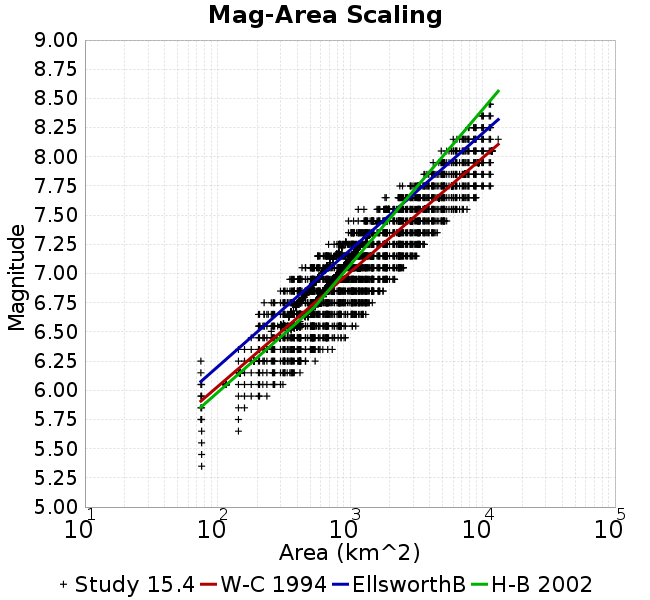

# Study 15.4
## Metadata
| **Name** | Study 15.4 |
|-----|-----|
| **Date** | Apr 2015 |
| **Region** | Los Angeles Box |
| **Description** | Los Angeles region with CVM-S4.26 Velocity Model, 1hz |
| **Velocity Model** | CVM-S4.26, 4.26 |

* [Metadata](#metadata)
* [GMPE Comparisons](#gmpe-comparisons)
  * [Vs30 model for GMPE comparisons: Wills 2015](#vs30-model-for-gmpe-comparisons-wills-2015)
  * [Vs30 model for GMPE comparisons: Simulation Value](#vs30-model-for-gmpe-comparisons-simulation-value)
* [Site Hazard Comparisons](#site-hazard-comparisons)
  * [GMPE: ASK2014, Vs30 model: Simulation Value](#gmpe-ask2014-vs30-model-simulation-value)
  * [GMPE: NGAWest_2014_NoIdr, Vs30 model: Simulation Value](#gmpe-ngawest2014noidr-vs30-model-simulation-value)
* [RotD100/RotD50 Ratios](#rotd100rotd50-ratios)
* [Plots](#plots)
  * [Magnitude-Frequency Plot](#magnitude-frequency-plot)
  * [Rupture Variation Count Plot](#rupture-variation-count-plot)
  * [Magnitude-Area Plots](#magnitude-area-plots)
  * [Plots Without Aleatory Magnitude Variability](#plots-without-aleatory-magnitude-variability)
    * [Magnitude-Frequency Plot](#magnitude-frequency-plot)
    * [Rupture Variation Count Plot](#rupture-variation-count-plot)
    * [Magnitude-Area Plots](#magnitude-area-plots)

## GMPE Comparisons
*[(top)](#study-154)*

### Vs30 model for GMPE comparisons: Wills 2015

* [ASK2014](gmpe_comparisons_ASK2014_Vs30Wills2015/)
* [BSSA2014](gmpe_comparisons_BSSA2014_Vs30Wills2015/)
* [CB2014](gmpe_comparisons_CB2014_Vs30Wills2015/)
* [CY2014](gmpe_comparisons_CY2014_Vs30Wills2015/)
* [NGAWest_2014_NoIdr](gmpe_comparisons_NGAWest_2014_NoIdr_Vs30Wills2015/)
### Vs30 model for GMPE comparisons: Simulation Value

* [ASK2014](gmpe_comparisons_ASK2014_Vs30Simulation/)
* [BSSA2014](gmpe_comparisons_BSSA2014_Vs30Simulation/)
* [CB2014](gmpe_comparisons_CB2014_Vs30Simulation/)
* [CY2014](gmpe_comparisons_CY2014_Vs30Simulation/)
* [NGAWest_2014_NoIdr](gmpe_comparisons_NGAWest_2014_NoIdr_Vs30Simulation/)

## Site Hazard Comparisons
*[(top)](#study-154)*

### GMPE: ASK2014, Vs30 model: Simulation Value

* [LAPD](site_hazard_LAPD_ASK2014_Vs30Simulation/)
* [PAS](site_hazard_PAS_ASK2014_Vs30Simulation/)
* [SBSM](site_hazard_SBSM_ASK2014_Vs30Simulation/)
* [STNI](site_hazard_STNI_ASK2014_Vs30Simulation/)
* [USC](site_hazard_USC_ASK2014_Vs30Simulation/)
* [WNGC](site_hazard_WNGC_ASK2014_Vs30Simulation/)
### GMPE: NGAWest_2014_NoIdr, Vs30 model: Simulation Value

* [LAPD](site_hazard_LAPD_NGAWest_2014_NoIdr_Vs30Simulation/)
* [PAS](site_hazard_PAS_NGAWest_2014_NoIdr_Vs30Simulation/)
* [SBSM](site_hazard_SBSM_NGAWest_2014_NoIdr_Vs30Simulation/)
* [STNI](site_hazard_STNI_NGAWest_2014_NoIdr_Vs30Simulation/)
* [USC](site_hazard_USC_NGAWest_2014_NoIdr_Vs30Simulation/)
* [WNGC](site_hazard_WNGC_NGAWest_2014_NoIdr_Vs30Simulation/)

## RotD100/RotD50 Ratios
*[(top)](#study-154)*

[RotD100/RotD50 Ratios Plotted Here](rotd_ratio_comparisons/)

## Plots
### Magnitude-Frequency Plot
*[(top)](#study-154)*

### Rupture Variation Count Plot
*[(top)](#study-154)*

### Magnitude-Area Plots
*[(top)](#study-154)*

| Scatter | 2-D Hist |
|-----|-----|
|  |  |
### Plots Without Aleatory Magnitude Variability
#### Magnitude-Frequency Plot
*[(top)](#study-154)*

#### Rupture Variation Count Plot
*[(top)](#study-154)*

#### Magnitude-Area Plots
*[(top)](#study-154)*

| Scatter | 2-D Hist |
|-----|-----|
|  |  |
