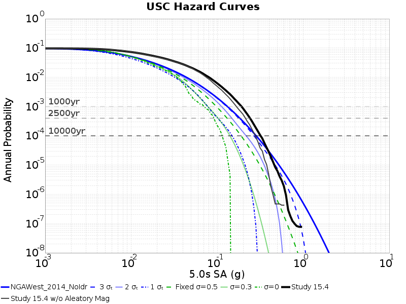

# Study 15.4 USC Hazard Curves

**GMPE: NGAWest2 2014 Averaged No Idriss, Vs30 Source: Simulation Value**

**Study Details**

| **Name** | Study 15.4 |
|-----|-----|
| **Date** | Apr 2015 |
| **Region** | Los Angeles Box |
| **Description** | Los Angeles region with CVM-S4.26 Velocity Model, 1hz |
| **Velocity Model** | CVM-S4.26, 4.26 |

## Table Of Contents
* [Hazard Curves](#hazard-curves)
  * [3s Hazard Curves](#3s-hazard-curves)
  * [5s Hazard Curves](#5s-hazard-curves)
  * [7.5s Hazard Curves](#75s-hazard-curves)
  * [10s Hazard Curves](#10s-hazard-curves)
* [Disaggregations](#disaggregations)
  * [3s Disaggregations](#3s-disaggregations)
    * [3s Disaggregations at Fixed Return Periods](#3s-disaggregations-at-fixed-return-periods)
    * [3s Disaggregations at Intersections](#3s-disaggregations-at-intersections)
  * [5s Disaggregations](#5s-disaggregations)
    * [5s Disaggregations at Fixed Return Periods](#5s-disaggregations-at-fixed-return-periods)
    * [5s Disaggregations at Intersections](#5s-disaggregations-at-intersections)
  * [7.5s Disaggregations](#75s-disaggregations)
    * [7.5s Disaggregations at Fixed Return Periods](#75s-disaggregations-at-fixed-return-periods)
  * [10s Disaggregations](#10s-disaggregations)
    * [10s Disaggregations at Fixed Return Periods](#10s-disaggregations-at-fixed-return-periods)
## Hazard Curves
*[(top)](#table-of-contents)*

**Legend**:
* **Simulations Curves** *(truncated below lowest possible y-value)*
  * Black Solid Line: Study 15.4
* **GMPE Curves**
  * Blue Solid Line: NGAWest_2014_NoIdr full curve
  * Blue Dashed Line: NGAWest_2014_NoIdr, 3-sigma truncation
  * Blue Dotted Line: NGAWest_2014_NoIdr, 2-sigma truncation
  * Blue Dotted and dashed Line: NGAWest_2014_NoIdr, 1-sigma truncation
  * Green Dashed Line: NGAWest_2014_NoIdr, Fixed sigma=0.5
  * Green Dotted Line: NGAWest_2014_NoIdr, Fixed sigma=0.3
  * Green Dotted and dashed Line: NGAWest_2014_NoIdr, Fixed sigma=0
* Gray Dashed Lines: 1000 yr, 2500 yr, 10000 yr return periods

### 3s Hazard Curves
*[(top)](#table-of-contents)*

### 5s Hazard Curves
*[(top)](#table-of-contents)*

### 7.5s Hazard Curves
*[(top)](#table-of-contents)*

### 10s Hazard Curves
*[(top)](#table-of-contents)*

## Disaggregations
*[(top)](#table-of-contents)*

### 3s Disaggregations
*[(top)](#table-of-contents)*

#### 3s Disaggregations at Fixed Return Periods
*[(top)](#table-of-contents)*

| **Return Period** | **Study 15.4 w/ sim dist for Epsilon** | **Study 15.4 w/ GMPE dist for Epsilon** | **NGAWest2 2014 Averaged No Idriss** |
|-----|-----|-----|-----|
| **1000 yr** |  |  |  |
| **2500 yr** |  |  |  |
| **10000 yr** |  |  |  |

#### 3s Disaggregations at Intersections
*[(top)](#table-of-contents)*

| **Disagg Point** | **Study 15.4 w/ sim dist for Epsilon** | **Study 15.4 w/ GMPE dist for Epsilon** | **NGAWest2 2014 Averaged No Idriss** |
|-----|-----|-----|-----|
| **927 yr**, 0.26493037 g |  |  |  |

### 5s Disaggregations
*[(top)](#table-of-contents)*

#### 5s Disaggregations at Fixed Return Periods
*[(top)](#table-of-contents)*

| **Return Period** | **Study 15.4 w/ sim dist for Epsilon** | **Study 15.4 w/ GMPE dist for Epsilon** | **NGAWest2 2014 Averaged No Idriss** |
|-----|-----|-----|-----|
| **1000 yr** |  |  |  |
| **2500 yr** |  |  |  |
| **10000 yr** |  |  |  |

#### 5s Disaggregations at Intersections
*[(top)](#table-of-contents)*

| **Disagg Point** | **Study 15.4 w/ sim dist for Epsilon** | **Study 15.4 w/ GMPE dist for Epsilon** | **NGAWest2 2014 Averaged No Idriss** |
|-----|-----|-----|-----|
| **31047 yr**, 0.38985315 g |  |  |  |

### 7.5s Disaggregations
*[(top)](#table-of-contents)*

#### 7.5s Disaggregations at Fixed Return Periods
*[(top)](#table-of-contents)*

| **Return Period** | **Study 15.4 w/ sim dist for Epsilon** | **Study 15.4 w/ GMPE dist for Epsilon** | **NGAWest2 2014 Averaged No Idriss** |
|-----|-----|-----|-----|
| **1000 yr** |  |  |  |
| **2500 yr** |  |  |  |
| **10000 yr** |  |  |  |

### 10s Disaggregations
*[(top)](#table-of-contents)*

#### 10s Disaggregations at Fixed Return Periods
*[(top)](#table-of-contents)*

| **Return Period** | **Study 15.4 w/ sim dist for Epsilon** | **Study 15.4 w/ GMPE dist for Epsilon** | **NGAWest2 2014 Averaged No Idriss** |
|-----|-----|-----|-----|
| **1000 yr** |  |  |  |
| **2500 yr** |  |  |  |
| **10000 yr** |  |  |  |

