# Study 15.4 WNGC Hazard Curves

**GMPE: NGAWest2 2014 Averaged No Idriss, Vs30 Source: Simulation Value**

**Study Details**

| **Name** | Study 15.4 |
|-----|-----|
| **Date** | Apr 2015 |
| **Region** | Los Angeles Box |
| **Description** | Los Angeles region with CVM-S4.26 Velocity Model, 1hz |
| **Velocity Model** | CVM-S4.26, 4.26 |

## Site Information

| **Name** | WNGC |
|-----|-----|
| **Latitude** | 34.041824 |
| **Longitude** | -118.0653 |
| **GMPE Parameters** |  |
| **Vs30** (*m/sec*) | 300.0 |
| **Vs30 Type** | Inferred |
| **Depth 1.0 km/sec** (*m*) | 550.0 |
| **Depth 2.5 km/sec** (*km*) | 3.7 |

### Site Map

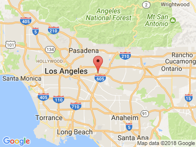

## Table Of Contents
* [Site Information](#site-information)
  * [Site Map](#site-map)
* [Hazard Spectra](#hazard-spectra)
  * [Source Contribution Spectra](#source-contribution-spectra)
* [Hazard Curves](#hazard-curves)
  * [3s Hazard Curves](#3s-hazard-curves)
    * [3s GMPE-Sim Comparison](#3s-gmpe-sim-comparison)
    * [3s Source Contributions](#3s-source-contributions)
  * [5s Hazard Curves](#5s-hazard-curves)
    * [5s GMPE-Sim Comparison](#5s-gmpe-sim-comparison)
    * [5s Source Contributions](#5s-source-contributions)
  * [7.5s Hazard Curves](#75s-hazard-curves)
    * [7.5s GMPE-Sim Comparison](#75s-gmpe-sim-comparison)
    * [7.5s Source Contributions](#75s-source-contributions)
  * [10s Hazard Curves](#10s-hazard-curves)
    * [10s GMPE-Sim Comparison](#10s-gmpe-sim-comparison)
    * [10s Source Contributions](#10s-source-contributions)
* [Disaggregations](#disaggregations)
  * [3s Disaggregations](#3s-disaggregations)
    * [3s Disaggregations at Simulation/GMPE Intersections](#3s-disaggregations-at-simulationgmpe-intersections)
    * [3s Disaggregations at Fixed Return Periods](#3s-disaggregations-at-fixed-return-periods)
    * [3s Disaggregations at Fixed IMLs](#3s-disaggregations-at-fixed-imls)
  * [5s Disaggregations](#5s-disaggregations)
    * [5s Disaggregations at Simulation/GMPE Intersections](#5s-disaggregations-at-simulationgmpe-intersections)
    * [5s Disaggregations at Fixed Return Periods](#5s-disaggregations-at-fixed-return-periods)
    * [5s Disaggregations at Fixed IMLs](#5s-disaggregations-at-fixed-imls)
  * [7.5s Disaggregations](#75s-disaggregations)
    * [7.5s Disaggregations at Simulation/GMPE Intersections](#75s-disaggregations-at-simulationgmpe-intersections)
    * [7.5s Disaggregations at Fixed Return Periods](#75s-disaggregations-at-fixed-return-periods)
    * [7.5s Disaggregations at Fixed IMLs](#75s-disaggregations-at-fixed-imls)
  * [10s Disaggregations](#10s-disaggregations)
    * [10s Disaggregations at Simulation/GMPE Intersections](#10s-disaggregations-at-simulationgmpe-intersections)
    * [10s Disaggregations at Fixed Return Periods](#10s-disaggregations-at-fixed-return-periods)
    * [10s Disaggregations at Fixed IMLs](#10s-disaggregations-at-fixed-imls)
## Hazard Spectra
*[(top)](#table-of-contents)*

**Legend**:
* **Simulation Spectra**
  * Black Solid Line: Study 15.4
  * Gray Solid Line: Study 15.4 w/o Aleatory Mag
* **GMPE Spectra**
  * Blue Solid Line: NGAWest_2014_NoIdr full spectra
  * Blue Dashed Line: NGAWest_2014_NoIdr, 3-sigma truncation
  * Blue Dotted Line: NGAWest_2014_NoIdr, 2-sigma truncation
  * Blue Dotted and dashed Line: NGAWest_2014_NoIdr, 1-sigma truncation
  * Green Dashed Line: NGAWest_2014_NoIdr, Fixed sigma=0.5
  * Green Dotted Line: NGAWest_2014_NoIdr, Fixed sigma=0.3
  * Green Dotted and dashed Line: NGAWest_2014_NoIdr, Fixed sigma=0

| **1000yr** | 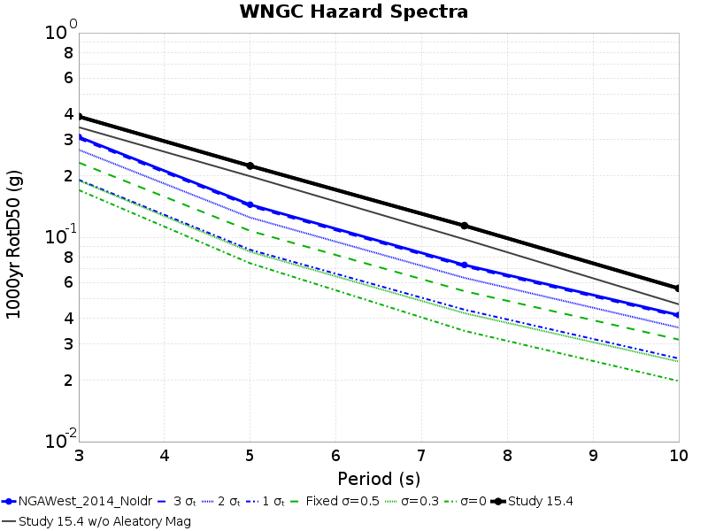 |
|-----|-----|
| **2500yr** | 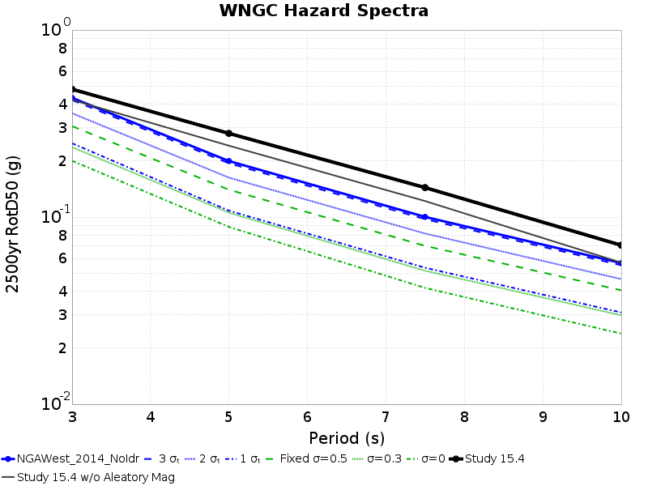 |
| **10000yr** | 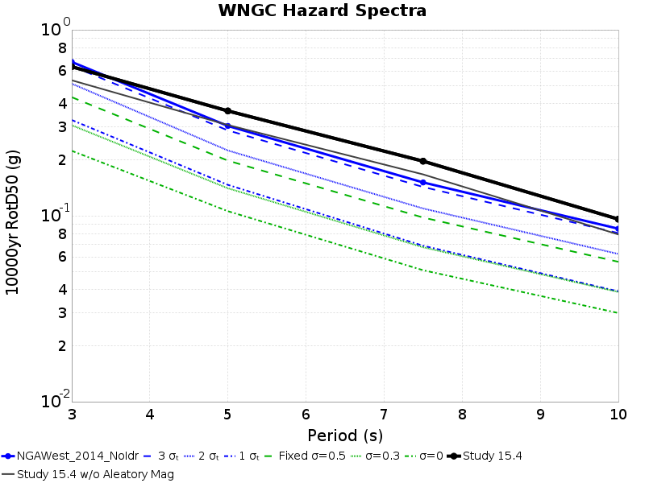 |
### Source Contribution Spectra
*[(top)](#table-of-contents)*

These plots show the contribution of each fault source to the hazard spectra. The same set of sources are plotted for both simulation values (left) and GMPE values (right). Sources are sorted in the legend (and colored by) their average contrubution in the simulation results at the given return period, and only the top 10 sources are plotted.

| **Return Period** | **Simulation Source Contributions** | **GMPE Source Contributions** |
|-----|-----|-----|
| 1000yr | 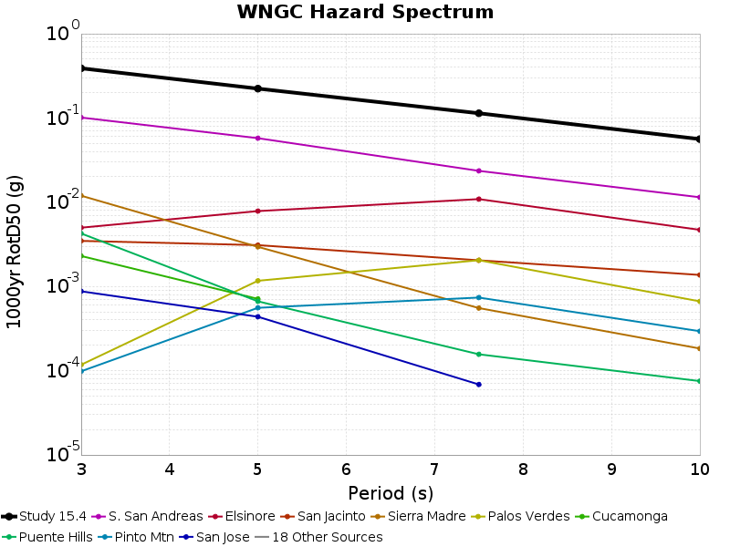 | 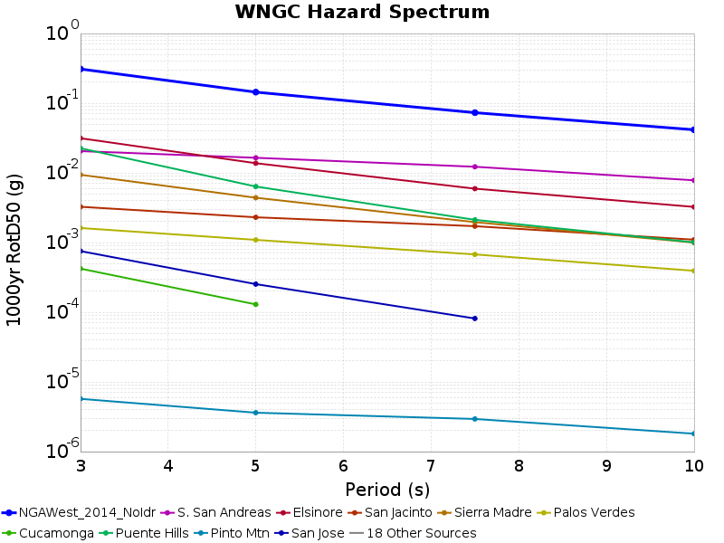 |
| 2500yr | 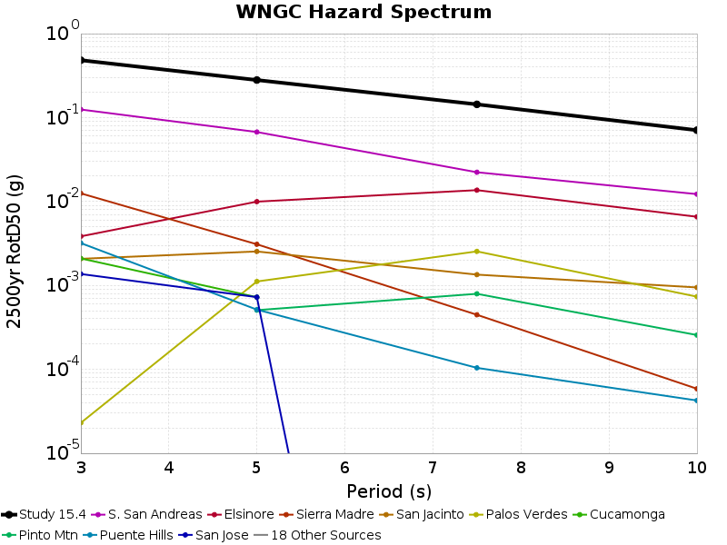 | 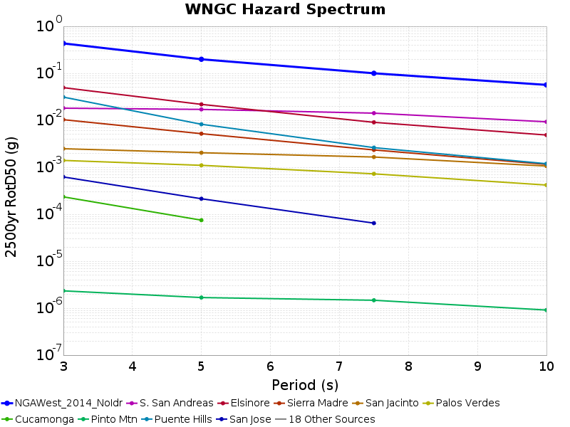 |
| 10000yr | 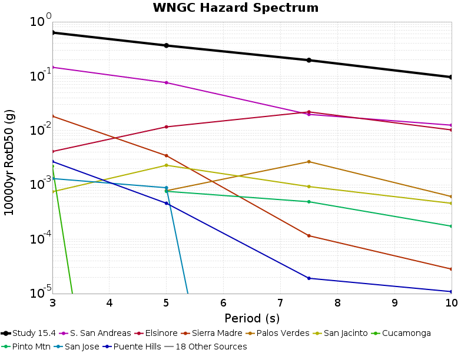 | 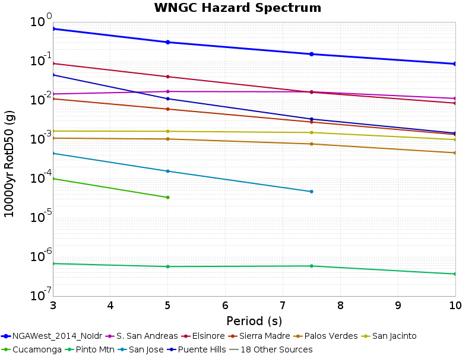 |

## Hazard Curves
*[(top)](#table-of-contents)*

**Legend**:
* **Simulation Curves** *(truncated below lowest possible y-value)*
  * Black Solid Line: Study 15.4
  * Gray Solid Line: Study 15.4 w/o Aleatory Mag
* **GMPE Curves**
  * Blue Solid Line: NGAWest_2014_NoIdr full curves
  * Blue Dashed Line: NGAWest_2014_NoIdr, 3-sigma truncation
  * Blue Dotted Line: NGAWest_2014_NoIdr, 2-sigma truncation
  * Blue Dotted and dashed Line: NGAWest_2014_NoIdr, 1-sigma truncation
  * Green Dashed Line: NGAWest_2014_NoIdr, Fixed sigma=0.5
  * Green Dotted Line: NGAWest_2014_NoIdr, Fixed sigma=0.3
  * Green Dotted and dashed Line: NGAWest_2014_NoIdr, Fixed sigma=0
* Gray Dashed Lines: 1000 yr, 2500 yr, 10000 yr return periods

### 3s Hazard Curves
*[(top)](#table-of-contents)*

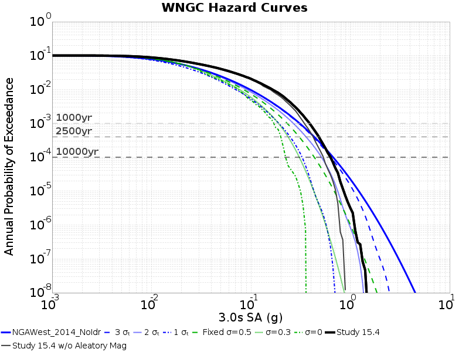

#### 3s GMPE-Sim Comparison
*[(top)](#table-of-contents)*

**Legend**:
* **Simulation Curves** *(truncated below lowest possible y-value)*
  * Black Solid Line: Study 15.4
  * Gray Solid Line: Study 15.4 w/o Aleatory Mag
* **GMPE Curves**
  * Light Red Thin Solid Lines: NGAWest_2014_NoIdr simulations (with samples from GMPE log-normal distribution)
  * Red Solid Line: NGAWest_2014_NoIdr, mean of 100 simulations
  * Blue Solid Line: NGAWest_2014_NoIdr full curves
* Gray Dashed Lines: 1000 yr, 2500 yr, 10000 yr return periods

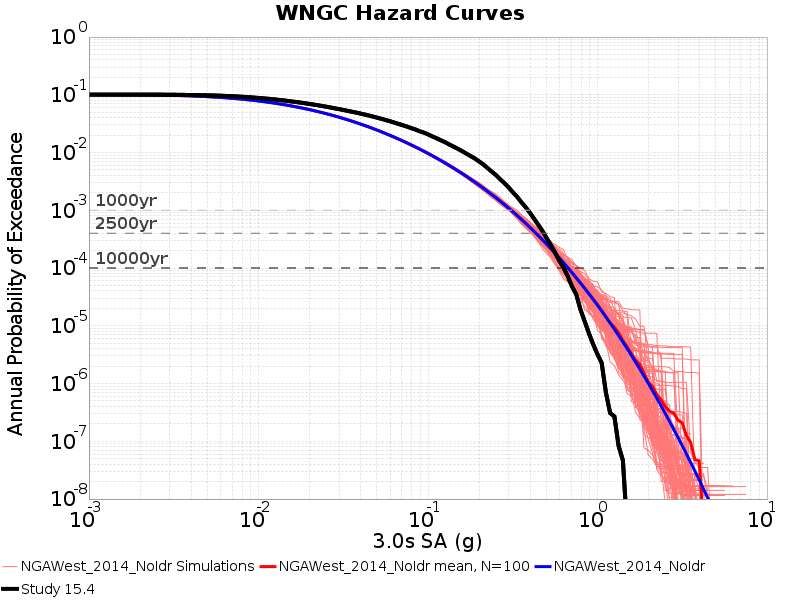

#### 3s Source Contributions
*[(top)](#table-of-contents)*

These plots show the contribution of each fault source to the hazard curves. The same set of sources are plotted for both simulation values (left) and GMPE values (right). Sources are sorted in the legend (and colored by) their contrubution in the simulation results at the **POE=4.0E-4** level, and only the top 10 sources are plotted.

| **Simulation Source Contributions** | **GMPE Source Contributions** |
|-----|-----|
| 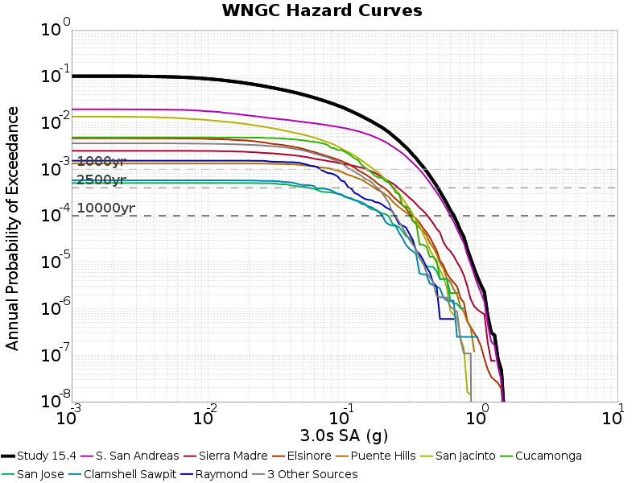 | 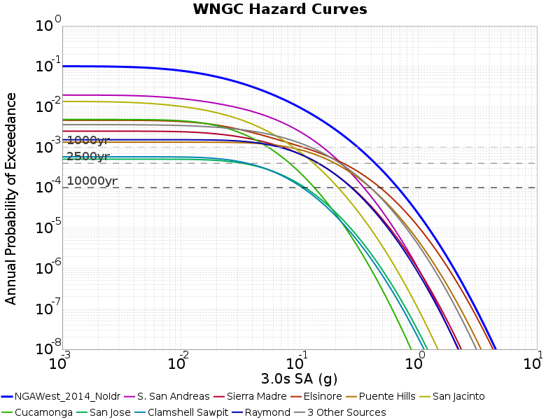 |

### 5s Hazard Curves
*[(top)](#table-of-contents)*

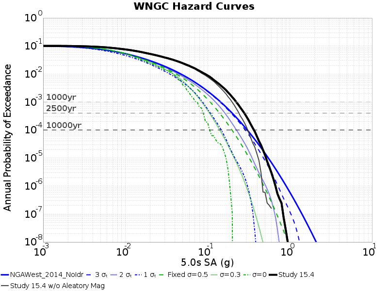

#### 5s GMPE-Sim Comparison
*[(top)](#table-of-contents)*

**Legend**:
* **Simulation Curves** *(truncated below lowest possible y-value)*
  * Black Solid Line: Study 15.4
  * Gray Solid Line: Study 15.4 w/o Aleatory Mag
* **GMPE Curves**
  * Light Red Thin Solid Lines: NGAWest_2014_NoIdr simulations (with samples from GMPE log-normal distribution)
  * Red Solid Line: NGAWest_2014_NoIdr, mean of 100 simulations
  * Blue Solid Line: NGAWest_2014_NoIdr full curves
* Gray Dashed Lines: 1000 yr, 2500 yr, 10000 yr return periods

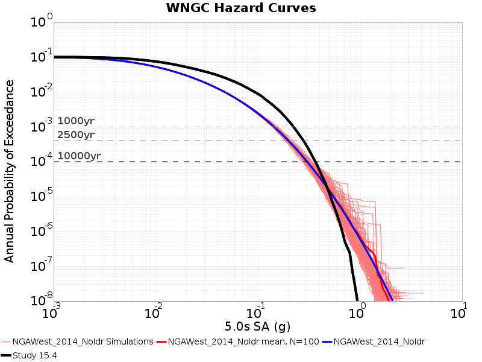

#### 5s Source Contributions
*[(top)](#table-of-contents)*

These plots show the contribution of each fault source to the hazard curves. The same set of sources are plotted for both simulation values (left) and GMPE values (right). Sources are sorted in the legend (and colored by) their contrubution in the simulation results at the **POE=4.0E-4** level, and only the top 10 sources are plotted.

| **Simulation Source Contributions** | **GMPE Source Contributions** |
|-----|-----|
| 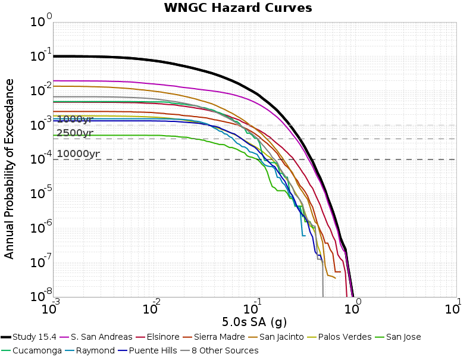 | 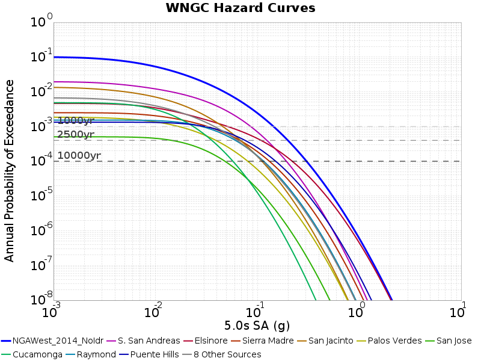 |

### 7.5s Hazard Curves
*[(top)](#table-of-contents)*

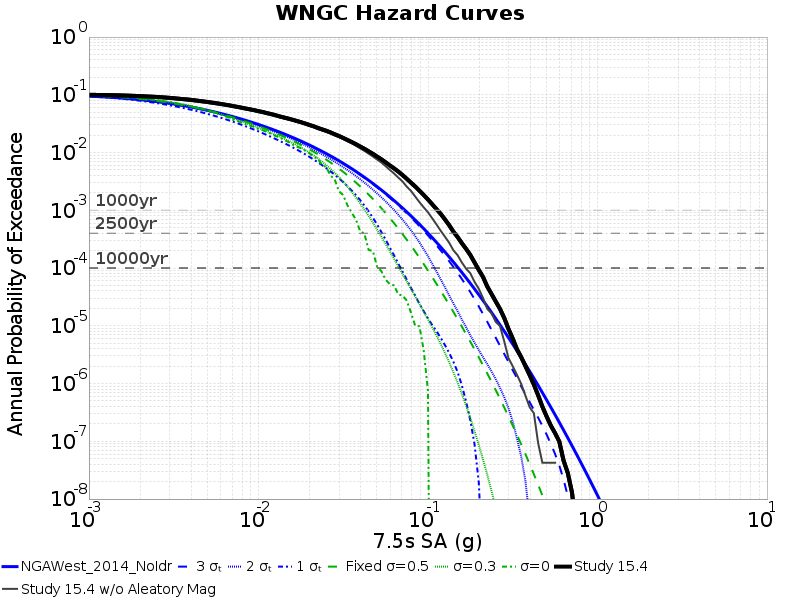

#### 7.5s GMPE-Sim Comparison
*[(top)](#table-of-contents)*

**Legend**:
* **Simulation Curves** *(truncated below lowest possible y-value)*
  * Black Solid Line: Study 15.4
  * Gray Solid Line: Study 15.4 w/o Aleatory Mag
* **GMPE Curves**
  * Light Red Thin Solid Lines: NGAWest_2014_NoIdr simulations (with samples from GMPE log-normal distribution)
  * Red Solid Line: NGAWest_2014_NoIdr, mean of 100 simulations
  * Blue Solid Line: NGAWest_2014_NoIdr full curves
* Gray Dashed Lines: 1000 yr, 2500 yr, 10000 yr return periods

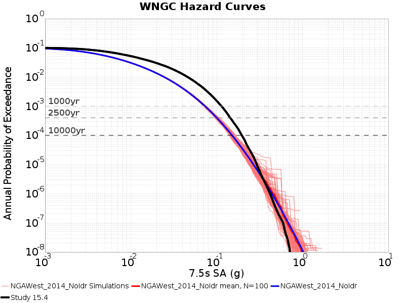

#### 7.5s Source Contributions
*[(top)](#table-of-contents)*

These plots show the contribution of each fault source to the hazard curves. The same set of sources are plotted for both simulation values (left) and GMPE values (right). Sources are sorted in the legend (and colored by) their contrubution in the simulation results at the **POE=4.0E-4** level, and only the top 10 sources are plotted.

| **Simulation Source Contributions** | **GMPE Source Contributions** |
|-----|-----|
| 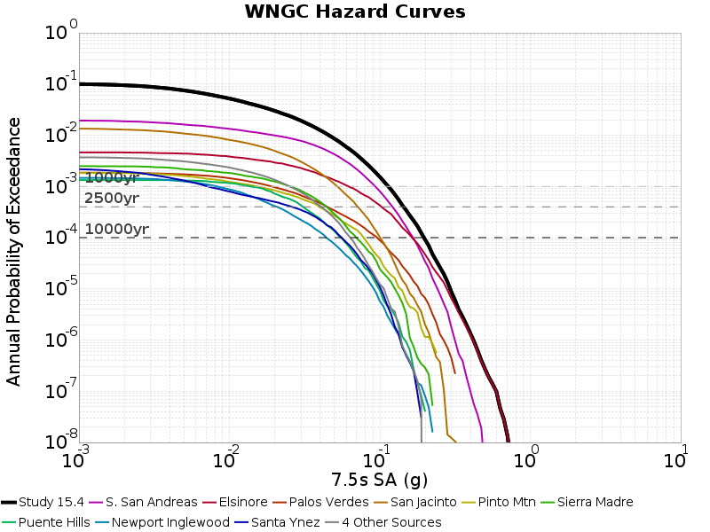 | 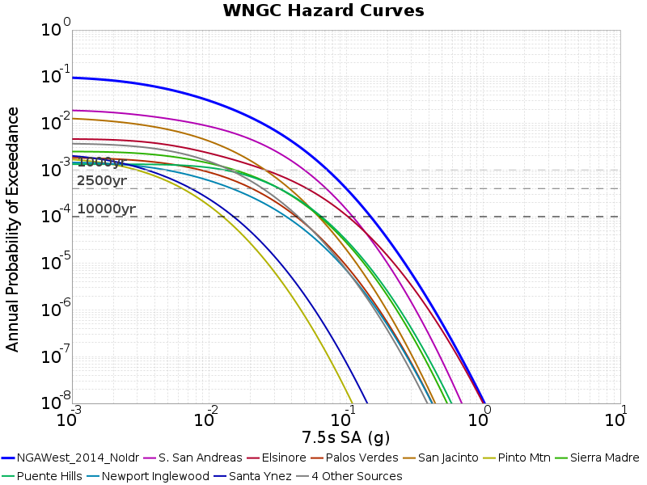 |

### 10s Hazard Curves
*[(top)](#table-of-contents)*

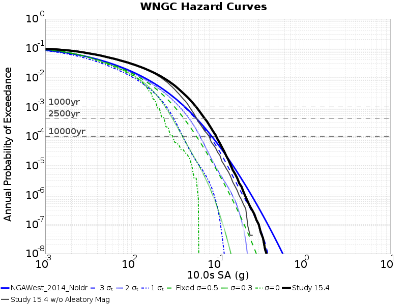

#### 10s GMPE-Sim Comparison
*[(top)](#table-of-contents)*

**Legend**:
* **Simulation Curves** *(truncated below lowest possible y-value)*
  * Black Solid Line: Study 15.4
  * Gray Solid Line: Study 15.4 w/o Aleatory Mag
* **GMPE Curves**
  * Light Red Thin Solid Lines: NGAWest_2014_NoIdr simulations (with samples from GMPE log-normal distribution)
  * Red Solid Line: NGAWest_2014_NoIdr, mean of 100 simulations
  * Blue Solid Line: NGAWest_2014_NoIdr full curves
* Gray Dashed Lines: 1000 yr, 2500 yr, 10000 yr return periods

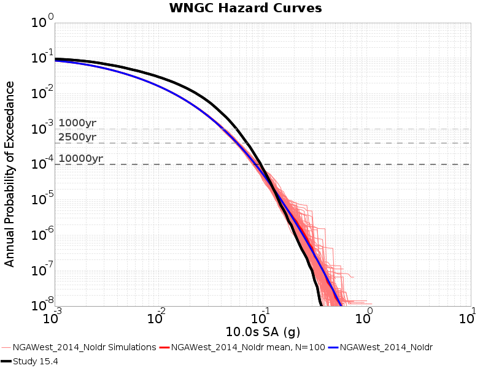

#### 10s Source Contributions
*[(top)](#table-of-contents)*

These plots show the contribution of each fault source to the hazard curves. The same set of sources are plotted for both simulation values (left) and GMPE values (right). Sources are sorted in the legend (and colored by) their contrubution in the simulation results at the **POE=4.0E-4** level, and only the top 10 sources are plotted.

| **Simulation Source Contributions** | **GMPE Source Contributions** |
|-----|-----|
| 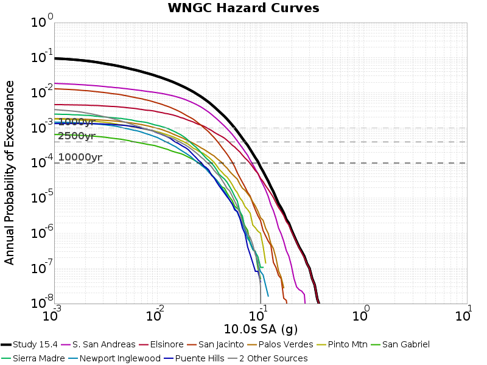 | 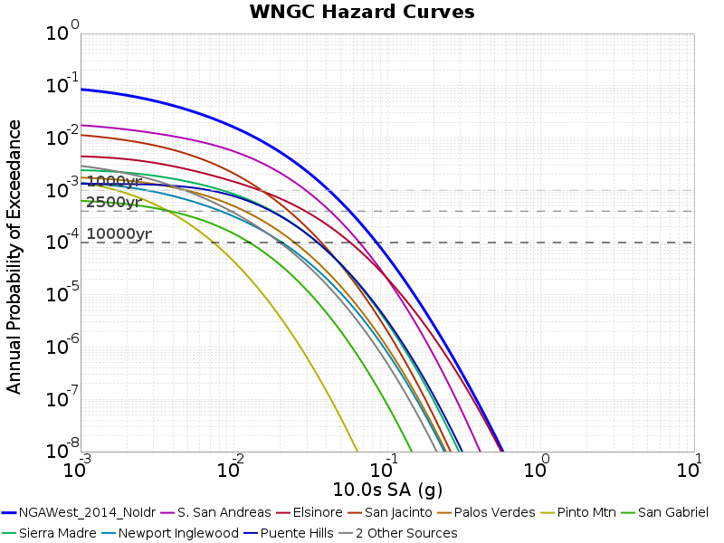 |

## Disaggregations
*[(top)](#table-of-contents)*

**Note on Epsilons:** Epsilon values are not straightforward for simulations. For a GMPE (in natural log space):

**GMPE Epsilon:** *epsilon = (gmpe_IML - gmpe_mean)/gmpe_sigma*

This simulation has at least 2 simulations per rupture, so we can calculate a 'simulation' mean/sigma for using in epsilon calculations. These disaggregations are labeled 'w/ sim dist for Epsilon':

**Simulation Distribution Epsilon:** *epsilon = (sim_IML - sim_mean)/sim_sigma*

We also include plots which use the GMPE mean and sigma when computing sigma:

**Simulation w/ GMPE Distribution Epsilon:** *epsilon = (sim_IML - gmpe_mean)/gmpe_sigma*

### 3s Disaggregations
*[(top)](#table-of-contents)*

#### 3s Disaggregations at Simulation/GMPE Intersections
*[(top)](#table-of-contents)*

| **Disagg Level** | **Study 15.4 w/ sim dist for Epsilon** | **Study 15.4 w/ GMPE dist for Epsilon** | **NGAWest2 2014 Averaged No Idriss** |
|-----|-----|-----|-----|
| **5719 yr 0.5691824 g** | 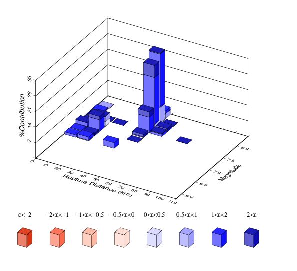 |  |  |

#### 3s Disaggregations at Fixed Return Periods
*[(top)](#table-of-contents)*

| **Disagg Level** | **Study 15.4 w/ sim dist for Epsilon** | **Study 15.4 w/ GMPE dist for Epsilon** | **NGAWest2 2014 Averaged No Idriss** |
|-----|-----|-----|-----|
| **1000 yr** |  |  |  |
| **2500 yr** | 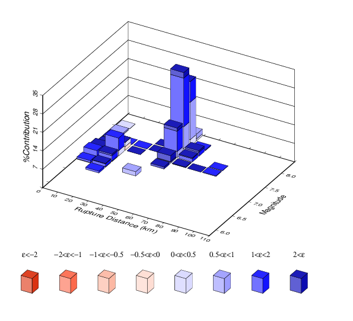 | 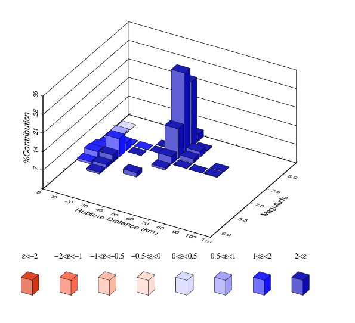 |  |
| **10000 yr** | 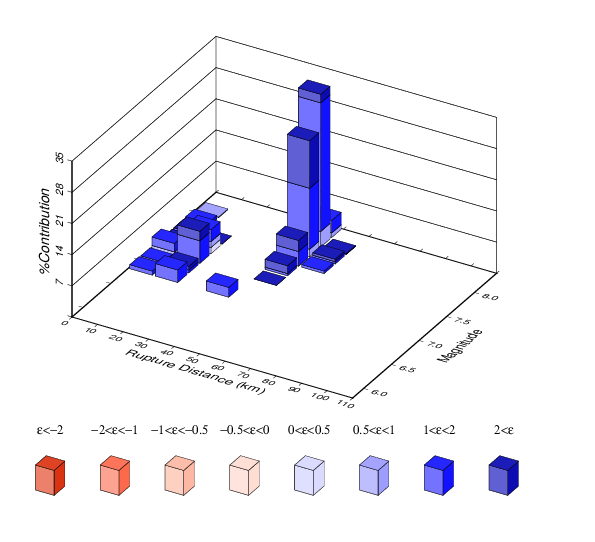 | 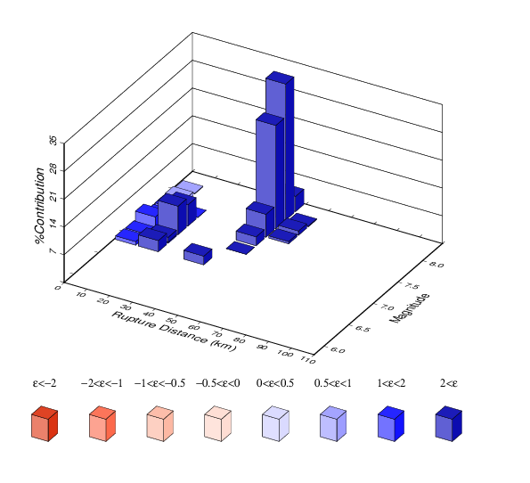 |  |

#### 3s Disaggregations at Fixed IMLs
*[(top)](#table-of-contents)*

| **Disagg Level** | **Study 15.4 w/ sim dist for Epsilon** | **Study 15.4 w/ GMPE dist for Epsilon** | **NGAWest2 2014 Averaged No Idriss** |
|-----|-----|-----|-----|
| **0.1 g** | 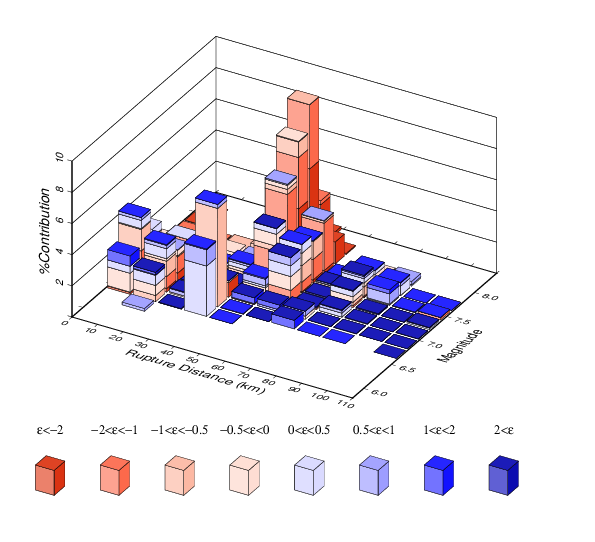 | 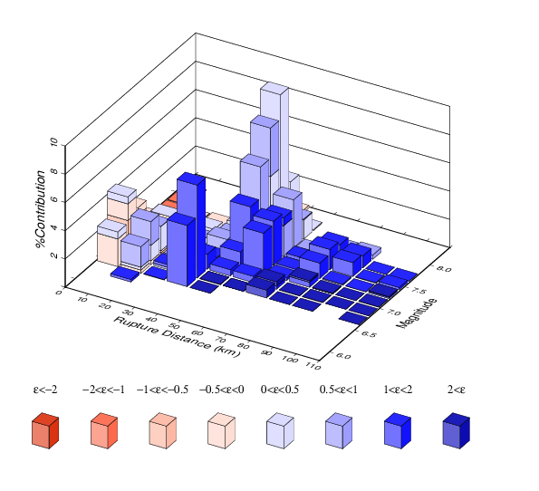 |  |
| **0.5 g** |  |  |  |
| **1.0 g** | 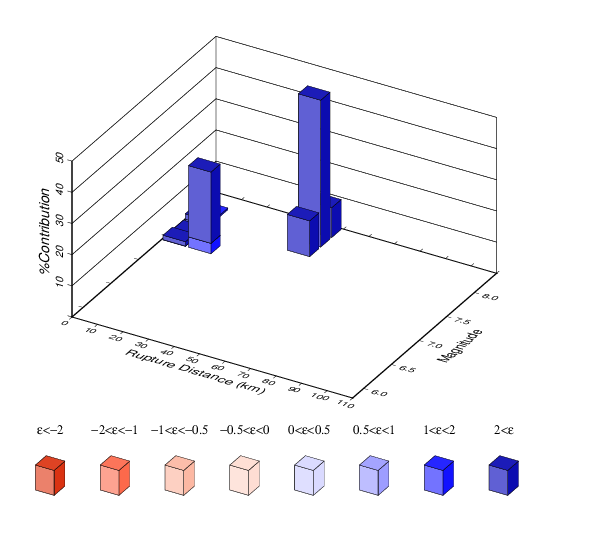 |  |  |

### 5s Disaggregations
*[(top)](#table-of-contents)*

#### 5s Disaggregations at Simulation/GMPE Intersections
*[(top)](#table-of-contents)*

| **Disagg Level** | **Study 15.4 w/ sim dist for Epsilon** | **Study 15.4 w/ GMPE dist for Epsilon** | **NGAWest2 2014 Averaged No Idriss** |
|-----|-----|-----|-----|
| **57125 yr 0.48048878 g** | 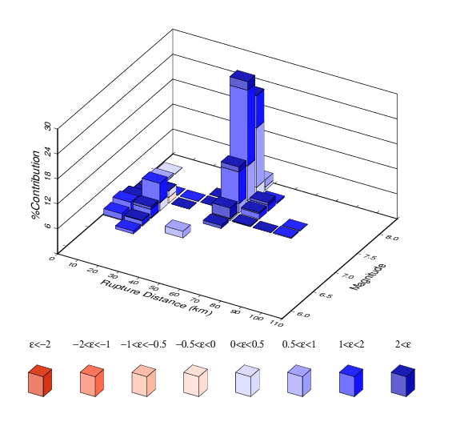 |  |  |

#### 5s Disaggregations at Fixed Return Periods
*[(top)](#table-of-contents)*

| **Disagg Level** | **Study 15.4 w/ sim dist for Epsilon** | **Study 15.4 w/ GMPE dist for Epsilon** | **NGAWest2 2014 Averaged No Idriss** |
|-----|-----|-----|-----|
| **1000 yr** | 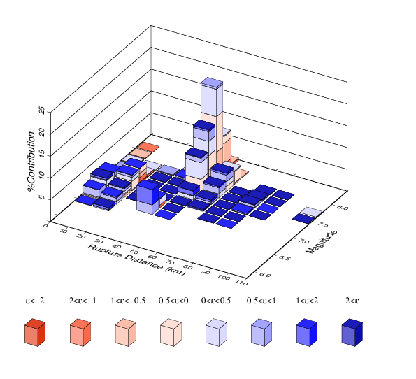 | 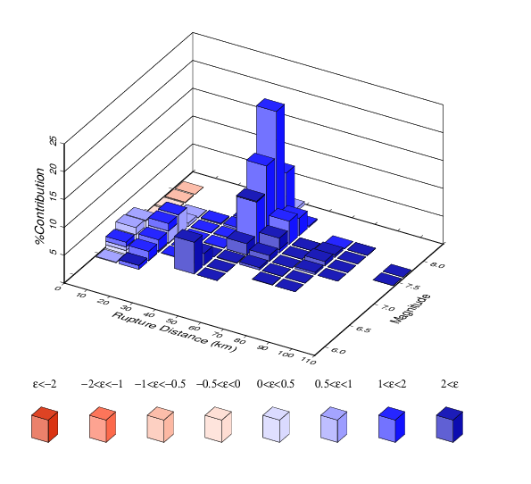 |  |
| **2500 yr** | 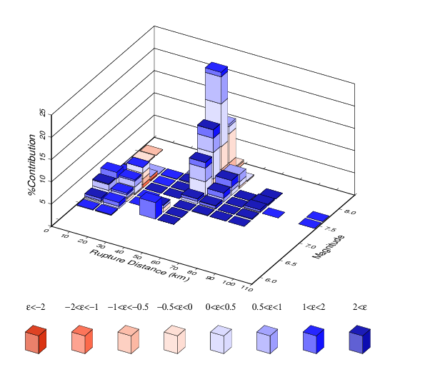 | 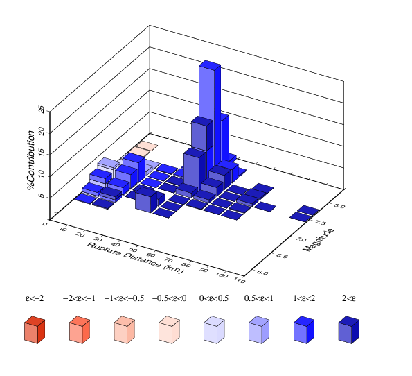 |  |
| **10000 yr** | 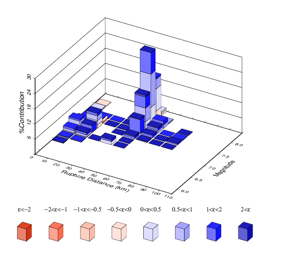 | 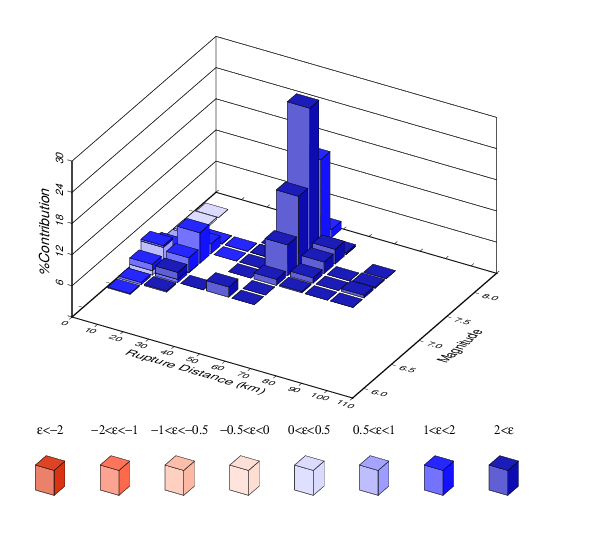 |  |

#### 5s Disaggregations at Fixed IMLs
*[(top)](#table-of-contents)*

| **Disagg Level** | **Study 15.4 w/ sim dist for Epsilon** | **Study 15.4 w/ GMPE dist for Epsilon** | **NGAWest2 2014 Averaged No Idriss** |
|-----|-----|-----|-----|
| **0.1 g** |  |  |  |
| **0.5 g** |  |  |  |
| **1.0 g** |  |  |  |

### 7.5s Disaggregations
*[(top)](#table-of-contents)*

#### 7.5s Disaggregations at Simulation/GMPE Intersections
*[(top)](#table-of-contents)*

| **Disagg Level** | **Study 15.4 w/ sim dist for Epsilon** | **Study 15.4 w/ GMPE dist for Epsilon** | **NGAWest2 2014 Averaged No Idriss** |
|-----|-----|-----|-----|
| **374997 yr 0.3598509 g** | 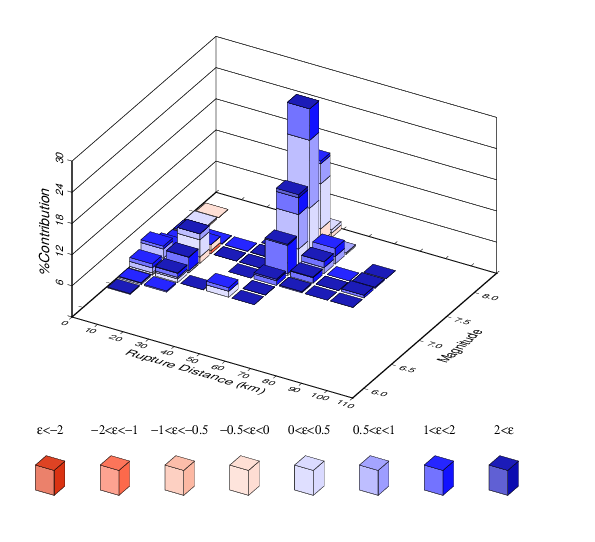 |  |  |

#### 7.5s Disaggregations at Fixed Return Periods
*[(top)](#table-of-contents)*

| **Disagg Level** | **Study 15.4 w/ sim dist for Epsilon** | **Study 15.4 w/ GMPE dist for Epsilon** | **NGAWest2 2014 Averaged No Idriss** |
|-----|-----|-----|-----|
| **1000 yr** | 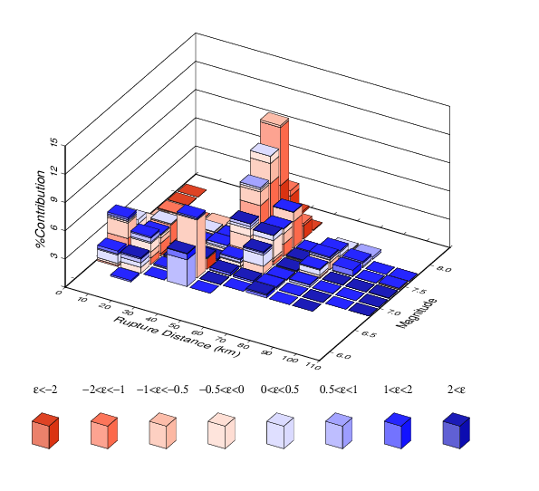 | 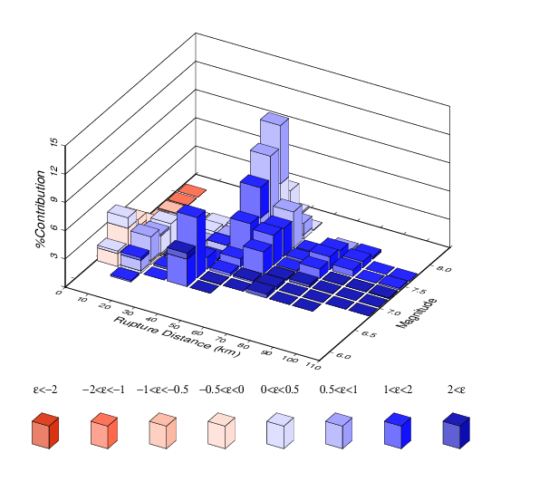 |  |
| **2500 yr** | 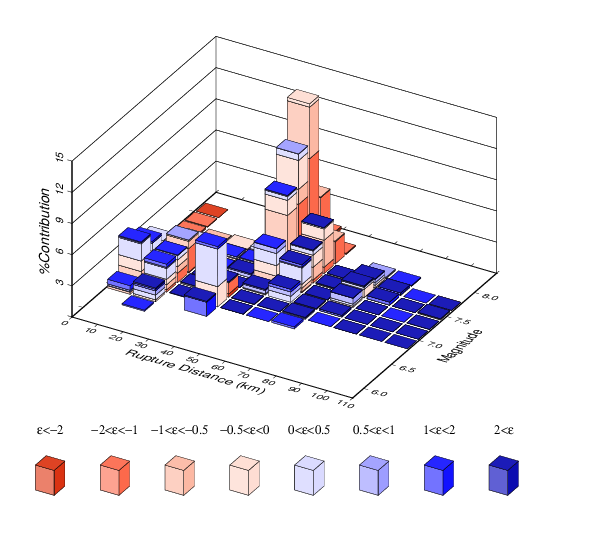 | 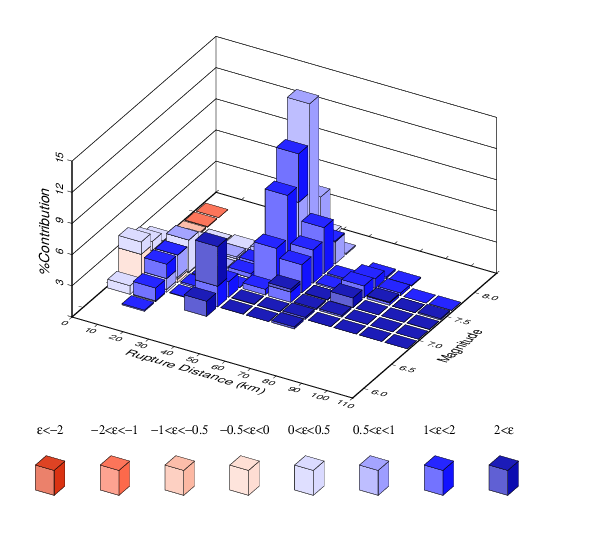 |  |
| **10000 yr** | 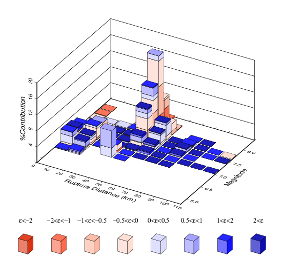 | 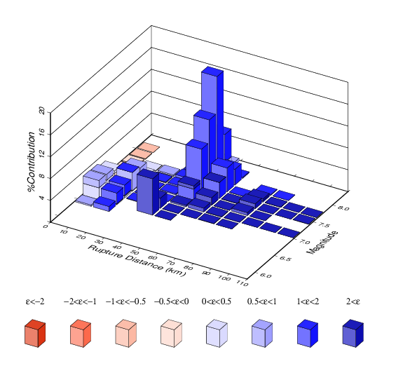 |  |

#### 7.5s Disaggregations at Fixed IMLs
*[(top)](#table-of-contents)*

| **Disagg Level** | **Study 15.4 w/ sim dist for Epsilon** | **Study 15.4 w/ GMPE dist for Epsilon** | **NGAWest2 2014 Averaged No Idriss** |
|-----|-----|-----|-----|
| **0.1 g** |  |  |  |
| **0.5 g** |  |  |  |
| **1.0 g** | N/A | N/A |  |

### 10s Disaggregations
*[(top)](#table-of-contents)*

#### 10s Disaggregations at Simulation/GMPE Intersections
*[(top)](#table-of-contents)*

| **Disagg Level** | **Study 15.4 w/ sim dist for Epsilon** | **Study 15.4 w/ GMPE dist for Epsilon** | **NGAWest2 2014 Averaged No Idriss** |
|-----|-----|-----|-----|
| **45852 yr 0.12545137 g** | 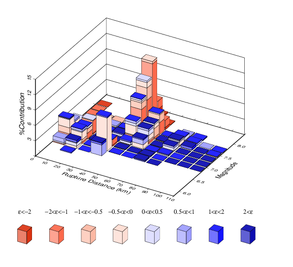 | 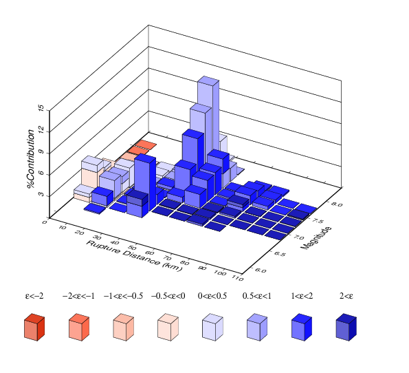 |  |

#### 10s Disaggregations at Fixed Return Periods
*[(top)](#table-of-contents)*

| **Disagg Level** | **Study 15.4 w/ sim dist for Epsilon** | **Study 15.4 w/ GMPE dist for Epsilon** | **NGAWest2 2014 Averaged No Idriss** |
|-----|-----|-----|-----|
| **1000 yr** | 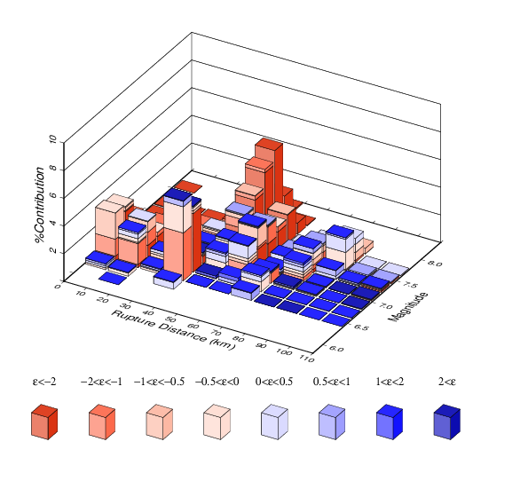 |  |  |
| **2500 yr** | 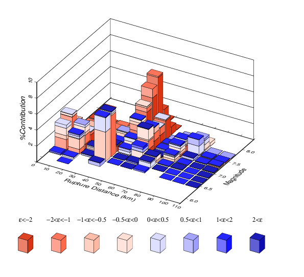 | 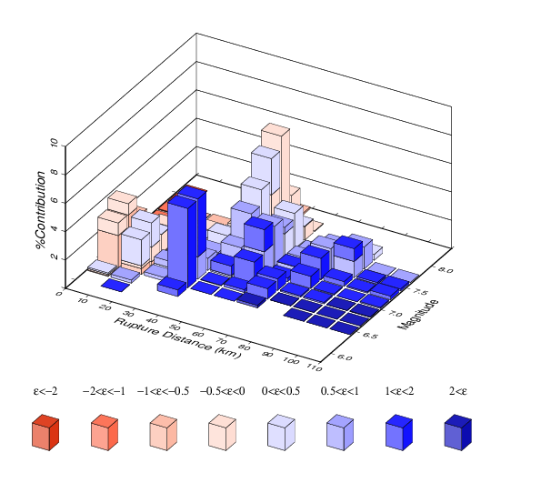 |  |
| **10000 yr** |  | 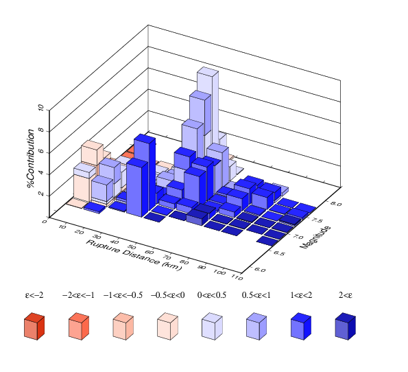 |  |

#### 10s Disaggregations at Fixed IMLs
*[(top)](#table-of-contents)*

| **Disagg Level** | **Study 15.4 w/ sim dist for Epsilon** | **Study 15.4 w/ GMPE dist for Epsilon** | **NGAWest2 2014 Averaged No Idriss** |
|-----|-----|-----|-----|
| **0.1 g** |  |  |  |
| **0.5 g** | N/A | N/A |  |
| **1.0 g** | N/A | N/A |  |

