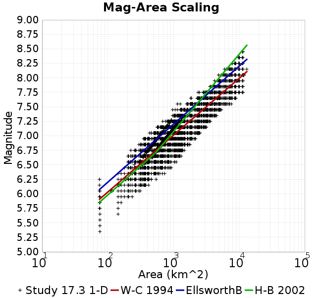

# Study 17.3 1-D
## Metadata
| **Name** | Study 17.3 1-D |
|-----|-----|
| **Date** | Mar 2017 |
| **Region** | Central California Box |
| **Description** | Central California with CCA-1D Velocity Model, 1hz |
| **Velocity Model** | CCA 1D, 1.0 |

* [Metadata](#metadata)
* [GMPE Comparisons](#gmpe-comparisons)
* [RotD100/RotD50 Ratios](#rotd100rotd50-ratios)
* [Plots](#plots)
  * [Magnitude-Frequency Plot](#magnitude-frequency-plot)
  * [Rupture Variation Count Plot](#rupture-variation-count-plot)
  * [Magnitude-Area Plots](#magnitude-area-plots)

## GMPE Comparisons
*[(top)](#study-173-1-d)*

* [ASK2014](gmpe_comparisons_ASK2014_Vs30Simulation/)
* [BSSA2014](gmpe_comparisons_BSSA2014_Vs30Simulation/)
* [CB2014](gmpe_comparisons_CB2014_Vs30Simulation/)
* [CY2014](gmpe_comparisons_CY2014_Vs30Simulation/)
* [NGAWest_2014_NoIdr](gmpe_comparisons_NGAWest_2014_NoIdr_Vs30Simulation/)

## RotD100/RotD50 Ratios
*[(top)](#study-173-1-d)*

[RotD100/RotD50 Ratios Plotted Here](rotd_ratio_comparisons/)

## Plots
### Magnitude-Frequency Plot
*[(top)](#study-173-1-d)*

### Rupture Variation Count Plot
*[(top)](#study-173-1-d)*

### Magnitude-Area Plots
*[(top)](#study-173-1-d)*

| Scatter | 2-D Hist |
|-----|-----|
|  |  |
