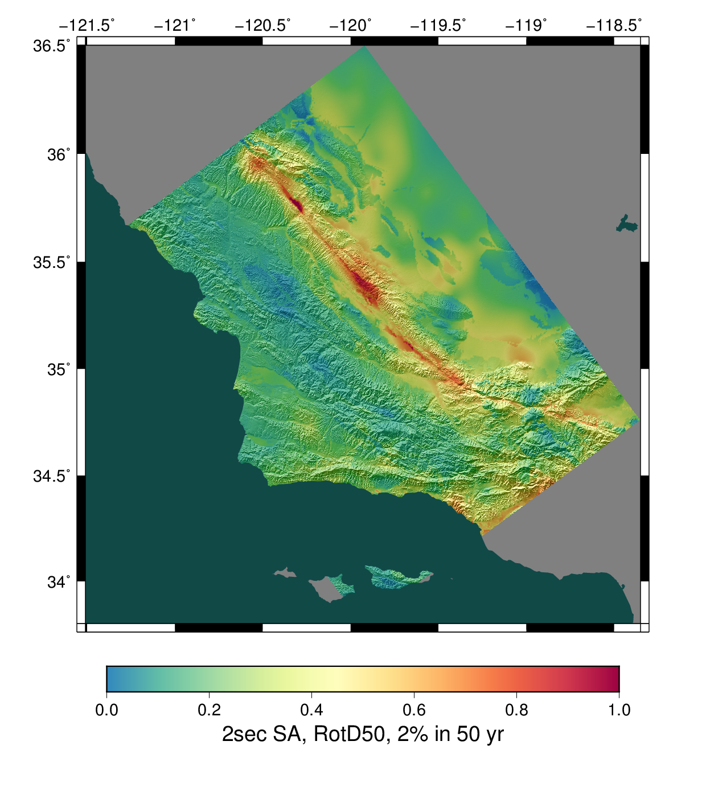
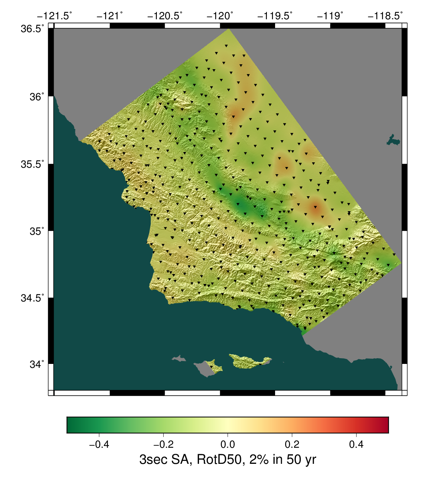
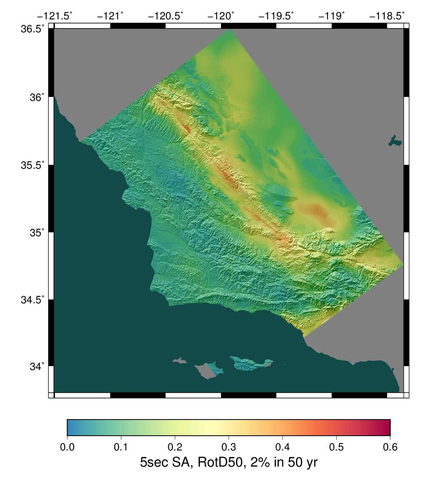
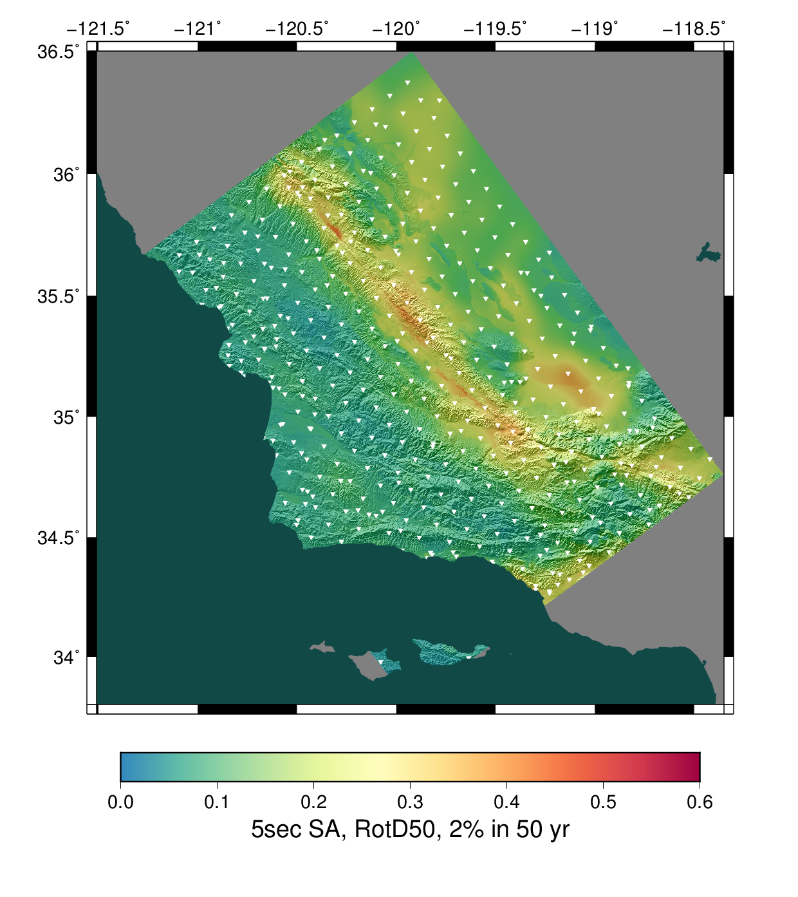
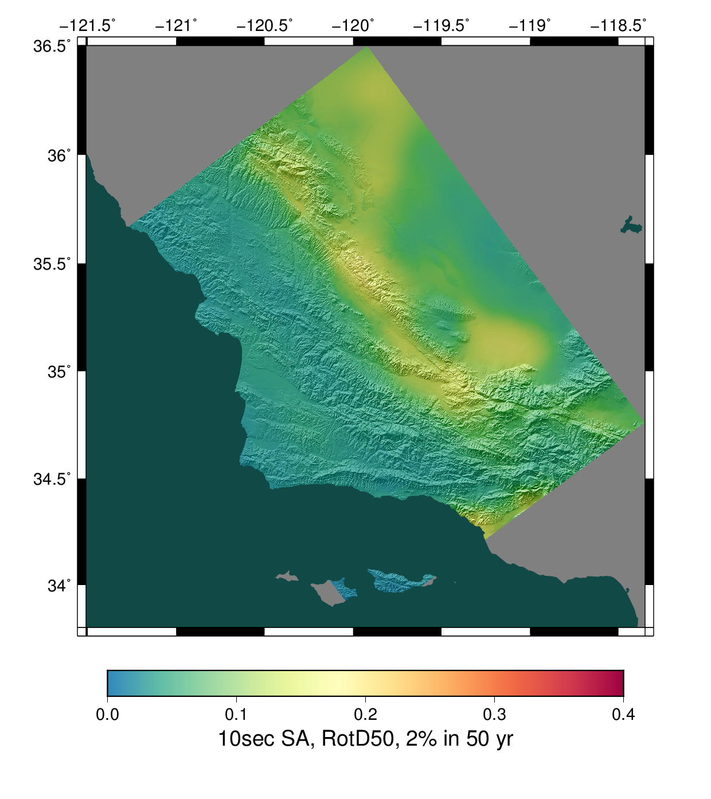
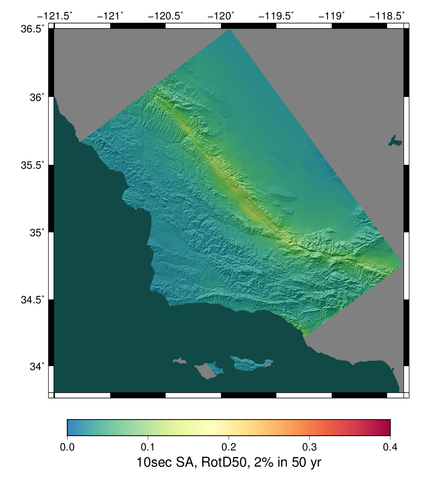
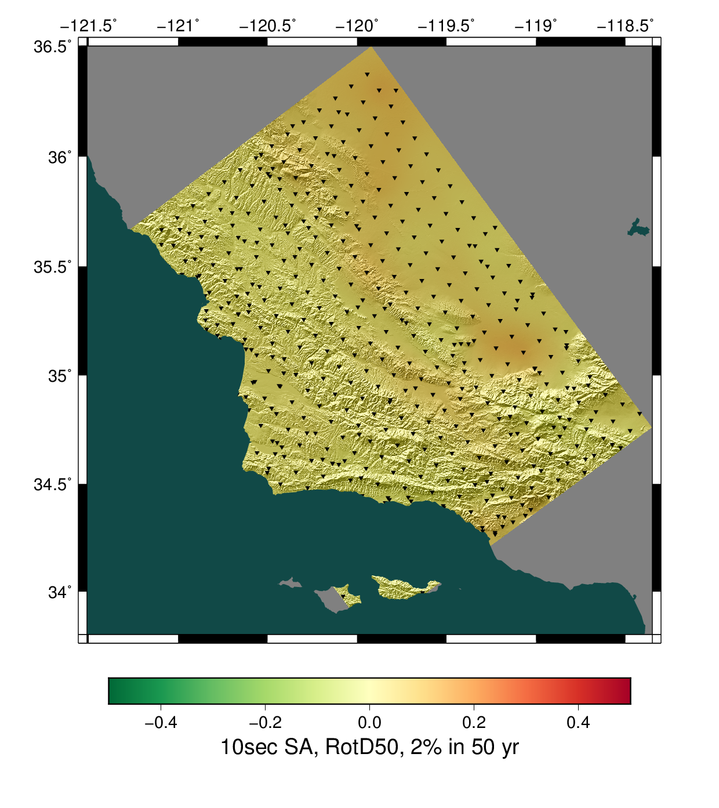

# Study 17.3 3-D Hazard Maps

**Study Details**

| **Name** | Study 17.3 3-D |
|-----|-----|
| **Date** | Mar 2017 |
| **Region** | Central California Box |
| **Description** | Central California with CCA-06 Velocity Model, 1hz |
| **Velocity Model** | CCA, iteration 6 |

**Basemap GMPE:** NGAWest2 2014 Averaged No Idriss

These are interpolated difference maps, where the differences between CyberShake and the GMPE basemap are interpolated and then added to the GMPE basemap. This results in a map which matches the CyberShake values exactly at each CyberShake site, but retains the detail (largely due to inclusion of site effects) of the GMPE basemap.
## Table Of Contents
* [2sec SA, RotD50, 2% in 50 yr](#2sec-sa-rotd50-2-in-50-yr)
* [3sec SA, RotD50, 2% in 50 yr](#3sec-sa-rotd50-2-in-50-yr)
* [5sec SA, RotD50, 2% in 50 yr](#5sec-sa-rotd50-2-in-50-yr)
* [10sec SA, RotD50, 2% in 50 yr](#10sec-sa-rotd50-2-in-50-yr)
* [Site Data Maps](#site-data-maps)
  * [Vs30: CGS/Wills VS30 Map (2015)](#vs30-cgswills-vs30-map-2015)
  * [Depth to Vs = 1.0 km/sec: SCEC CCA, Iteration 6, Basin Depth](#depth-to-vs--10-kmsec-scec-cca-iteration-6-basin-depth)
  * [Depth to Vs = 2.5 km/sec: SCEC CCA, Iteration 6, Basin Depth](#depth-to-vs--25-kmsec-scec-cca-iteration-6-basin-depth)
## 2sec SA, RotD50, 2% in 50 yr
*[(top)](#table-of-contents)*

| 
**Interpolated CyberShake Map**
 | 
**GMPE Basemap**
 |
|-----|-----|
|  |  |
| 
**Interpolated CyberShake Map w/ Sites Marked**
 | 
**GMPE Basemap**
 |
|  |  |
| 
**Difference: CyberShake - GMPE Basemap**
 | 
**Ratio: CyberShake / GMPE Basemap**
 |
|  |  |

## 3sec SA, RotD50, 2% in 50 yr
*[(top)](#table-of-contents)*

| 
**Interpolated CyberShake Map**
 | 
**GMPE Basemap**
 |
|-----|-----|
|  |  |
| 
**Interpolated CyberShake Map w/ Sites Marked**
 | 
**GMPE Basemap**
 |
|  |  |
| 
**Difference: CyberShake - GMPE Basemap**
 | 
**Ratio: CyberShake / GMPE Basemap**
 |
|  |  |

## 5sec SA, RotD50, 2% in 50 yr
*[(top)](#table-of-contents)*

| 
**Interpolated CyberShake Map**
 | 
**GMPE Basemap**
 |
|-----|-----|
|  |  |
| 
**Interpolated CyberShake Map w/ Sites Marked**
 | 
**GMPE Basemap**
 |
|  |  |
| 
**Difference: CyberShake - GMPE Basemap**
 | 
**Ratio: CyberShake / GMPE Basemap**
 |
|  |  |

## 10sec SA, RotD50, 2% in 50 yr
*[(top)](#table-of-contents)*

| 
**Interpolated CyberShake Map**
 | 
**GMPE Basemap**
 |
|-----|-----|
|  |  |
| 
**Interpolated CyberShake Map w/ Sites Marked**
 | 
**GMPE Basemap**
 |
|  |  |
| 
**Difference: CyberShake - GMPE Basemap**
 | 
**Ratio: CyberShake / GMPE Basemap**
 |
|  |  |

## Site Data Maps
### Vs30: CGS/Wills VS30 Map (2015)

### Depth to Vs = 1.0 km/sec: SCEC CCA, Iteration 6, Basin Depth

### Depth to Vs = 2.5 km/sec: SCEC CCA, Iteration 6, Basin Depth

