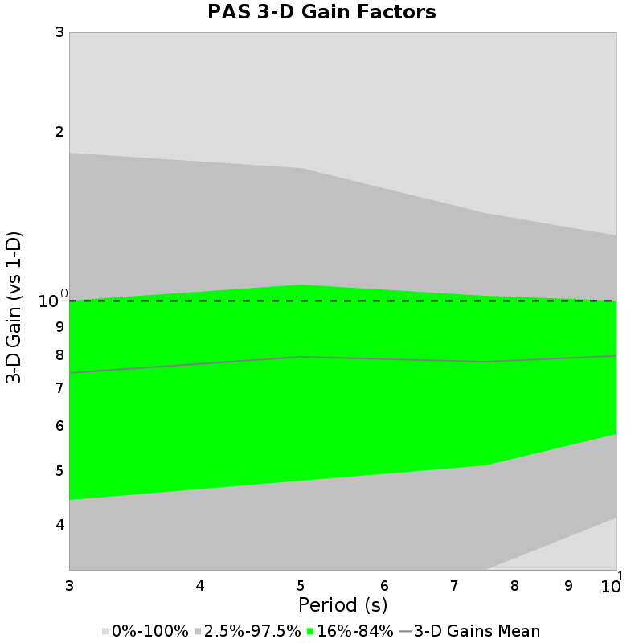
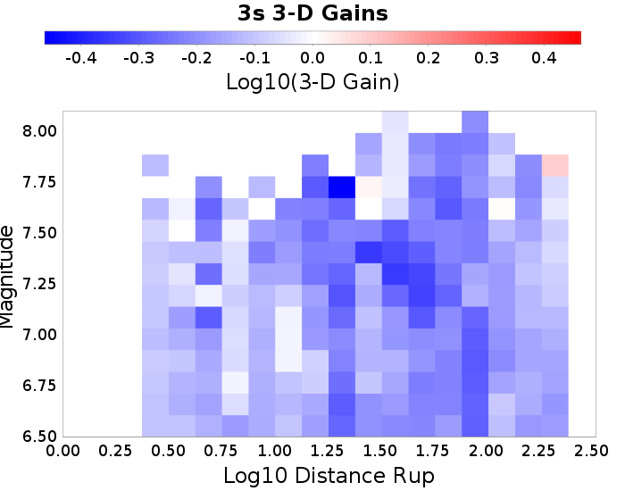
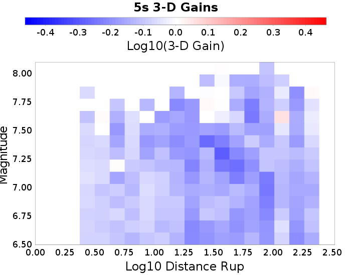
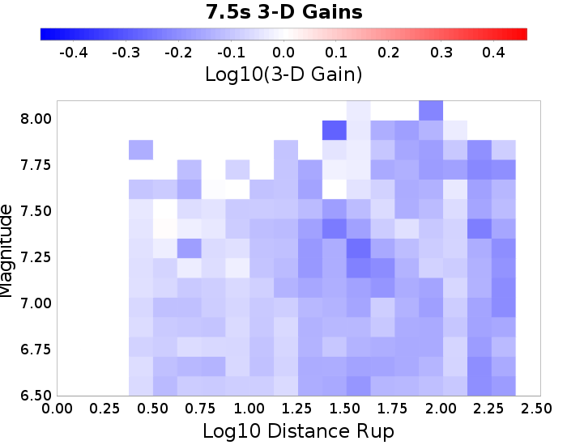
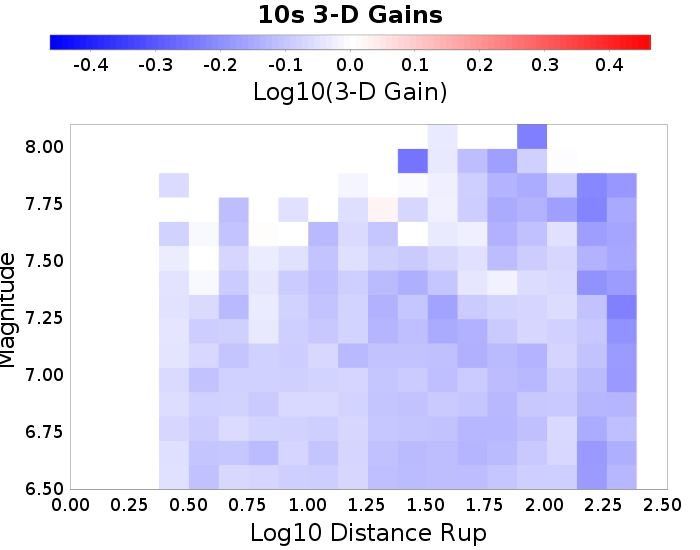

## 3-D vs 1-D Comparisons

* 3-D Model: RSQSim 2585
* 1-D Model: RSQSim/BBP

## Table Of Contents
* [3-D vs 1-D Comparisons](#3-d-vs-1-d-comparisons)
* [PAS](#pas)
  * [PAS 3-D Gain Spectra](#pas-3-d-gain-spectra)
  * [PAS 3-D Mag/Distance Gain Plots](#pas-3-d-magdistance-gain-plots)
## PAS
*[(top)](#table-of-contents)*

### PAS 3-D Gain Spectra
*[(top)](#table-of-contents)*

### PAS 3-D Mag/Distance Gain Plots
*[(top)](#table-of-contents)*

| **3s** | **5s** | **7.5s** | **10s** |
|-----|-----|-----|-----|
|  |  |  |  |

