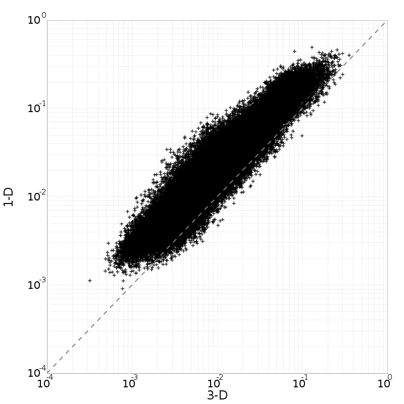
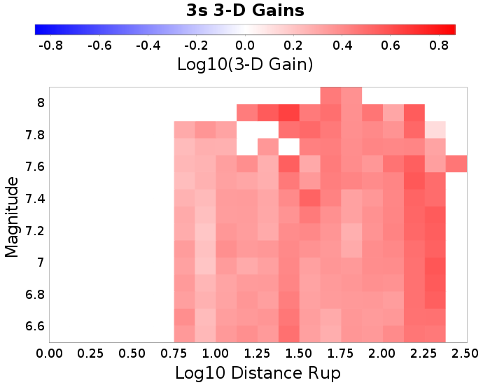
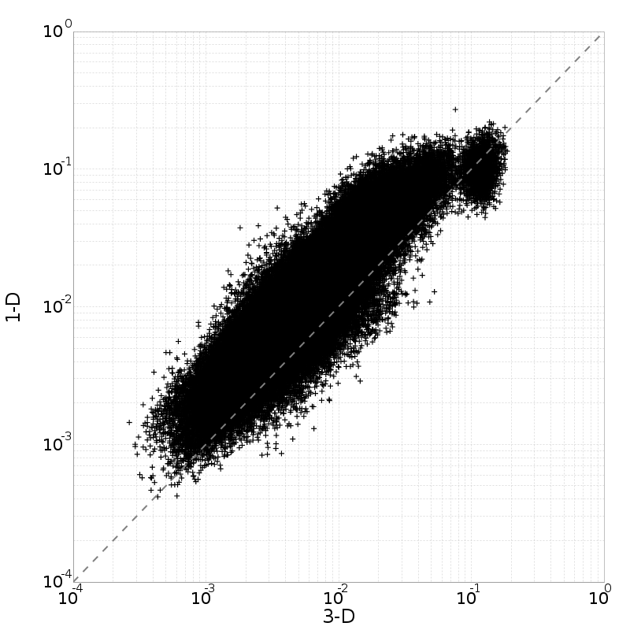
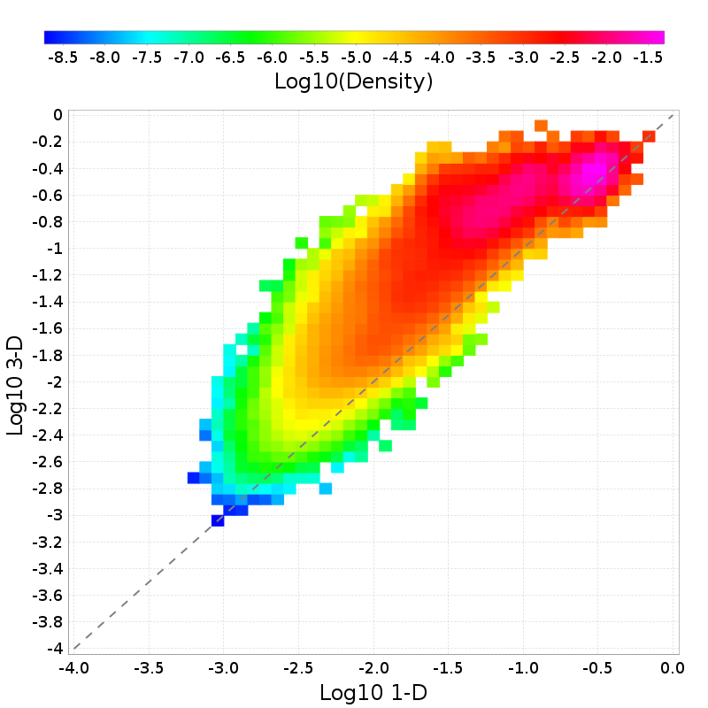

## 3-D vs 1-D Comparisons

* 3-D Model: RSQSim 2585
* 1-D Model: RSQSim-BBP (Vs30=500 m/s)

## Table Of Contents
* [3-D vs 1-D Comparisons](#3-d-vs-1-d-comparisons)
* [4 Similar Vs Sites](#4-similar-vs-sites)
  * [4 Similar Vs Sites 3-D Gain Spectra](#4-similar-vs-sites-3-d-gain-spectra)
  * [4 Similar Vs Sites Scatter Plots](#4-similar-vs-sites-scatter-plots)
  * [4 Similar Vs Sites 3-D Mag/Distance Gain Plots](#4-similar-vs-sites-3-d-magdistance-gain-plots)
* [USC](#usc)
  * [USC 3-D Gain Spectra](#usc-3-d-gain-spectra)
  * [USC Scatter Plots](#usc-scatter-plots)
  * [USC 3-D Mag/Distance Gain Plots](#usc-3-d-magdistance-gain-plots)
* [STNI](#stni)
  * [STNI 3-D Gain Spectra](#stni-3-d-gain-spectra)
  * [STNI Scatter Plots](#stni-scatter-plots)
  * [STNI 3-D Mag/Distance Gain Plots](#stni-3-d-magdistance-gain-plots)
* [SBSM](#sbsm)
  * [SBSM 3-D Gain Spectra](#sbsm-3-d-gain-spectra)
  * [SBSM Scatter Plots](#sbsm-scatter-plots)
  * [SBSM 3-D Mag/Distance Gain Plots](#sbsm-3-d-magdistance-gain-plots)
* [WNGC](#wngc)
  * [WNGC 3-D Gain Spectra](#wngc-3-d-gain-spectra)
  * [WNGC Scatter Plots](#wngc-scatter-plots)
  * [WNGC 3-D Mag/Distance Gain Plots](#wngc-3-d-magdistance-gain-plots)
## 4 Similar Vs Sites
*[(top)](#table-of-contents)*

Results for all 4 with Vs30 within 150 m/s of 1-D Vs30=500 m/s

| **Name** | **Vs30** |
|-----|-----|
| USC | 500 m/s |
| STNI | 500 m/s |
| SBSM | 500 m/s |
| WNGC | 500 m/s |

### 4 Similar Vs Sites 3-D Gain Spectra
*[(top)](#table-of-contents)*

### 4 Similar Vs Sites Scatter Plots
*[(top)](#table-of-contents)*

| **3s** | **5s** | **7.5s** | **10s** |
|-----|-----|-----|-----|
|  |  |  |  |
|  |  |  |  |

### 4 Similar Vs Sites 3-D Mag/Distance Gain Plots
*[(top)](#table-of-contents)*

| **3s** | **5s** | **7.5s** | **10s** |
|-----|-----|-----|-----|
|  |  |  |  |

## USC
*[(top)](#table-of-contents)*

| **Name** | USC |
|-----|-----|
| **Latitude** | 34.0192 |
| **Longitude** | -118.286 |
| **Site Parameters** |  |
| **Vs30** (*m/sec*) | 500.0 |
| **Depth 1.0 km/sec** (*m*) | 600.0 |
| **Depth 2.5 km/sec** (*km*) | 4.05 |

### USC 3-D Gain Spectra
*[(top)](#table-of-contents)*

### USC Scatter Plots
*[(top)](#table-of-contents)*

| **3s** | **5s** | **7.5s** | **10s** |
|-----|-----|-----|-----|
|  |  |  |  |
|  |  |  |  |

### USC 3-D Mag/Distance Gain Plots
*[(top)](#table-of-contents)*

| **3s** | **5s** | **7.5s** | **10s** |
|-----|-----|-----|-----|
|  |  |  |  |

## STNI
*[(top)](#table-of-contents)*

| **Name** | STNI |
|-----|-----|
| **Latitude** | 33.93088 |
| **Longitude** | -118.17881 |
| **Site Parameters** |  |
| **Vs30** (*m/sec*) | 500.0 |
| **Depth 1.0 km/sec** (*m*) | 900.0 |
| **Depth 2.5 km/sec** (*km*) | 5.6 |

### STNI 3-D Gain Spectra
*[(top)](#table-of-contents)*

### STNI Scatter Plots
*[(top)](#table-of-contents)*

| **3s** | **5s** | **7.5s** | **10s** |
|-----|-----|-----|-----|
|  |  |  |  |
|  |  |  |  |

### STNI 3-D Mag/Distance Gain Plots
*[(top)](#table-of-contents)*

| **3s** | **5s** | **7.5s** | **10s** |
|-----|-----|-----|-----|
|  |  |  |  |

## SBSM
*[(top)](#table-of-contents)*

| **Name** | SBSM |
|-----|-----|
| **Latitude** | 34.064987 |
| **Longitude** | -117.29201 |
| **Site Parameters** |  |
| **Vs30** (*m/sec*) | 500.0 |
| **Depth 1.0 km/sec** (*m*) | 350.0 |
| **Depth 2.5 km/sec** (*km*) | 1.8 |

### SBSM 3-D Gain Spectra
*[(top)](#table-of-contents)*

### SBSM Scatter Plots
*[(top)](#table-of-contents)*

| **3s** | **5s** | **7.5s** | **10s** |
|-----|-----|-----|-----|
|  |  |  |  |
|  |  |  |  |

### SBSM 3-D Mag/Distance Gain Plots
*[(top)](#table-of-contents)*

| **3s** | **5s** | **7.5s** | **10s** |
|-----|-----|-----|-----|
|  |  |  |  |

## WNGC
*[(top)](#table-of-contents)*

| **Name** | WNGC |
|-----|-----|
| **Latitude** | 34.041824 |
| **Longitude** | -118.0653 |
| **Site Parameters** |  |
| **Vs30** (*m/sec*) | 500.0 |
| **Depth 1.0 km/sec** (*m*) | 550.0 |
| **Depth 2.5 km/sec** (*km*) | 3.7 |

### WNGC 3-D Gain Spectra
*[(top)](#table-of-contents)*

### WNGC Scatter Plots
*[(top)](#table-of-contents)*

| **3s** | **5s** | **7.5s** | **10s** |
|-----|-----|-----|-----|
|  |  |  |  |
|  |  |  |  |

### WNGC 3-D Mag/Distance Gain Plots
*[(top)](#table-of-contents)*

| **3s** | **5s** | **7.5s** | **10s** |
|-----|-----|-----|-----|
|  |  |  |  |

