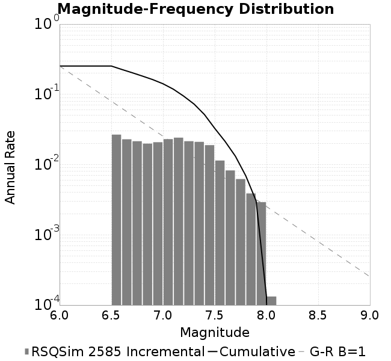
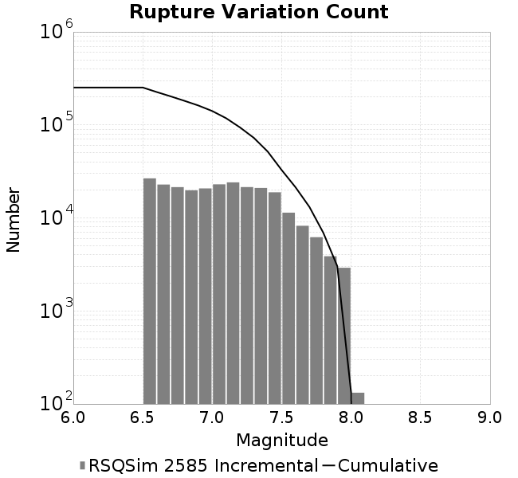
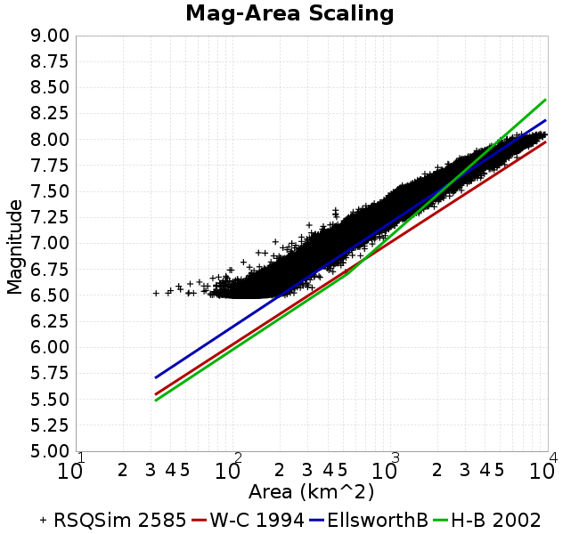
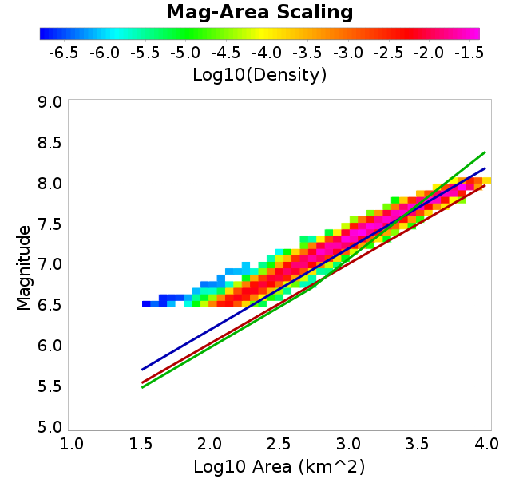

# RSQSim 2585
## Metadata
| **Name** | RSQSim 2585 |
|-----|-----|
| **Date** | Apr 2018 |
| **Region** | Central California Box |
| **Description** | RSQSim prototype with catalog 2585 (1myr) |
| **Velocity Model** | CVM-S4.26, 4.26 |

* [Metadata](#metadata)
* [Site Hazard Comparisons](#site-hazard-comparisons)
  * [GMPE: NGAWest_2014_NoIdr, Vs30 model: Simulation Value](#gmpe-ngawest2014noidr-vs30-model-simulation-value)
  * [GMPE: ASK2014, Vs30 model: Simulation Value](#gmpe-ask2014-vs30-model-simulation-value)
* [Plots](#plots)
  * [Magnitude-Frequency Plot](#magnitude-frequency-plot)
  * [Rupture Variation Count Plot](#rupture-variation-count-plot)
  * [Magnitude-Area Plots](#magnitude-area-plots)

## Site Hazard Comparisons
*[(top)](#rsqsim-2585)*

### GMPE: NGAWest_2014_NoIdr, Vs30 model: Simulation Value

* [LAPD](site_hazard_LAPD_NGAWest_2014_NoIdr_Vs30Simulation/)
* [STNI](site_hazard_STNI_NGAWest_2014_NoIdr_Vs30Simulation/)
* [USC](site_hazard_USC_NGAWest_2014_NoIdr_Vs30Simulation/)
### GMPE: ASK2014, Vs30 model: Simulation Value

* [USC](site_hazard_USC_ASK2014_Vs30Simulation/)

## Plots
### Magnitude-Frequency Plot
*[(top)](#rsqsim-2585)*

### Rupture Variation Count Plot
*[(top)](#rsqsim-2585)*

### Magnitude-Area Plots
*[(top)](#rsqsim-2585)*

| Scatter | 2-D Hist |
|-----|-----|
|  |  |
