# RSQSim 2585 USC Hazard Curves

**GMPE: NGAWest2 2014 Averaged No Idriss, Vs30 Source: Simulation Value**

**Study Details**

| **Name** | RSQSim 2585 |
|-----|-----|
| **Date** | Apr 2018 |
| **Region** | Central California Box |
| **Description** | RSQSim prototype with catalog 2585 (1myr) |
| **Velocity Model** | CVM-S4.26, 4.26 |

## Site Information

| **Name** | USC |
|-----|-----|
| **Latitude** | 34.0192 |
| **Longitude** | -118.286 |
| **GMPE Parameters** |  |
| **Vs30** (*m/sec*) | 500.0 |
| **Vs30 Type** | Inferred |
| **Depth 1.0 km/sec** (*m*) | 600.0 |
| **Depth 2.5 km/sec** (*km*) | 4.05 |

### Site Map

## Table Of Contents
* [Site Information](#site-information)
  * [Site Map](#site-map)
* [Hazard Spectra](#hazard-spectra)
  * [Source Contribution Spectra](#source-contribution-spectra)
* [Hazard Curves](#hazard-curves)
  * [3s Hazard Curves](#3s-hazard-curves)
    * [3s GMPE-Sim Comparison](#3s-gmpe-sim-comparison)
    * [3s Source Contributions](#3s-source-contributions)
    * [3s Simulation Curve Animation](#3s-simulation-curve-animation)
  * [5s Hazard Curves](#5s-hazard-curves)
    * [5s GMPE-Sim Comparison](#5s-gmpe-sim-comparison)
    * [5s Source Contributions](#5s-source-contributions)
    * [5s Simulation Curve Animation](#5s-simulation-curve-animation)
  * [7.5s Hazard Curves](#75s-hazard-curves)
    * [7.5s GMPE-Sim Comparison](#75s-gmpe-sim-comparison)
    * [7.5s Source Contributions](#75s-source-contributions)
    * [7.5s Simulation Curve Animation](#75s-simulation-curve-animation)
  * [10s Hazard Curves](#10s-hazard-curves)
    * [10s GMPE-Sim Comparison](#10s-gmpe-sim-comparison)
    * [10s Source Contributions](#10s-source-contributions)
    * [10s Simulation Curve Animation](#10s-simulation-curve-animation)
* [Disaggregations](#disaggregations)
  * [3s Disaggregations](#3s-disaggregations)
    * [3s Disaggregations at Simulation/GMPE Intersections](#3s-disaggregations-at-simulationgmpe-intersections)
    * [3s Disaggregations at Fixed Return Periods](#3s-disaggregations-at-fixed-return-periods)
    * [3s Disaggregations at Fixed IMLs](#3s-disaggregations-at-fixed-imls)
  * [5s Disaggregations](#5s-disaggregations)
    * [5s Disaggregations at Simulation/GMPE Intersections](#5s-disaggregations-at-simulationgmpe-intersections)
    * [5s Disaggregations at Fixed Return Periods](#5s-disaggregations-at-fixed-return-periods)
    * [5s Disaggregations at Fixed IMLs](#5s-disaggregations-at-fixed-imls)
  * [7.5s Disaggregations](#75s-disaggregations)
    * [7.5s Disaggregations at Simulation/GMPE Intersections](#75s-disaggregations-at-simulationgmpe-intersections)
    * [7.5s Disaggregations at Fixed Return Periods](#75s-disaggregations-at-fixed-return-periods)
    * [7.5s Disaggregations at Fixed IMLs](#75s-disaggregations-at-fixed-imls)
  * [10s Disaggregations](#10s-disaggregations)
    * [10s Disaggregations at Simulation/GMPE Intersections](#10s-disaggregations-at-simulationgmpe-intersections)
    * [10s Disaggregations at Fixed Return Periods](#10s-disaggregations-at-fixed-return-periods)
    * [10s Disaggregations at Fixed IMLs](#10s-disaggregations-at-fixed-imls)
## Hazard Spectra
*[(top)](#table-of-contents)*

**Legend**:
* **Simulations Spectra**
  * Black Solid Line: RSQSim 2585
  * Gray Solid Line: Study 15.4
  * Gray Dashed Line: Study 15.4 w/o Aleatory Mag
  * Orange Solid Line: RSQSim/BBP
* **GMPE Spectra**
  * Blue Solid Line: NGAWest_2014_NoIdr full spectra
  * Blue Dashed Line: NGAWest_2014_NoIdr, 3-sigma truncation
  * Blue Dotted Line: NGAWest_2014_NoIdr, 2-sigma truncation
  * Blue Dotted and dashed Line: NGAWest_2014_NoIdr, 1-sigma truncation
  * Green Dashed Line: NGAWest_2014_NoIdr, Fixed sigma=0.5
  * Green Dotted Line: NGAWest_2014_NoIdr, Fixed sigma=0.3
  * Green Dotted and dashed Line: NGAWest_2014_NoIdr, Fixed sigma=0

| **1000yr** | 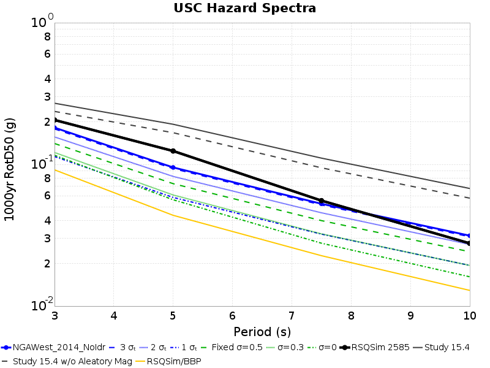 |
|-----|-----|
| **2500yr** | 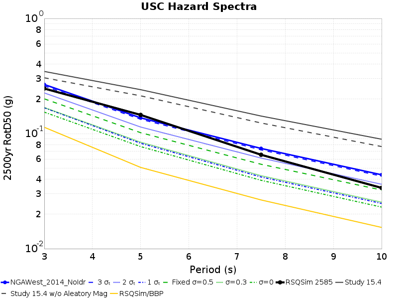 |
| **10000yr** |  |
### Source Contribution Spectra
*[(top)](#table-of-contents)*

These plots show the contribution of each fault source to the hazard spectra. The same set of sources are plotted for both simulation values (left) and GMPE values (right). Sources are sorted in the legend (and colored by) their average contrubution in the simulation results at the given return period, and only the top 10 sources are plotted.

*NOTE: Source curves are not mututally exclusive. For the case of multi fault ruptures, a single rupture can be included in the curve for multiple sources*

| **Return Period** | **Simulation Source Contributions** | **GMPE Source Contributions** |
|-----|-----|-----|
| 1000yr |  |  |
| 2500yr |  |  |
| 10000yr |  |  |

## Hazard Curves
*[(top)](#table-of-contents)*

**Legend**:
* **Simulations Curves** *(truncated below lowest possible y-value)*
  * Black Solid Line: RSQSim 2585
  * Gray Solid Line: Study 15.4
  * Gray Dashed Line: Study 15.4 w/o Aleatory Mag
  * Orange Solid Line: RSQSim/BBP
* **GMPE Curves**
  * Blue Solid Line: NGAWest_2014_NoIdr full curves
  * Blue Dashed Line: NGAWest_2014_NoIdr, 3-sigma truncation
  * Blue Dotted Line: NGAWest_2014_NoIdr, 2-sigma truncation
  * Blue Dotted and dashed Line: NGAWest_2014_NoIdr, 1-sigma truncation
  * Green Dashed Line: NGAWest_2014_NoIdr, Fixed sigma=0.5
  * Green Dotted Line: NGAWest_2014_NoIdr, Fixed sigma=0.3
  * Green Dotted and dashed Line: NGAWest_2014_NoIdr, Fixed sigma=0
* Gray Dashed Lines: 1000 yr, 2500 yr, 10000 yr return periods

### 3s Hazard Curves
*[(top)](#table-of-contents)*

#### 3s GMPE-Sim Comparison
*[(top)](#table-of-contents)*

**Legend**:
* **Simulations Curves** *(truncated below lowest possible y-value)*
  * Black Solid Line: RSQSim 2585
  * Gray Solid Line: Study 15.4
  * Gray Dashed Line: Study 15.4 w/o Aleatory Mag
  * Orange Solid Line: RSQSim/BBP
* **GMPE Curves**
  * Light Red Thin Solid Lines: NGAWest_2014_NoIdr simulations (with samples from GMPE log-normal distribution)
  * Red Solid Line: NGAWest_2014_NoIdr, mean of 100 simulations
  * Blue Solid Line: NGAWest_2014_NoIdr full curves
* Gray Dashed Lines: 1000 yr, 2500 yr, 10000 yr return periods

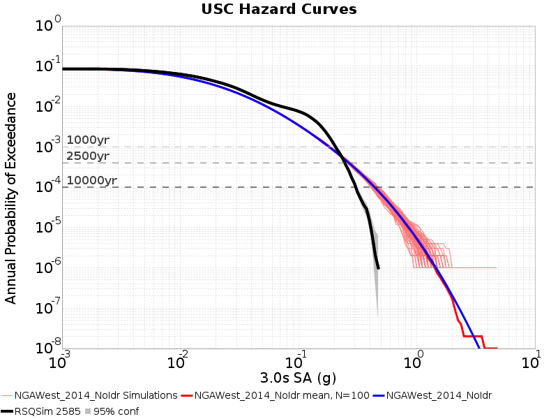

#### 3s Source Contributions
*[(top)](#table-of-contents)*

These plots show the contribution of each fault source to the hazard curves. The same set of sources are plotted for both simulation values (left) and GMPE values (right). Sources are sorted in the legend (and colored by) their contrubution in the simulation results at the **POE=4.0E-4** level, and only the top 10 sources are plotted.

*NOTE: Source curves are not mututally exclusive. For the case of multi fault ruptures, a single rupture can be included in the curve for multiple sources*

| **Simulation Source Contributions** | **GMPE Source Contributions** |
|-----|-----|
|  |  |

#### 3s Simulation Curve Animation
*[(top)](#table-of-contents)*

This animation shows the affect of input simulation catalog length on the simulation hazard curve. Each frame adds an additional 50000 years of the catalog to the simulation (in both the simulation and GMPE curves). Previous results (for shorter sub-catalogs) are faded out.

### 5s Hazard Curves
*[(top)](#table-of-contents)*

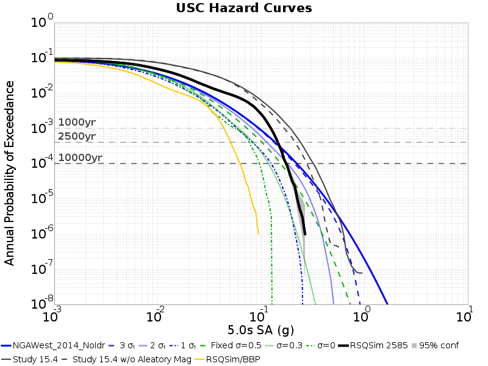

#### 5s GMPE-Sim Comparison
*[(top)](#table-of-contents)*

**Legend**:
* **Simulations Curves** *(truncated below lowest possible y-value)*
  * Black Solid Line: RSQSim 2585
  * Gray Solid Line: Study 15.4
  * Gray Dashed Line: Study 15.4 w/o Aleatory Mag
  * Orange Solid Line: RSQSim/BBP
* **GMPE Curves**
  * Light Red Thin Solid Lines: NGAWest_2014_NoIdr simulations (with samples from GMPE log-normal distribution)
  * Red Solid Line: NGAWest_2014_NoIdr, mean of 100 simulations
  * Blue Solid Line: NGAWest_2014_NoIdr full curves
* Gray Dashed Lines: 1000 yr, 2500 yr, 10000 yr return periods

#### 5s Source Contributions
*[(top)](#table-of-contents)*

These plots show the contribution of each fault source to the hazard curves. The same set of sources are plotted for both simulation values (left) and GMPE values (right). Sources are sorted in the legend (and colored by) their contrubution in the simulation results at the **POE=4.0E-4** level, and only the top 10 sources are plotted.

*NOTE: Source curves are not mututally exclusive. For the case of multi fault ruptures, a single rupture can be included in the curve for multiple sources*

| **Simulation Source Contributions** | **GMPE Source Contributions** |
|-----|-----|
| 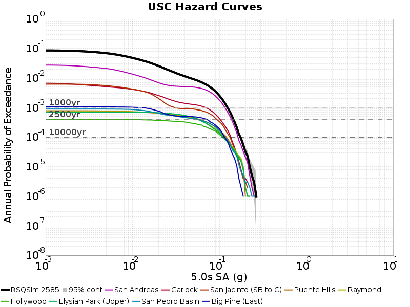 |  |

#### 5s Simulation Curve Animation
*[(top)](#table-of-contents)*

This animation shows the affect of input simulation catalog length on the simulation hazard curve. Each frame adds an additional 50000 years of the catalog to the simulation (in both the simulation and GMPE curves). Previous results (for shorter sub-catalogs) are faded out.

### 7.5s Hazard Curves
*[(top)](#table-of-contents)*

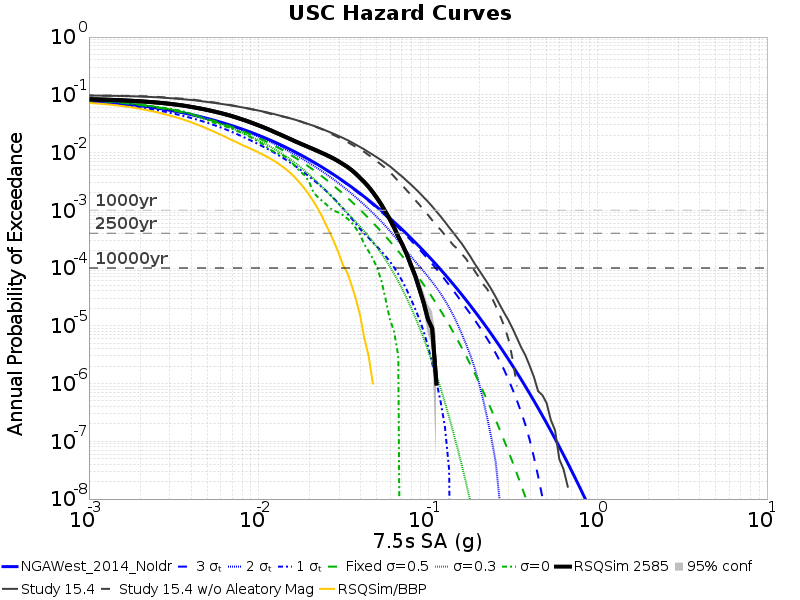

#### 7.5s GMPE-Sim Comparison
*[(top)](#table-of-contents)*

**Legend**:
* **Simulations Curves** *(truncated below lowest possible y-value)*
  * Black Solid Line: RSQSim 2585
  * Gray Solid Line: Study 15.4
  * Gray Dashed Line: Study 15.4 w/o Aleatory Mag
  * Orange Solid Line: RSQSim/BBP
* **GMPE Curves**
  * Light Red Thin Solid Lines: NGAWest_2014_NoIdr simulations (with samples from GMPE log-normal distribution)
  * Red Solid Line: NGAWest_2014_NoIdr, mean of 100 simulations
  * Blue Solid Line: NGAWest_2014_NoIdr full curves
* Gray Dashed Lines: 1000 yr, 2500 yr, 10000 yr return periods

#### 7.5s Source Contributions
*[(top)](#table-of-contents)*

These plots show the contribution of each fault source to the hazard curves. The same set of sources are plotted for both simulation values (left) and GMPE values (right). Sources are sorted in the legend (and colored by) their contrubution in the simulation results at the **POE=4.0E-4** level, and only the top 10 sources are plotted.

*NOTE: Source curves are not mututally exclusive. For the case of multi fault ruptures, a single rupture can be included in the curve for multiple sources*

| **Simulation Source Contributions** | **GMPE Source Contributions** |
|-----|-----|
| 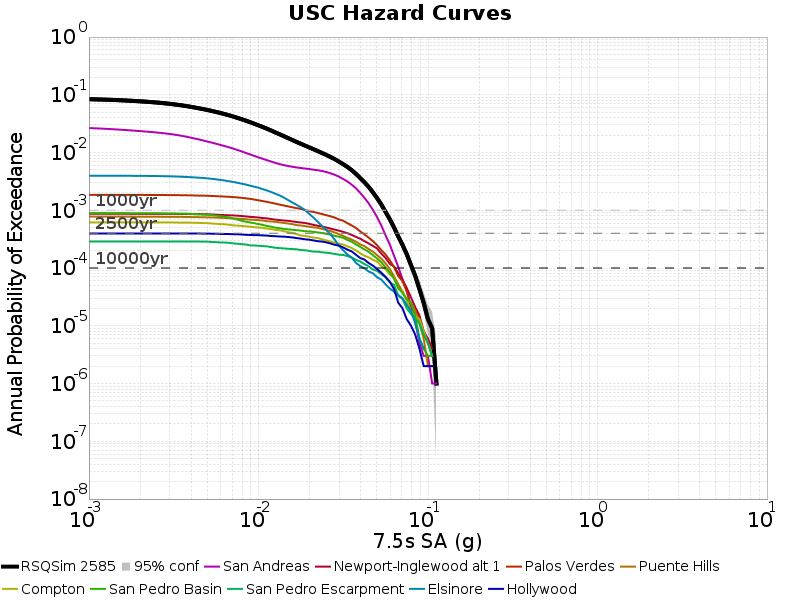 | 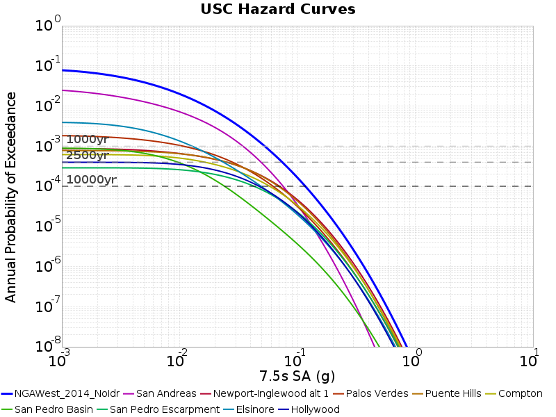 |

#### 7.5s Simulation Curve Animation
*[(top)](#table-of-contents)*

This animation shows the affect of input simulation catalog length on the simulation hazard curve. Each frame adds an additional 50000 years of the catalog to the simulation (in both the simulation and GMPE curves). Previous results (for shorter sub-catalogs) are faded out.

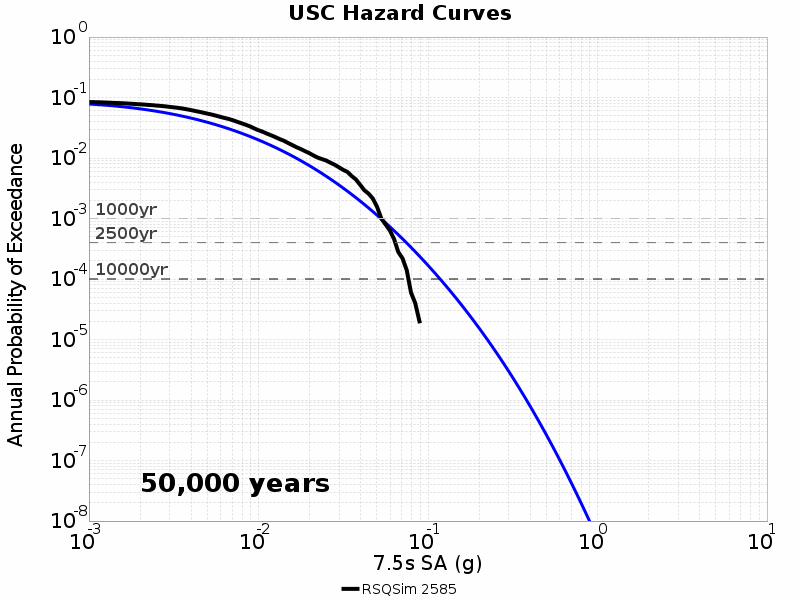

### 10s Hazard Curves
*[(top)](#table-of-contents)*

#### 10s GMPE-Sim Comparison
*[(top)](#table-of-contents)*

**Legend**:
* **Simulations Curves** *(truncated below lowest possible y-value)*
  * Black Solid Line: RSQSim 2585
  * Gray Solid Line: Study 15.4
  * Gray Dashed Line: Study 15.4 w/o Aleatory Mag
  * Orange Solid Line: RSQSim/BBP
* **GMPE Curves**
  * Light Red Thin Solid Lines: NGAWest_2014_NoIdr simulations (with samples from GMPE log-normal distribution)
  * Red Solid Line: NGAWest_2014_NoIdr, mean of 100 simulations
  * Blue Solid Line: NGAWest_2014_NoIdr full curves
* Gray Dashed Lines: 1000 yr, 2500 yr, 10000 yr return periods

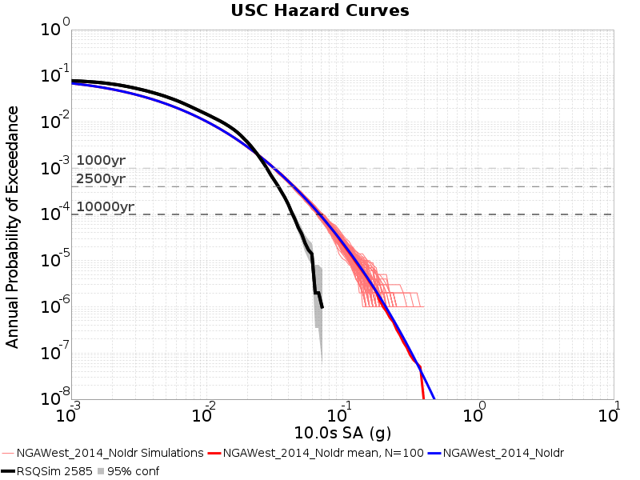

#### 10s Source Contributions
*[(top)](#table-of-contents)*

These plots show the contribution of each fault source to the hazard curves. The same set of sources are plotted for both simulation values (left) and GMPE values (right). Sources are sorted in the legend (and colored by) their contrubution in the simulation results at the **POE=4.0E-4** level, and only the top 10 sources are plotted.

*NOTE: Source curves are not mututally exclusive. For the case of multi fault ruptures, a single rupture can be included in the curve for multiple sources*

| **Simulation Source Contributions** | **GMPE Source Contributions** |
|-----|-----|
| 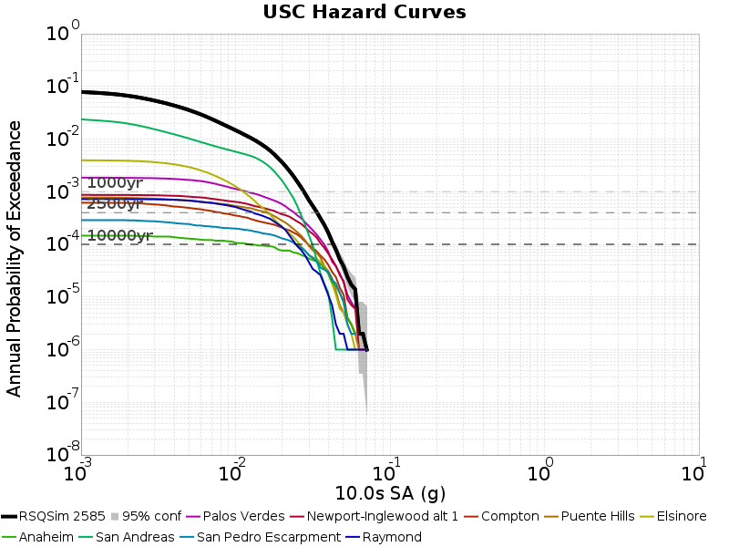 | 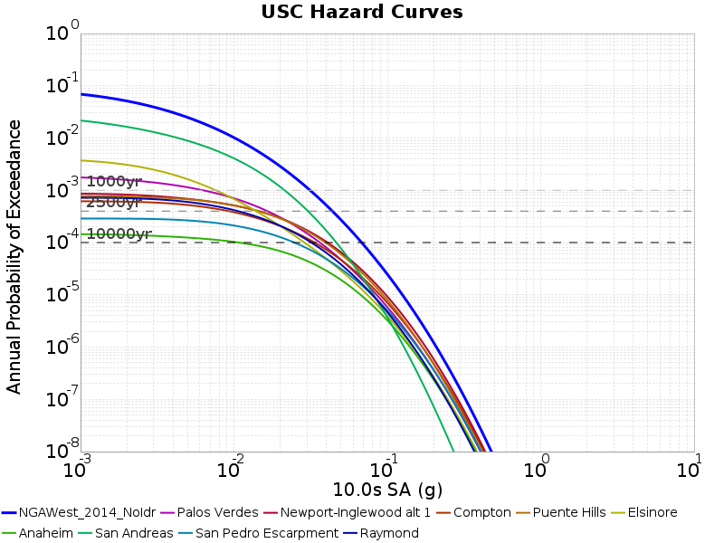 |

#### 10s Simulation Curve Animation
*[(top)](#table-of-contents)*

This animation shows the affect of input simulation catalog length on the simulation hazard curve. Each frame adds an additional 50000 years of the catalog to the simulation (in both the simulation and GMPE curves). Previous results (for shorter sub-catalogs) are faded out.

## Disaggregations
*[(top)](#table-of-contents)*

**Note on Epsilons:** Epsilon values are not straightforward for simulations. For a GMPE (in natural log space):

**GMPE Epsilon:** *epsilon = (gmpe_IML - gmpe_mean)/gmpe_sigma*

This simulation does not have distributions for each rupture, so in order to compute an epsilon, we must use the GMPE mean and sigma values:

**Simulation w/ GMPE Distribution Epsilon:** *epsilon = (sim_IML - gmpe_mean)/gmpe_sigma*

### 3s Disaggregations
*[(top)](#table-of-contents)*

#### 3s Disaggregations at Simulation/GMPE Intersections
*[(top)](#table-of-contents)*

| **Disagg Level** | **RSQSim 2585 w/ GMPE dist for Epsilon** | **NGAWest2 2014 Averaged No Idriss** |
|-----|-----|-----|
| **1777 yr 0.23286599 g** |  |  |

#### 3s Disaggregations at Fixed Return Periods
*[(top)](#table-of-contents)*

| **Disagg Level** | **RSQSim 2585 w/ GMPE dist for Epsilon** | **NGAWest2 2014 Averaged No Idriss** |
|-----|-----|-----|
| **1000 yr** |  |  |
| **2500 yr** |  |  |
| **10000 yr** |  |  |

#### 3s Disaggregations at Fixed IMLs
*[(top)](#table-of-contents)*

| **Disagg Level** | **RSQSim 2585 w/ GMPE dist for Epsilon** | **NGAWest2 2014 Averaged No Idriss** |
|-----|-----|-----|
| **0.1 g** |  |  |
| **0.5 g** | N/A | N/A |  |
| **1.0 g** | N/A | N/A |  |

### 5s Disaggregations
*[(top)](#table-of-contents)*

#### 5s Disaggregations at Simulation/GMPE Intersections
*[(top)](#table-of-contents)*

| **Disagg Level** | **RSQSim 2585 w/ GMPE dist for Epsilon** | **NGAWest2 2014 Averaged No Idriss** |
|-----|-----|-----|
| **3270 yr 0.15144812 g** |  |  |

#### 5s Disaggregations at Fixed Return Periods
*[(top)](#table-of-contents)*

| **Disagg Level** | **RSQSim 2585 w/ GMPE dist for Epsilon** | **NGAWest2 2014 Averaged No Idriss** |
|-----|-----|-----|
| **1000 yr** |  |  |
| **2500 yr** |  |  |
| **10000 yr** |  |  |

#### 5s Disaggregations at Fixed IMLs
*[(top)](#table-of-contents)*

| **Disagg Level** | **RSQSim 2585 w/ GMPE dist for Epsilon** | **NGAWest2 2014 Averaged No Idriss** |
|-----|-----|-----|
| **0.1 g** |  |  |
| **0.5 g** | N/A | N/A |  |
| **1.0 g** | N/A | N/A |  |

### 7.5s Disaggregations
*[(top)](#table-of-contents)*

#### 7.5s Disaggregations at Simulation/GMPE Intersections
*[(top)](#table-of-contents)*

| **Disagg Level** | **RSQSim 2585 w/ GMPE dist for Epsilon** | **NGAWest2 2014 Averaged No Idriss** |
|-----|-----|-----|
| **1311 yr 0.05868364 g** |  |  |

#### 7.5s Disaggregations at Fixed Return Periods
*[(top)](#table-of-contents)*

| **Disagg Level** | **RSQSim 2585 w/ GMPE dist for Epsilon** | **NGAWest2 2014 Averaged No Idriss** |
|-----|-----|-----|
| **1000 yr** |  |  |
| **2500 yr** |  |  |
| **10000 yr** |  |  |

#### 7.5s Disaggregations at Fixed IMLs
*[(top)](#table-of-contents)*

| **Disagg Level** | **RSQSim 2585 w/ GMPE dist for Epsilon** | **NGAWest2 2014 Averaged No Idriss** |
|-----|-----|-----|
| **0.1 g** |  |  |
| **0.5 g** | N/A | N/A |  |
| **1.0 g** | N/A | N/A |  |

### 10s Disaggregations
*[(top)](#table-of-contents)*

#### 10s Disaggregations at Simulation/GMPE Intersections
*[(top)](#table-of-contents)*

| **Disagg Level** | **RSQSim 2585 w/ GMPE dist for Epsilon** | **NGAWest2 2014 Averaged No Idriss** |
|-----|-----|-----|
| **504 yr 0.023714153 g** |  |  |

#### 10s Disaggregations at Fixed Return Periods
*[(top)](#table-of-contents)*

| **Disagg Level** | **RSQSim 2585 w/ GMPE dist for Epsilon** | **NGAWest2 2014 Averaged No Idriss** |
|-----|-----|-----|
| **1000 yr** |  |  |
| **2500 yr** |  |  |
| **10000 yr** |  |  |

#### 10s Disaggregations at Fixed IMLs
*[(top)](#table-of-contents)*

| **Disagg Level** | **RSQSim 2585 w/ GMPE dist for Epsilon** | **NGAWest2 2014 Averaged No Idriss** |
|-----|-----|-----|
| **0.1 g** | N/A | N/A |  |
| **0.5 g** | N/A | N/A |  |
| **1.0 g** | N/A | N/A |  |

