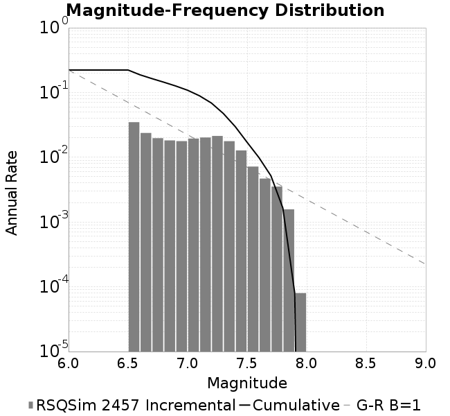
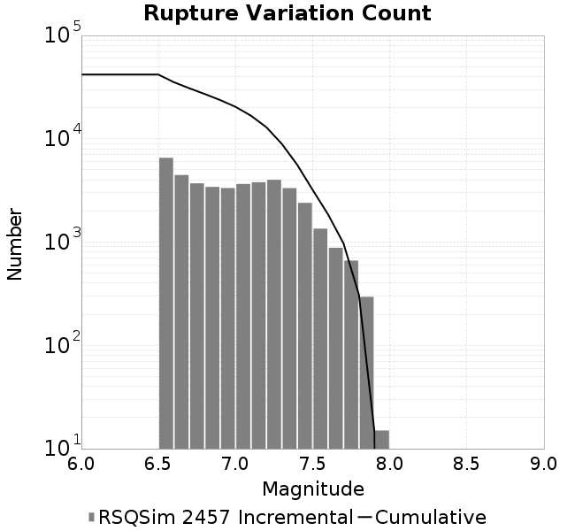
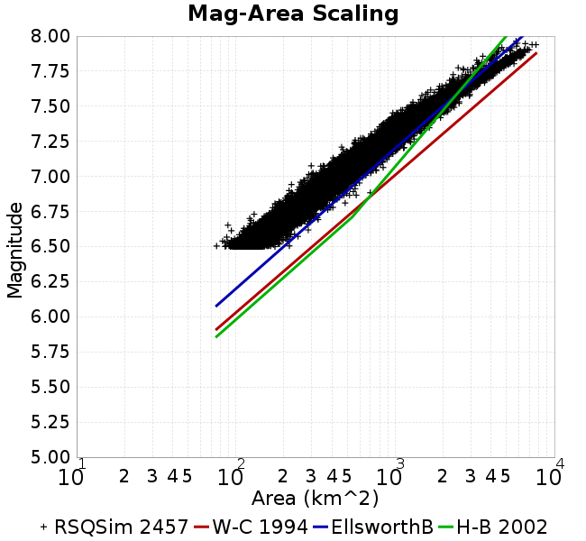
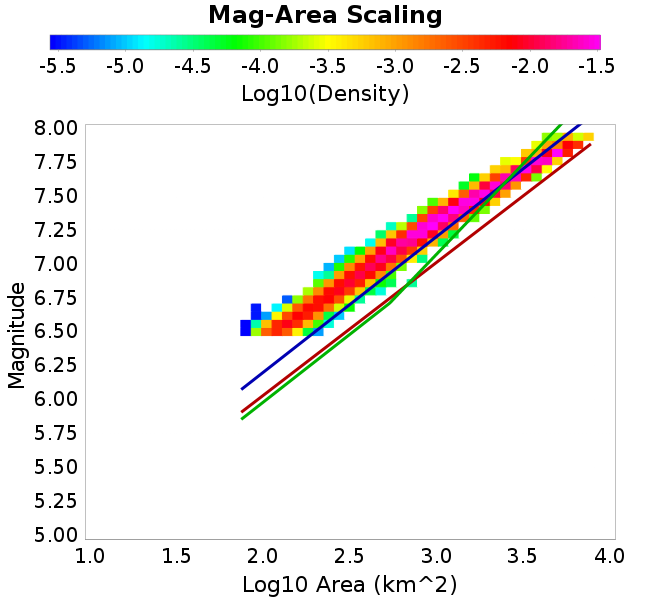

# RSQSim 2457
## Metadata
| **Name** | RSQSim 2457 |
|-----|-----|
| **Date** | Apr 2018 |
| **Region** | Central California Box |
| **Description** | RSQSim prototype with catalog 2457 |
| **Velocity Model** | CVM-S4.26, 4.26 |

* [Metadata](#metadata)
* [GMPE Comparisons](#gmpe-comparisons)
  * [Vs30 model for GMPE comparisons: Wills 2015](#vs30-model-for-gmpe-comparisons-wills-2015)
  * [Vs30 model for GMPE comparisons: Simulation Value](#vs30-model-for-gmpe-comparisons-simulation-value)
* [Site Hazard Comparisons](#site-hazard-comparisons)
* [Plots](#plots)
  * [Magnitude-Frequency Plot](#magnitude-frequency-plot)
  * [Rupture Variation Count Plot](#rupture-variation-count-plot)
  * [Magnitude-Area Plots](#magnitude-area-plots)

## GMPE Comparisons
*[(top)](#rsqsim-2457)*

### Vs30 model for GMPE comparisons: Wills 2015

* [NGAWest_2014_NoIdr](gmpe_comparisons_NGAWest_2014_NoIdr_Vs30Wills2015/)
### Vs30 model for GMPE comparisons: Simulation Value

* [NGAWest_2014_NoIdr](gmpe_comparisons_NGAWest_2014_NoIdr_Vs30Simulation/)

## Site Hazard Comparisons
*[(top)](#rsqsim-2457)*

* [USC](site_hazard_USC_Vs30Simulation/)

## Plots
### Magnitude-Frequency Plot
*[(top)](#rsqsim-2457)*

### Rupture Variation Count Plot
*[(top)](#rsqsim-2457)*

### Magnitude-Area Plots
*[(top)](#rsqsim-2457)*

| Scatter | 2-D Hist |
|-----|-----|
|  |  |
