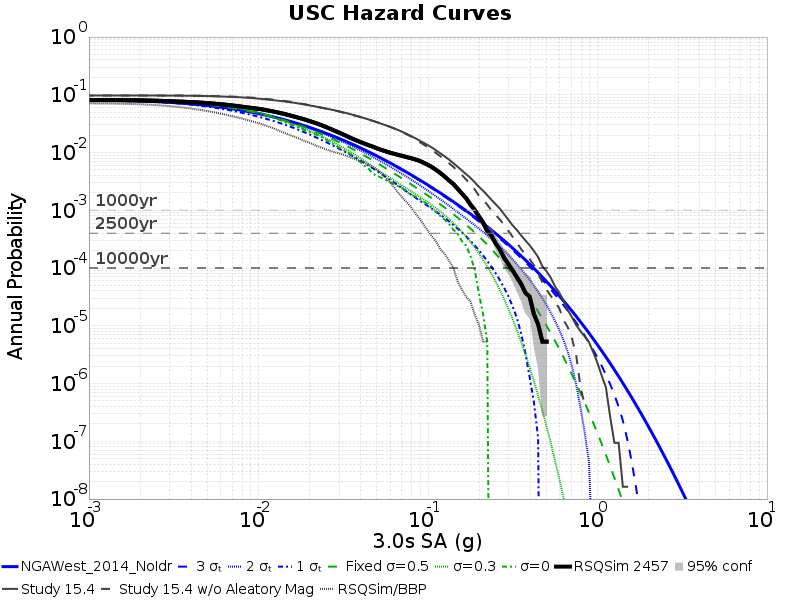
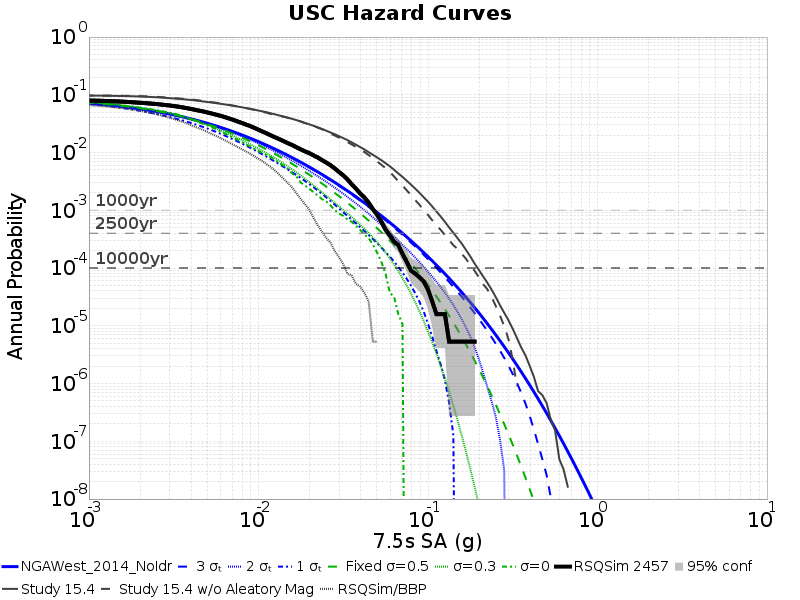

## Table Of Contents
* [Hazard Curves](#hazard-curves)
  * [3s Hazard Curves](#3s-hazard-curves)
  * [5s Hazard Curves](#5s-hazard-curves)
  * [7.5s Hazard Curves](#75s-hazard-curves)
  * [10s Hazard Curves](#10s-hazard-curves)
## Hazard Curves
*[(top)](#table-of-contents)*

**Legend**:
* **Simulations Curves**
 * Black Solid Line: RSQSim 2457
* **GMPE Curves**
 * Blue Solid Line: NGAWest_2014_NoIdr full curve
 * Blue Dashed Line: NGAWest_2014_NoIdr, 3-sigma truncation
 * Blue Dotted Line: NGAWest_2014_NoIdr, 2-sigma truncation
 * Blue Dotted and dashed Line: NGAWest_2014_NoIdr, 1-sigma truncation
* Green Dashed Line: NGAWest_2014_NoIdr, Fixed sigma=0.3
* Green Dotted Line: NGAWest_2014_NoIdr, Fixed sigma=0
* Gray Dashed Lines: 1000 yr, 2500 yr, 10000 yr return periods

### 3s Hazard Curves
*[(top)](#table-of-contents)*

### 5s Hazard Curves
*[(top)](#table-of-contents)*

### 7.5s Hazard Curves
*[(top)](#table-of-contents)*

### 10s Hazard Curves
*[(top)](#table-of-contents)*

