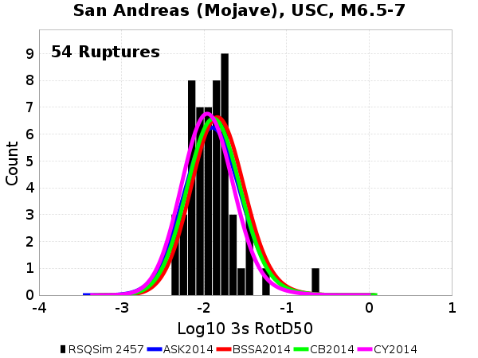
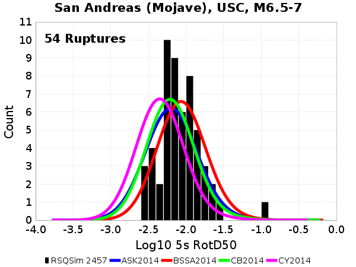
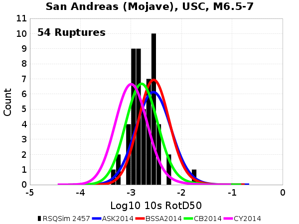
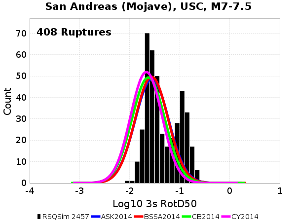
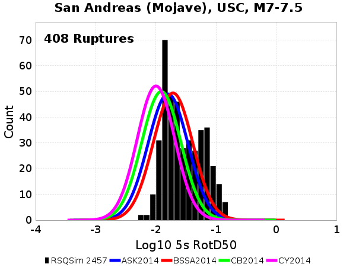
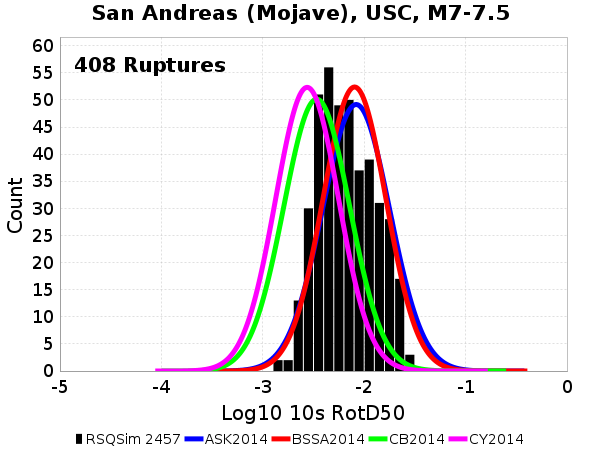
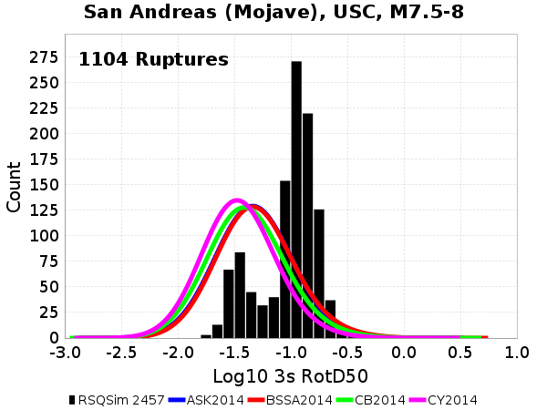
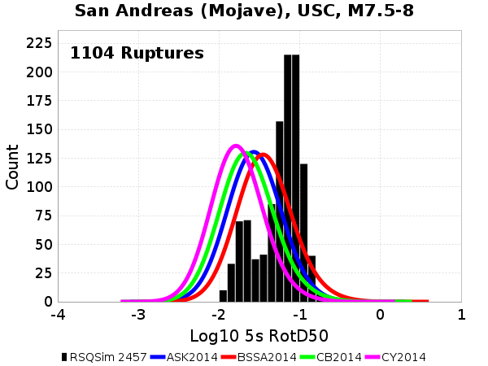
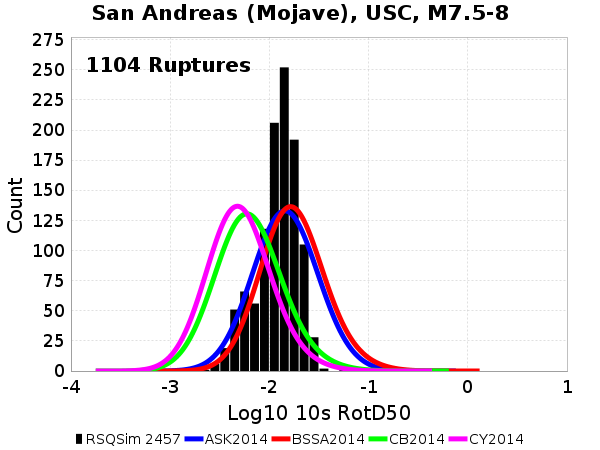

# RSQSim 2457 Source/Site GMPE Comparisons

**Vs30 Source: Simulation Value**

**GMPEs:**
* Abrahamson, Silva & Kamai (2014)
* Boore, Stewart, Seyhan & Atkinson (2014)
* Campbell & Bozorgnia (2014)
* Chiou & Youngs (2014)

## Table Of Contents
* [San Andreas (Mojave)](#san-andreas-mojave)
  * [San Andreas (Mojave), USC](#san-andreas-mojave-usc)
## San Andreas (Mojave)
*[(top)](#table-of-contents)*

### San Andreas (Mojave), USC
*[(top)](#table-of-contents)*

| Mag Range | **3s** | **5s** | **10s** |
|-----|-----|-----|-----|
| **M6.5-7** |  |  |  |
| **M7-7.5** |  |  |  |
| **M7.5-8** |  |  |  |
