# Study 18.8
## Metadata
| **Name** | Study 18.8 |
|-----|-----|
| **Date** | Aug 2018 |
| **Region** | CyberShake Bay Area Map Region |
| **Description** | Northern California with Bay Area, CCA, and CVM-S4.26 Velocity Models, 1hz |
| **Velocity Model** | Study 18.8 Stitched,  |

* [Metadata](#metadata)
* [Hazard Maps](hazard_maps/)
* [Plots](#plots)
  * [Magnitude-Frequency Plot](#magnitude-frequency-plot)
  * [Rupture Variation Count Plot](#rupture-variation-count-plot)
  * [Magnitude-Area Plots](#magnitude-area-plots)
  * [Slip-Area Plots](#slip-area-plots)
  * [Plots Without Aleatory Magnitude Variability](#plots-without-aleatory-magnitude-variability)
    * [No-Aleatory Magnitude-Frequency Plot](#no-aleatory-magnitude-frequency-plot)
    * [No-Aleatory Rupture Variation Count Plot](#no-aleatory-rupture-variation-count-plot)
    * [No-Aleatory Magnitude-Area Plots](#no-aleatory-magnitude-area-plots)
    * [No-Aleatory Slip-Area Plots](#no-aleatory-slip-area-plots)

## Hazard Maps
*[(top)](#study-188)*

[Hazard Maps Plotted Here](hazard_maps/)

## Plots
### Magnitude-Frequency Plot
*[(top)](#study-188)*

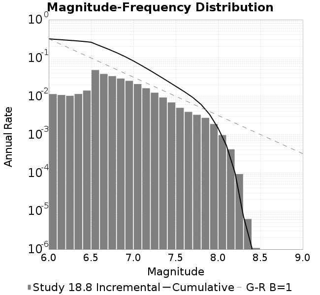
### Rupture Variation Count Plot
*[(top)](#study-188)*

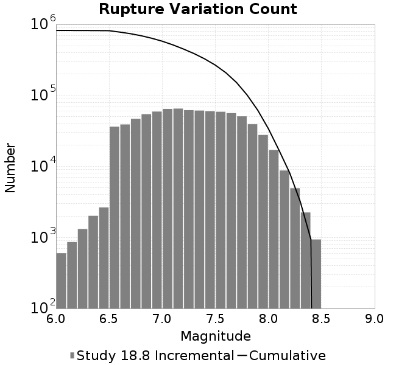
### Magnitude-Area Plots
*[(top)](#study-188)*

| Scatter | 2-D Hist |
|-----|-----|
| 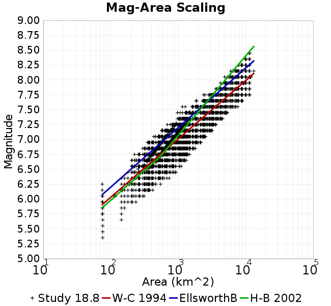 | 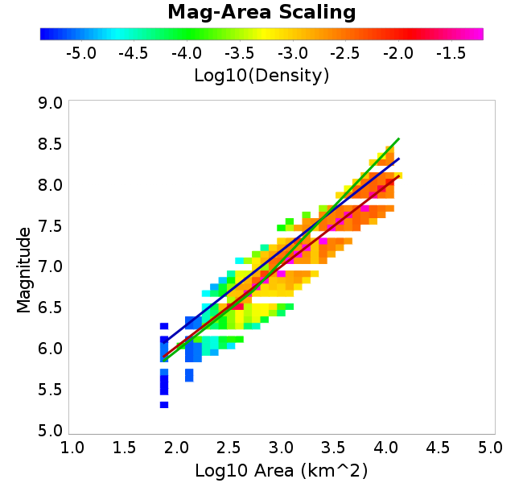 |
### Slip-Area Plots
*[(top)](#study-188)*

| Scatter | 2-D Hist |
|-----|-----|
| 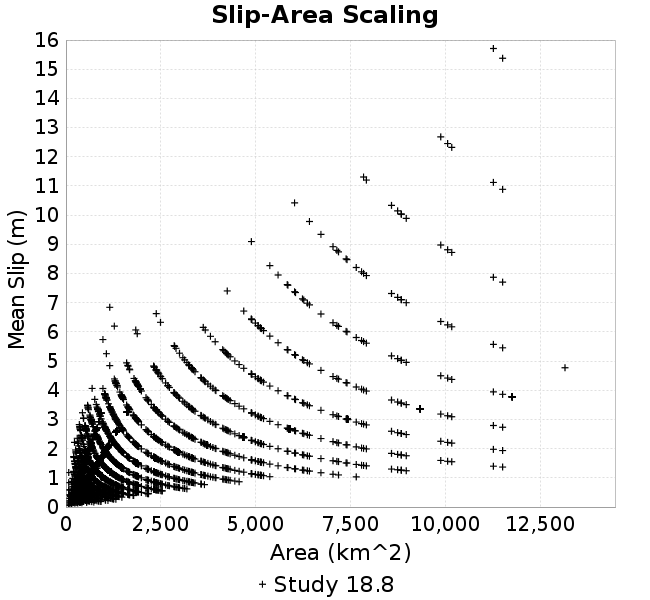 | 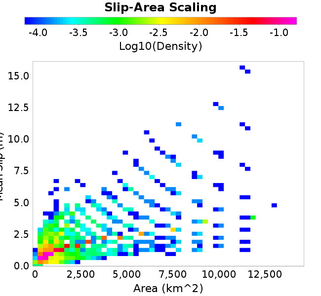 |
### Plots Without Aleatory Magnitude Variability
#### No-Aleatory Magnitude-Frequency Plot
*[(top)](#study-188)*

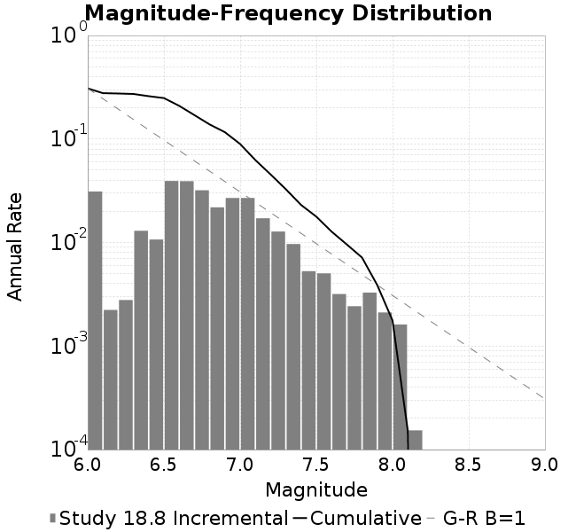
#### No-Aleatory Rupture Variation Count Plot
*[(top)](#study-188)*

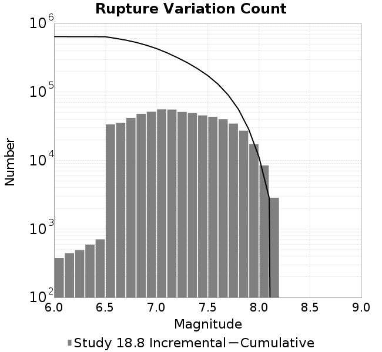
#### No-Aleatory Magnitude-Area Plots
*[(top)](#study-188)*

| Scatter | 2-D Hist |
|-----|-----|
| 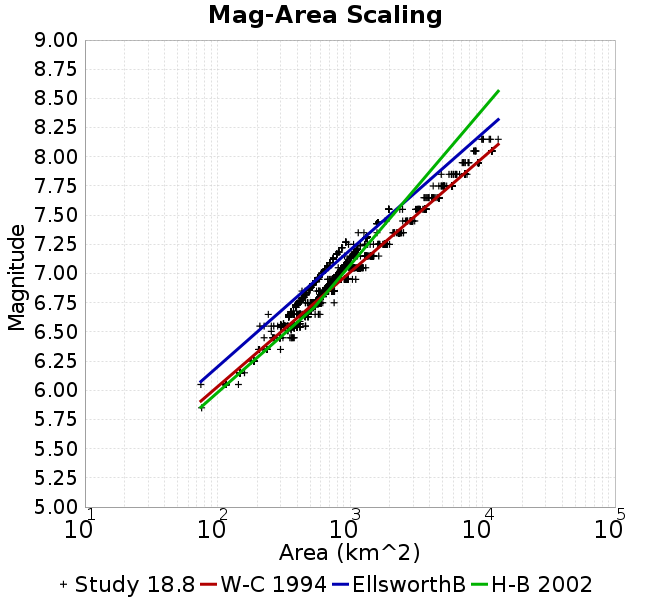 | 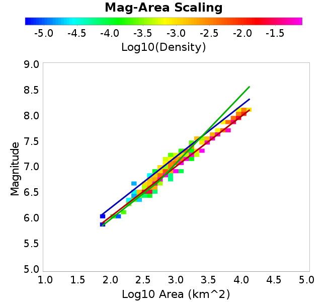 |
#### No-Aleatory Slip-Area Plots
*[(top)](#study-188)*

| Scatter | 2-D Hist |
|-----|-----|
| 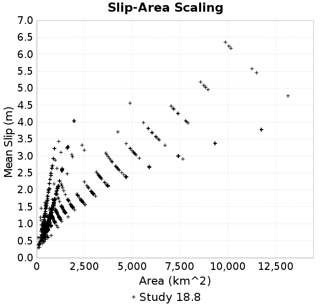 | 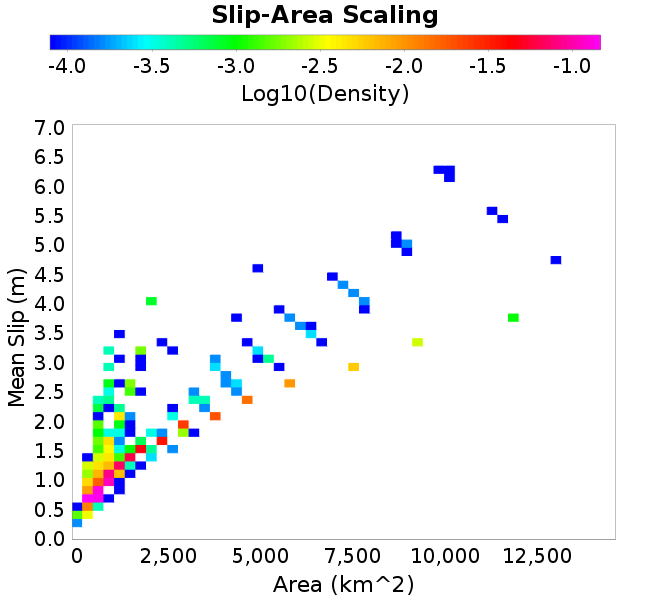 |
