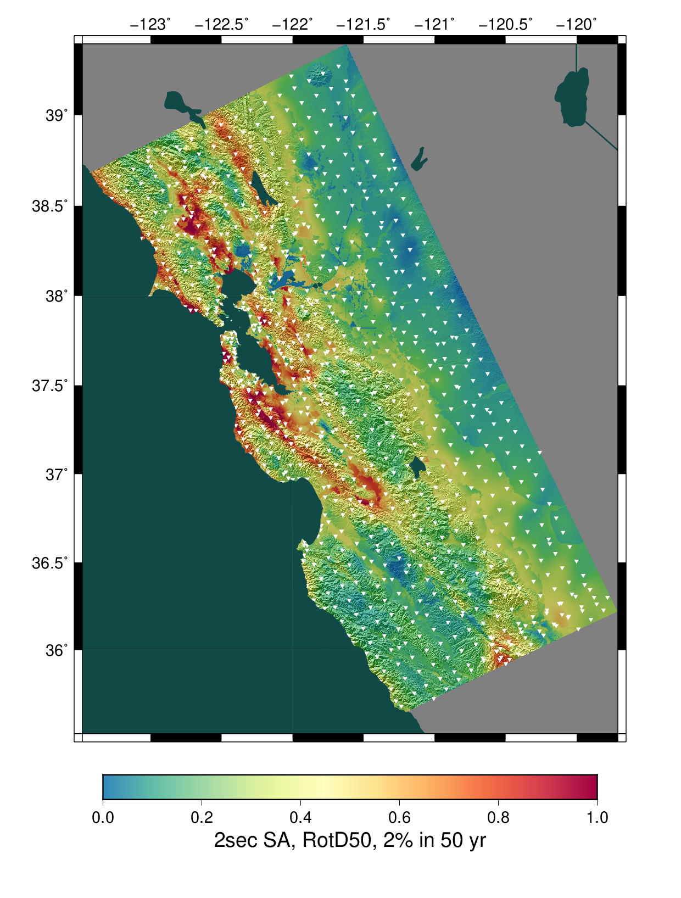
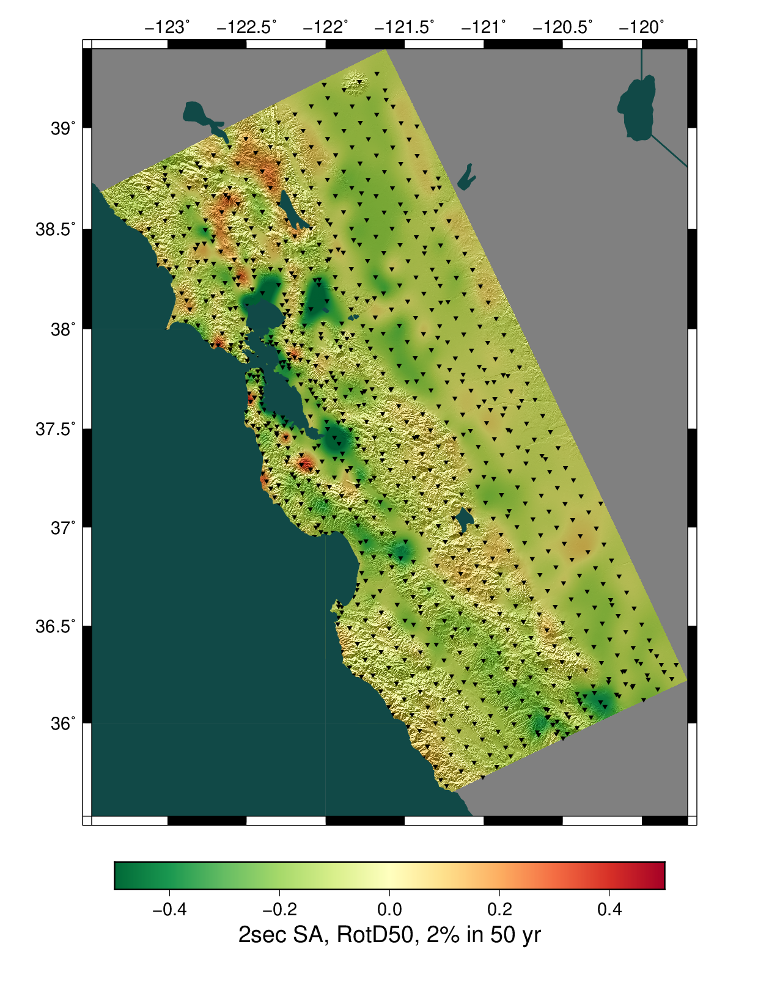
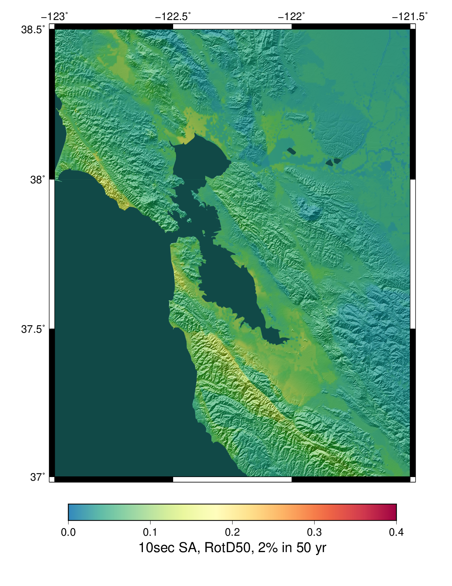

# Study 18.8 Hazard Maps

**Study Details**

| **Name** | Study 18.8 |
|-----|-----|
| **Date** | Aug 2018 |
| **Region** | CyberShake Bay Area Map Region |
| **Description** | Northern California with Bay Area, CCA, and CVM-S4.26 Velocity Models, 1hz |
| **Velocity Model** | Study 18.8 Stitched,  |

**Basemap GMPE:** NGAWest2 2014 Averaged No Idriss

These are interpolated difference maps, where the differences between CyberShake and the GMPE basemap are interpolated and then added to the GMPE basemap. This results in a map which matches the CyberShake values exactly at each CyberShake site, but retains the detail (largely due to inclusion of site effects) of the GMPE basemap.
## Table Of Contents
* [2sec SA, RotD50, 2% in 50 yr](#2sec-sa-rotd50-2-in-50-yr)
* [3sec SA, RotD50, 2% in 50 yr](#3sec-sa-rotd50-2-in-50-yr)
* [5sec SA, RotD50, 2% in 50 yr](#5sec-sa-rotd50-2-in-50-yr)
* [10sec SA, RotD50, 2% in 50 yr](#10sec-sa-rotd50-2-in-50-yr)
* [Site Data Maps](#site-data-maps)
  * [Vs30: CGS/Wills VS30 Map (2015)](#vs30-cgswills-vs30-map-2015)
  * [Depth to Vs = 1.0 km/sec: SCEC CyberShake Study 18.8 Stitched Basin Depth](#depth-to-vs--10-kmsec-scec-cybershake-study-188-stitched-basin-depth)
  * [Depth to Vs = 2.5 km/sec: SCEC CyberShake Study 18.8 Stitched Basin Depth](#depth-to-vs--25-kmsec-scec-cybershake-study-188-stitched-basin-depth)
* [Zoomed Maps](#zoomed-maps)
  * [Zoomed 2sec SA, RotD50, 2% in 50 yr](#zoomed-2sec-sa-rotd50-2-in-50-yr)
  * [Zoomed 3sec SA, RotD50, 2% in 50 yr](#zoomed-3sec-sa-rotd50-2-in-50-yr)
  * [Zoomed 5sec SA, RotD50, 2% in 50 yr](#zoomed-5sec-sa-rotd50-2-in-50-yr)
  * [Zoomed 10sec SA, RotD50, 2% in 50 yr](#zoomed-10sec-sa-rotd50-2-in-50-yr)
  * [Zoomed Site Data Maps](#zoomed-site-data-maps)
    * [Zoomed Vs30: CGS/Wills VS30 Map (2015)](#zoomed-vs30-cgswills-vs30-map-2015)
    * [Zoomed Depth to Vs = 1.0 km/sec: SCEC CyberShake Study 18.8 Stitched Basin Depth](#zoomed-depth-to-vs--10-kmsec-scec-cybershake-study-188-stitched-basin-depth)
    * [Zoomed Depth to Vs = 2.5 km/sec: SCEC CyberShake Study 18.8 Stitched Basin Depth](#zoomed-depth-to-vs--25-kmsec-scec-cybershake-study-188-stitched-basin-depth)
## 2sec SA, RotD50, 2% in 50 yr
*[(top)](#table-of-contents)*

| 
**Interpolated CyberShake Map**
 | 
**GMPE Basemap**
 |
|-----|-----|
|  |  |
| 
**Interpolated CyberShake Map w/ Sites Marked**
 | 
**GMPE Basemap**
 |
|  |  |
| 
**Difference: CyberShake - GMPE Basemap**
 | 
**Ratio: CyberShake / GMPE Basemap**
 |
|  |  |

## 3sec SA, RotD50, 2% in 50 yr
*[(top)](#table-of-contents)*

| 
**Interpolated CyberShake Map**
 | 
**GMPE Basemap**
 |
|-----|-----|
|  |  |
| 
**Interpolated CyberShake Map w/ Sites Marked**
 | 
**GMPE Basemap**
 |
|  |  |
| 
**Difference: CyberShake - GMPE Basemap**
 | 
**Ratio: CyberShake / GMPE Basemap**
 |
|  |  |

## 5sec SA, RotD50, 2% in 50 yr
*[(top)](#table-of-contents)*

| 
**Interpolated CyberShake Map**
 | 
**GMPE Basemap**
 |
|-----|-----|
|  |  |
| 
**Interpolated CyberShake Map w/ Sites Marked**
 | 
**GMPE Basemap**
 |
|  |  |
| 
**Difference: CyberShake - GMPE Basemap**
 | 
**Ratio: CyberShake / GMPE Basemap**
 |
|  |  |

## 10sec SA, RotD50, 2% in 50 yr
*[(top)](#table-of-contents)*

| 
**Interpolated CyberShake Map**
 | 
**GMPE Basemap**
 |
|-----|-----|
|  |  |
| 
**Interpolated CyberShake Map w/ Sites Marked**
 | 
**GMPE Basemap**
 |
|  |  |
| 
**Difference: CyberShake - GMPE Basemap**
 | 
**Ratio: CyberShake / GMPE Basemap**
 |
|  |  |

## Site Data Maps
### Vs30: CGS/Wills VS30 Map (2015)
*[(top)](#table-of-contents)*

### Depth to Vs = 1.0 km/sec: SCEC CyberShake Study 18.8 Stitched Basin Depth
*[(top)](#table-of-contents)*

### Depth to Vs = 2.5 km/sec: SCEC CyberShake Study 18.8 Stitched Basin Depth
*[(top)](#table-of-contents)*

## Zoomed Maps
*[(top)](#table-of-contents)*

### Zoomed 2sec SA, RotD50, 2% in 50 yr
*[(top)](#table-of-contents)*

| 
**Interpolated CyberShake Map**
 | 
**GMPE Basemap**
 |
|-----|-----|
|  |  |
| 
**Interpolated CyberShake Map w/ Sites Marked**
 | 
**GMPE Basemap**
 |
|  |  |
| 
**Difference: CyberShake - GMPE Basemap**
 | 
**Ratio: CyberShake / GMPE Basemap**
 |
|  |  |

### Zoomed 3sec SA, RotD50, 2% in 50 yr
*[(top)](#table-of-contents)*

| 
**Interpolated CyberShake Map**
 | 
**GMPE Basemap**
 |
|-----|-----|
|  |  |
| 
**Interpolated CyberShake Map w/ Sites Marked**
 | 
**GMPE Basemap**
 |
|  |  |
| 
**Difference: CyberShake - GMPE Basemap**
 | 
**Ratio: CyberShake / GMPE Basemap**
 |
|  |  |

### Zoomed 5sec SA, RotD50, 2% in 50 yr
*[(top)](#table-of-contents)*

| 
**Interpolated CyberShake Map**
 | 
**GMPE Basemap**
 |
|-----|-----|
|  |  |
| 
**Interpolated CyberShake Map w/ Sites Marked**
 | 
**GMPE Basemap**
 |
|  |  |
| 
**Difference: CyberShake - GMPE Basemap**
 | 
**Ratio: CyberShake / GMPE Basemap**
 |
|  |  |

### Zoomed 10sec SA, RotD50, 2% in 50 yr
*[(top)](#table-of-contents)*

| 
**Interpolated CyberShake Map**
 | 
**GMPE Basemap**
 |
|-----|-----|
|  |  |
| 
**Interpolated CyberShake Map w/ Sites Marked**
 | 
**GMPE Basemap**
 |
|  |  |
| 
**Difference: CyberShake - GMPE Basemap**
 | 
**Ratio: CyberShake / GMPE Basemap**
 |
|  |  |

### Zoomed Site Data Maps
#### Zoomed Vs30: CGS/Wills VS30 Map (2015)
*[(top)](#table-of-contents)*

#### Zoomed Depth to Vs = 1.0 km/sec: SCEC CyberShake Study 18.8 Stitched Basin Depth
*[(top)](#table-of-contents)*

#### Zoomed Depth to Vs = 2.5 km/sec: SCEC CyberShake Study 18.8 Stitched Basin Depth
*[(top)](#table-of-contents)*

