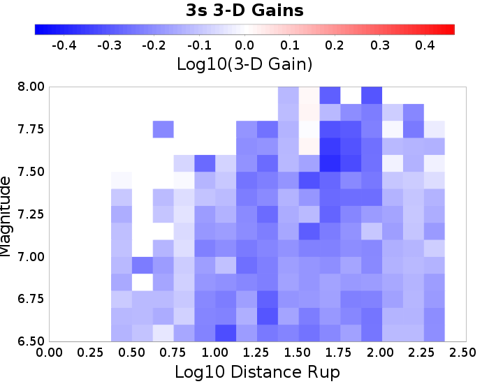
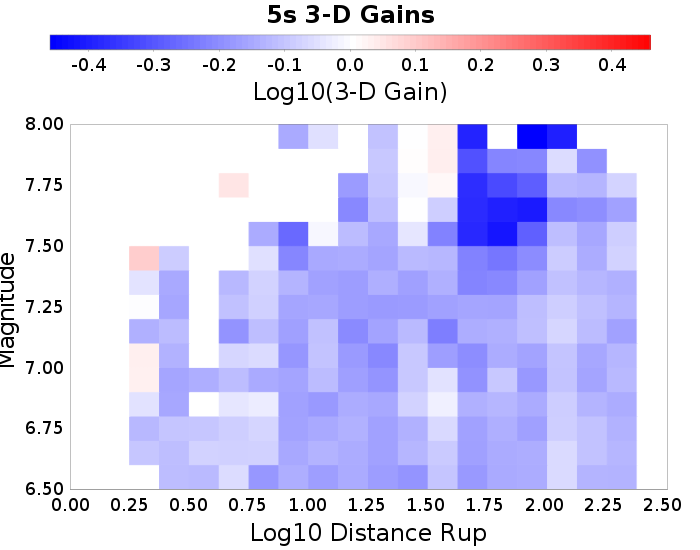
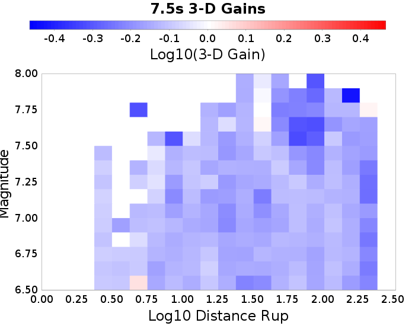
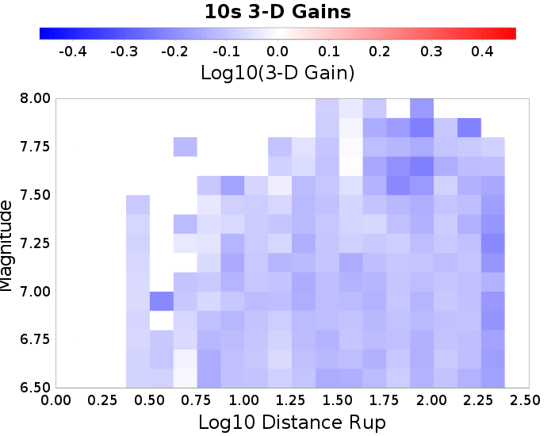

## 3-D vs 1-D Comparisons

* 3-D Model: RSQSim 2740
* 1-D Model: RSQSim/BBP

## Table Of Contents
* [3-D vs 1-D Comparisons](#3-d-vs-1-d-comparisons)
* [All Sites](#all-sites)
  * [All Sites 3-D Gain Spectra](#all-sites-3-d-gain-spectra)
  * [All Sites 3-D Mag/Distance Gain Plots](#all-sites-3-d-magdistance-gain-plots)
* [PAS](#pas)
  * [PAS 3-D Gain Spectra](#pas-3-d-gain-spectra)
  * [PAS 3-D Mag/Distance Gain Plots](#pas-3-d-magdistance-gain-plots)
* [s119](#s119)
  * [s119 3-D Gain Spectra](#s119-3-d-gain-spectra)
  * [s119 3-D Mag/Distance Gain Plots](#s119-3-d-magdistance-gain-plots)
* [s480](#s480)
  * [s480 3-D Gain Spectra](#s480-3-d-gain-spectra)
  * [s480 3-D Mag/Distance Gain Plots](#s480-3-d-magdistance-gain-plots)
* [s279](#s279)
  * [s279 3-D Gain Spectra](#s279-3-d-gain-spectra)
  * [s279 3-D Mag/Distance Gain Plots](#s279-3-d-magdistance-gain-plots)
## All Sites
*[(top)](#table-of-contents)*

### All Sites 3-D Gain Spectra
*[(top)](#table-of-contents)*

### All Sites 3-D Mag/Distance Gain Plots
*[(top)](#table-of-contents)*

| **3s** | **5s** | **7.5s** | **10s** |
|-----|-----|-----|-----|
|  |  |  |  |

## PAS
*[(top)](#table-of-contents)*

### PAS 3-D Gain Spectra
*[(top)](#table-of-contents)*

### PAS 3-D Mag/Distance Gain Plots
*[(top)](#table-of-contents)*

| **3s** | **5s** | **7.5s** | **10s** |
|-----|-----|-----|-----|
|  |  |  |  |

## s119
*[(top)](#table-of-contents)*

### s119 3-D Gain Spectra
*[(top)](#table-of-contents)*

### s119 3-D Mag/Distance Gain Plots
*[(top)](#table-of-contents)*

| **3s** | **5s** | **7.5s** | **10s** |
|-----|-----|-----|-----|
|  |  |  |  |

## s480
*[(top)](#table-of-contents)*

### s480 3-D Gain Spectra
*[(top)](#table-of-contents)*

### s480 3-D Mag/Distance Gain Plots
*[(top)](#table-of-contents)*

| **3s** | **5s** | **7.5s** | **10s** |
|-----|-----|-----|-----|
|  |  |  |  |

## s279
*[(top)](#table-of-contents)*

### s279 3-D Gain Spectra
*[(top)](#table-of-contents)*

### s279 3-D Mag/Distance Gain Plots
*[(top)](#table-of-contents)*

| **3s** | **5s** | **7.5s** | **10s** |
|-----|-----|-----|-----|
|  |  |  |  |

