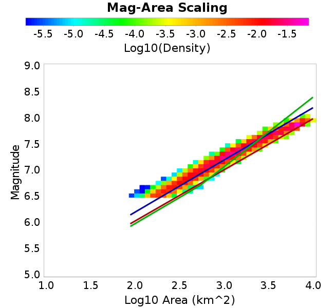

# RSQSim 2740
## Metadata
| **Name** | RSQSim 2740 |
|-----|-----|
| **Date** | Sep 2018 |
| **Region** | Los Angeles Box |
| **Description** | RSQSim prototype with catalog 2740 (259kyr) |
| **Velocity Model** | CVM-S4.26, 4.26 |

* [Metadata](#metadata)
* [Site Hazard Comparisons](#site-hazard-comparisons)
  * [GMPE: ASK2014, Vs30 model: Simulation Value](#gmpe-ask2014-vs30-model-simulation-value)
* [3-D vs 1-D Comparisons](#3-d-vs-1-d-comparisons)
* [Plots](#plots)
  * [Magnitude-Frequency Plot](#magnitude-frequency-plot)
  * [Rupture Variation Count Plot](#rupture-variation-count-plot)
  * [Magnitude-Area Plots](#magnitude-area-plots)
  * [Slip-Area Plots](#slip-area-plots)

## Site Hazard Comparisons
*[(top)](#rsqsim-2740)*

### GMPE: ASK2014, Vs30 model: Simulation Value

* [LAPD](site_hazard_LAPD_ASK2014_Vs30Simulation/)
* [PAS](site_hazard_PAS_ASK2014_Vs30Simulation/)
* [s119](site_hazard_s119_ASK2014_Vs30Simulation/)
* [s279](site_hazard_s279_ASK2014_Vs30Simulation/)
* [s480](site_hazard_s480_ASK2014_Vs30Simulation/)
* [SBSM](site_hazard_SBSM_ASK2014_Vs30Simulation/)
* [SMCA](site_hazard_SMCA_ASK2014_Vs30Simulation/)
* [STNI](site_hazard_STNI_ASK2014_Vs30Simulation/)
* [USC](site_hazard_USC_ASK2014_Vs30Simulation/)
* [WNGC](site_hazard_WNGC_ASK2014_Vs30Simulation/)

## 3-D vs 1-D Comparisons
*[(top)](#rsqsim-2740)*

[3-D vs 1-D Comparisons Plotted Here](3d_1d_comparison/)

## Plots
### Magnitude-Frequency Plot
*[(top)](#rsqsim-2740)*

### Rupture Variation Count Plot
*[(top)](#rsqsim-2740)*

### Magnitude-Area Plots
*[(top)](#rsqsim-2740)*

| Scatter | 2-D Hist |
|-----|-----|
|  |  |
### Slip-Area Plots
*[(top)](#rsqsim-2740)*

| Scatter | 2-D Hist |
|-----|-----|
|  |  |
