# rundir2740 Rotated Rupture Variability, M7.2 SS

This exercise uses translations and rotations to estimate ground motion variability from different sources. We begin by selecting a subset of similar ruptures which match a set of criteria (in this case, M7.2, Vertical Strike-Slip with Surface Rupture). Each rupture is then reoriented such that its strike (following the Aki & Richards 1980 convention) is 0 degrees (due North, dipping to the right for normal or reverse ruptures). For each site, ruptures are translated such that their scalar seismic moment centroid is directly North of the site, and their 3-dimensional distance (Rrup) is as specified (we consider 3 distance[s] here).

We then  perform various rotations. We rotate the rupture in place around its centroid, holding the site-to-source centroid path and Rrup constant (henceforth 'Rupture Strike'). We also rotate ruptures around the site, holding Rrup and source orientation relative to the site constant but sampling different various paths (henceforth 'Path'). We do this for each unique combination of Rupture Strike, Path, Distance, Site, and Rupture.

**Study Details**

| **Name** | RSQSim RotRup 2740 |
|-----|-----|
| **Date** | Feb 2019 |
| **Region** | Los Angeles Box |
| **Description** | RSQSim rotated-rupture variability study with catalog 2740 |
| **Velocity Model** | CVM-S4.26, 4.26 |

## Table Of Contents
* [Rupture Rotation Parameters](#rupture-rotation-parameters)
* [M7.2 SS RSQSim Rupture Match Criteria](#m72-ss-rsqsim-rupture-match-criteria)
* [Sites](#sites)
* [Result Summary Table](#result-summary-table)
  * [Dist-Dependent Plot Table](#dist-dependent-plot-table)
* [Path-to-path Variability](#path-to-path-variability)
  * [Path-to-path Variability Methodology](#path-to-path-variability-methodology)
  * [20.0 km M7.2 Path-to-path Results](#200-km-m72-path-to-path-results)
  * [50.0 km M7.2 Path-to-path Results](#500-km-m72-path-to-path-results)
  * [100.0 km M7.2 Path-to-path Results](#1000-km-m72-path-to-path-results)
* [Source-strike Variability](#source-strike-variability)
  * [Source-strike Variability Methodology](#source-strike-variability-methodology)
  * [20.0 km M7.2 Source-strike Results](#200-km-m72-source-strike-results)
  * [50.0 km M7.2 Source-strike Results](#500-km-m72-source-strike-results)
  * [100.0 km M7.2 Source-strike Results](#1000-km-m72-source-strike-results)
* [Within-event, single-site Variability](#within-event-single-site-variability)
  * [Within-event, single-site Variability Methodology](#within-event-single-site-variability-methodology)
  * [20.0 km M7.2 Within-event, single-site Results](#200-km-m72-within-event-single-site-results)
  * [50.0 km M7.2 Within-event, single-site Results](#500-km-m72-within-event-single-site-results)
  * [100.0 km M7.2 Within-event, single-site Results](#1000-km-m72-within-event-single-site-results)
* [Between-events Variability](#between-events-variability)
  * [Between-events Variability Methodology](#between-events-variability-methodology)
  * [20.0 km M7.2 Between-events Results](#200-km-m72-between-events-results)
  * [50.0 km M7.2 Between-events Results](#500-km-m72-between-events-results)
  * [100.0 km M7.2 Between-events Results](#1000-km-m72-between-events-results)
* [Azumth Dependence](#azumth-dependence)
  * [PAS Azumth Dependence](#pas-azumth-dependence)
    * [PAS Rupture Strike Dependence](#pas-rupture-strike-dependence)
    * [PAS Path Dependence](#pas-path-dependence)
  * [USC Azumth Dependence](#usc-azumth-dependence)
    * [USC Rupture Strike Dependence](#usc-rupture-strike-dependence)
    * [USC Path Dependence](#usc-path-dependence)
  * [All Sites Azumth Dependence](#all-sites-azumth-dependence)
    * [All Sites Rupture Strike Dependence](#all-sites-rupture-strike-dependence)
    * [All Sites Path Dependence](#all-sites-path-dependence)
* [BBP PartB Comparison](#bbp-partb-comparison)
  * [BBP PartB Summary Table](#bbp-partb-summary-table)
  * [BBP PartB, M7.2, Vertical Strike-Slip with Surface Rupture](#bbp-partb-m72-vertical-strike-slip-with-surface-rupture)
* [CSV Files](#csv-files)
## Rupture Rotation Parameters

| Quantity | Variations | Description |
|-----|-----|-----|
| Rupture | 100 | Unique (but similar in faulting style and magnitude) ruptures which match the given scenario. |
| Site | 2 | Unique site locations. If 3-d, each will have unique velocity profiles. |
| Rupture Strike | 18 | Rupture strike conforming to the Aki & Richards (1980) convention, where dipping faults dip to the right of the rupture. If path rotation is also performed, this azimuth is relative to the path. |
| Path | 36 | Path from the site to the centroid of the rupture, in azimuthal degrees (0 is North) |
| Distance | 20.0, 50.0, 100.0 km | 3-dimensional distance between the site and the rupture surface. |
| **Total # Simulations** | **388800** | Total number of combinations of the above. |

## M7.2 SS RSQSim Rupture Match Criteria
*[(top)](#table-of-contents)*

We condisder 100 events in the catalog which match the following criteria:

* M=[7.15,7.25]
* Ztor=[0.0,1.0]
* Rake=[-180,-170] or [-10,10] or [170,180]
* Dip=90.0
* Linear rupture (max 5.0% deviation from ideal)

## Sites

| Name | Location | Vs30 (m/s) | Z1.0 (km) | Z2.5 (km) |
|-----|-----|-----|-----|-----|
| PAS | *34.148426, -118.17119* | 838.8 | 0.05 | 0.65 |
| USC | *34.0192, -118.286* | 313.1 | 0.6 | 4.05 |

## Result Summary Table

| Type | Notation | Distance | 3s Std. Dev. | 5s Std. Dev. | 10s Std. Dev. |
|-----|-----|-----|-----|-----|-----|
| Path-to-path | &phi;P2P | 20 km | 0.34 | 0.33 | 0.16 |
| Path-to-path | &phi;P2P | 50 km | 0.38 | 0.37 | 0.23 |
| Path-to-path | &phi;P2P | 100 km | 0.39 | 0.4 | 0.27 |
| Source-strike | &phi;s | 20 km | 0.54 | 0.45 | 0.37 |
| Source-strike | &phi;s | 50 km | 0.5 | 0.47 | 0.49 |
| Source-strike | &phi;s | 100 km | 0.48 | 0.49 | 0.52 |
| Within-event, single-site | &phi;SS | 20 km | 0.59 | 0.49 | 0.37 |
| Within-event, single-site | &phi;SS | 50 km | 0.55 | 0.51 | 0.5 |
| Within-event, single-site | &phi;SS | 100 km | 0.56 | 0.56 | 0.54 |
| Between-events | &tau; | 20 km | 0.13 | 0.16 | 0.18 |
| Between-events | &tau; | 50 km | 0.11 | 0.16 | 0.19 |
| Between-events | &tau; | 100 km | 0.11 | 0.15 | 0.19 |

### Dist-Dependent Plot Table
*[(top)](#table-of-contents)*

| **&phi;P2P** | 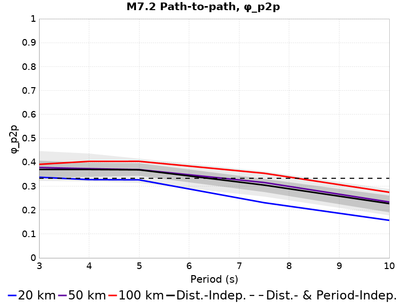 |
|-----|-----|
| **&phi;s** |  |
| **&phi;SS** | 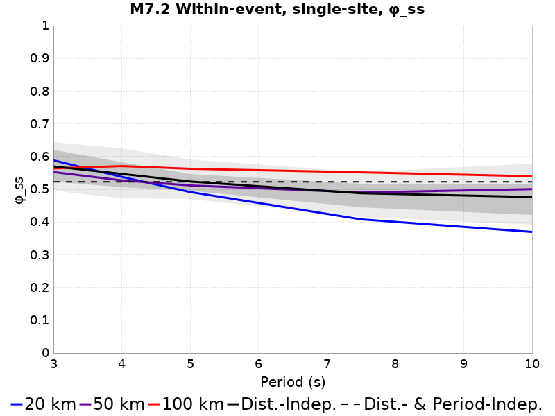 |
| **&tau;** |  |

## Path-to-path Variability
*[(top)](#table-of-contents)*

### Path-to-path Variability Methodology
*[(top)](#table-of-contents)*

Path-to-path variability, denoted &phi;P2P in Al Atik (2010), is computed separately for each:

* Site *[2 unique]*
* Distance *[3 unique]*

Then, for each unique combination of:

* Rupture *[100 unique]*
* Rupture Strike *[18 unique]*

we compute residuals of the natural-log ground motions (relative to the median), computed across all 36 combinations of:

* Path *[36 unique]*

We take &phi;P2P to be the standard deviation of all residuals across each combination of Rupture, Rupture Strike. We also compute the total standard deviation across all residuals from all sites. This total value is reported as **ALL SITES** and in summary plots/tables.

Here is an exmample with 5 rotations, which would be repeated for each combination of [Rupture, Rupture Strike]. The site is shown with a blue square, and initially oriented rupture in bold with its hypocenter as a red star and centroid a green circle. Rotations of that rupture are in gray:

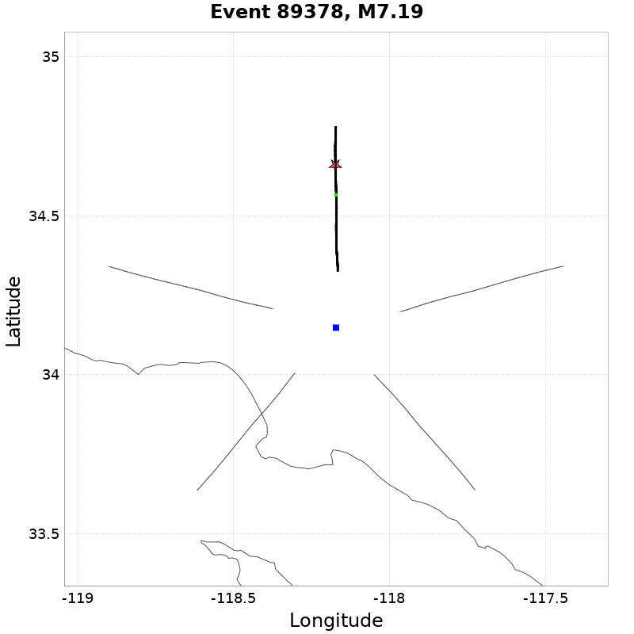

### 20.0 km M7.2 Path-to-path Results
*[(top)](#table-of-contents)*

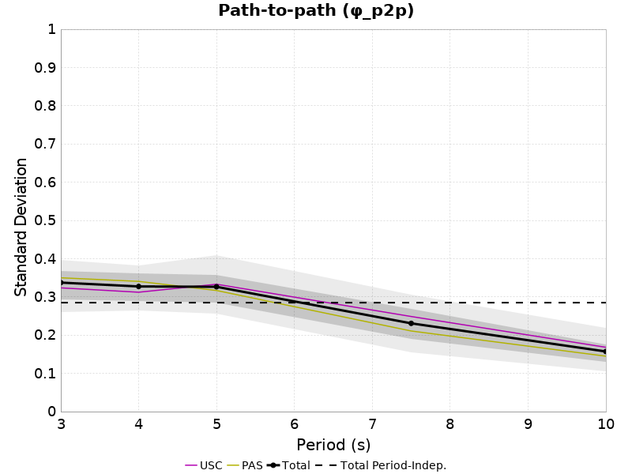

| Site | 3s &phi;P2P | Total | Mean | Median | Range | 5s &phi;P2P | Total | Mean | Median | Range | 10s &phi;P2P | Total | Mean | Median | Range |
|-----|-----|-----|-----|-----|-----|-----|-----|-----|-----|-----|-----|-----|-----|-----|-----|
| PAS |  | 0.35 | 0.34 | 0.33 | [0.11 0.8] |  | 0.32 | 0.3 | 0.3 | [0.1 0.59] |  | 0.15 | 0.13 | 0.13 | [0.04 0.42] |
| USC |  | 0.32 | 0.32 | 0.32 | [0.15 0.56] |  | 0.33 | 0.32 | 0.32 | [0.1 0.55] |  | 0.17 | 0.16 | 0.14 | [0.05 0.48] |
| **ALL SITES** |  | **0.34** | **0.33** | **0.32** | **[0.11 0.8]** |  | **0.33** | **0.31** | **0.31** | **[0.1 0.59]** |  | **0.16** | **0.14** | **0.14** | **[0.04 0.48]** |

| 3s | 5s |
|-----|-----|
|  | 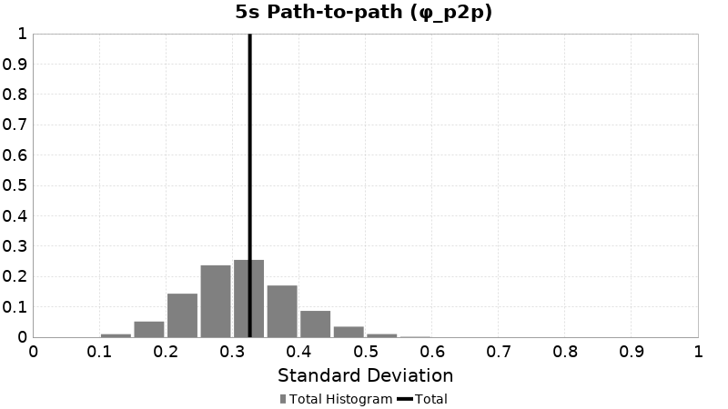 |
| 10s |  |
|  |  |

### 50.0 km M7.2 Path-to-path Results
*[(top)](#table-of-contents)*

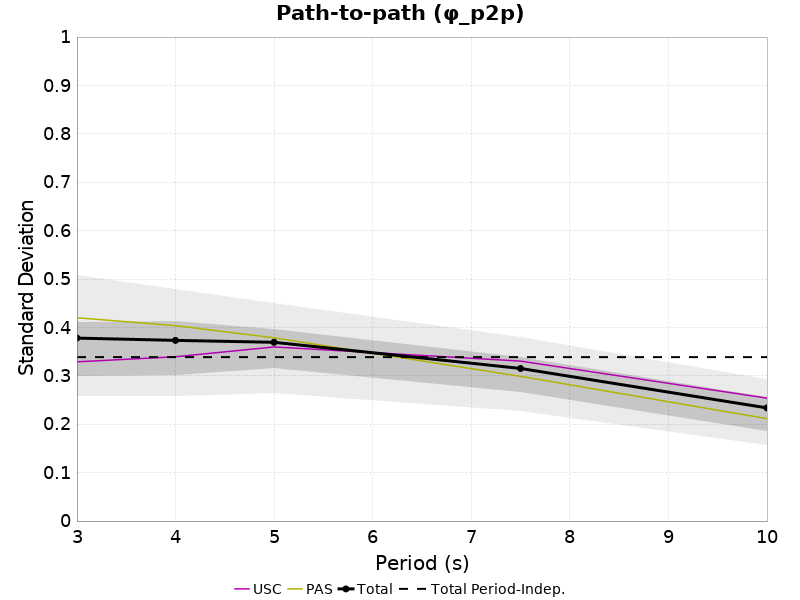

| Site | 3s &phi;P2P | Total | Mean | Median | Range | 5s &phi;P2P | Total | Mean | Median | Range | 10s &phi;P2P | Total | Mean | Median | Range |
|-----|-----|-----|-----|-----|-----|-----|-----|-----|-----|-----|-----|-----|-----|-----|-----|
| PAS |  | 0.42 | 0.4 | 0.38 | [0.17 0.81] |  | 0.38 | 0.37 | 0.35 | [0.18 0.65] |  | 0.21 | 0.2 | 0.2 | [0.07 0.4] |
| USC |  | 0.33 | 0.33 | 0.32 | [0.14 0.56] |  | 0.36 | 0.36 | 0.35 | [0.17 0.55] |  | 0.25 | 0.24 | 0.24 | [0.11 0.47] |
| **ALL SITES** |  | **0.38** | **0.36** | **0.34** | **[0.14 0.81]** |  | **0.37** | **0.36** | **0.35** | **[0.17 0.65]** |  | **0.23** | **0.22** | **0.22** | **[0.07 0.47]** |

| 3s | 5s |
|-----|-----|
| 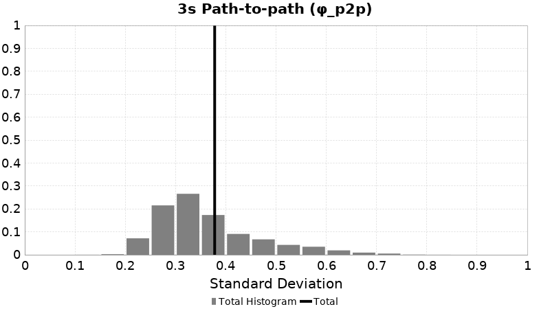 |  |
| 10s |  |
| 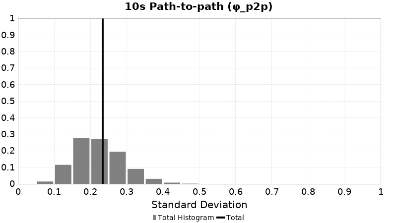 |  |

### 100.0 km M7.2 Path-to-path Results
*[(top)](#table-of-contents)*

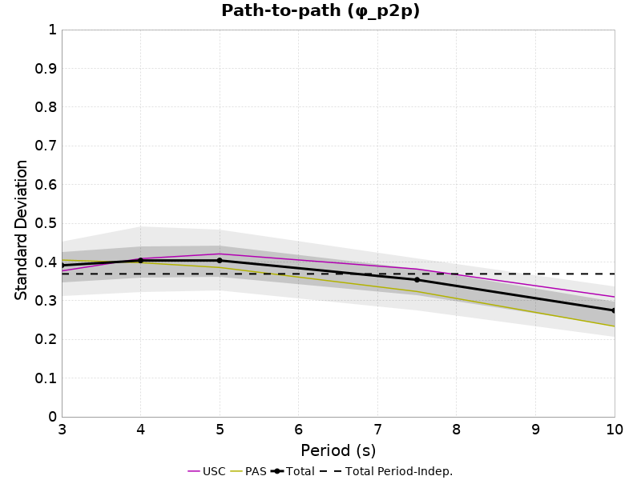

| Site | 3s &phi;P2P | Total | Mean | Median | Range | 5s &phi;P2P | Total | Mean | Median | Range | 10s &phi;P2P | Total | Mean | Median | Range |
|-----|-----|-----|-----|-----|-----|-----|-----|-----|-----|-----|-----|-----|-----|-----|-----|
| PAS |  | 0.4 | 0.4 | 0.39 | [0.2 0.7] |  | 0.39 | 0.38 | 0.37 | [0.18 0.67] |  | 0.23 | 0.23 | 0.22 | [0.09 0.49] |
| USC |  | 0.38 | 0.38 | 0.37 | [0.24 0.6] |  | 0.42 | 0.42 | 0.41 | [0.2 0.63] |  | 0.31 | 0.3 | 0.3 | [0.13 0.54] |
| **ALL SITES** |  | **0.39** | **0.39** | **0.38** | **[0.2 0.7]** |  | **0.4** | **0.4** | **0.39** | **[0.18 0.67]** |  | **0.27** | **0.27** | **0.26** | **[0.09 0.54]** |

| 3s | 5s |
|-----|-----|
| 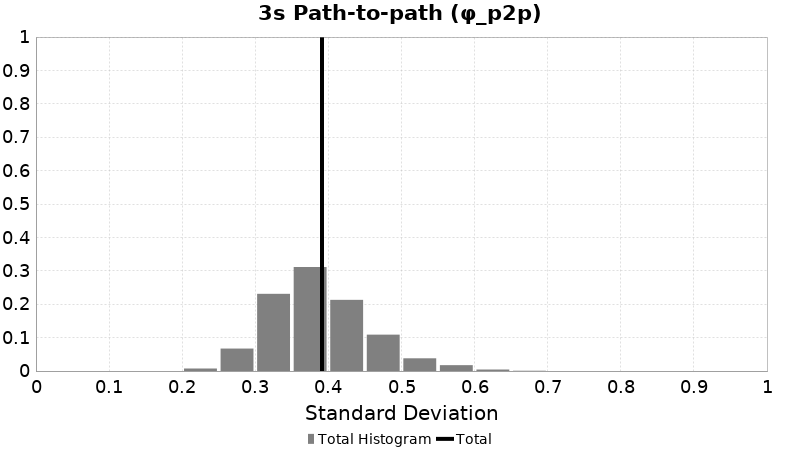 | 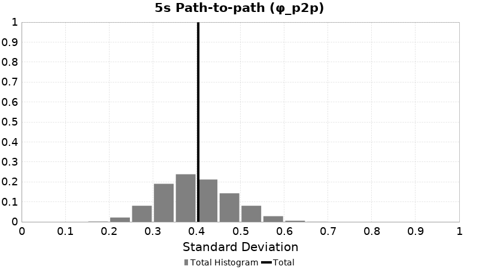 |
| 10s |  |
|  |  |

## Source-strike Variability
*[(top)](#table-of-contents)*

### Source-strike Variability Methodology
*[(top)](#table-of-contents)*

Source-strike variability, denoted &phi;s in Aki & Richards (1980), is computed separately for each:

* Site *[2 unique]*
* Distance *[3 unique]*

Then, for each unique combination of:

* Rupture *[100 unique]*
* Path *[36 unique]*

we compute residuals, &delta;Wes, of the natural-log ground motions (relative to the median), computed across all 18 combinations of:

* Rupture Strike *[18 unique]*

We take &phi;s to be the standard deviation of all residuals, &delta;Wes, across each combination of Rupture, Path. We also compute the total standard deviation across all residuals from all sites. This total value is reported as **ALL SITES** and in summary plots/tables.

Here is an exmample with 5 rotations, which would be repeated for each combination of [Rupture, Path]. The site is shown with a blue square, and initially oriented rupture in bold with its hypocenter as a red star and centroid a green circle. Rotations of that rupture are in gray:

### 20.0 km M7.2 Source-strike Results
*[(top)](#table-of-contents)*

| Site | 3s &phi;s | Total | Mean | Median | Range | 5s &phi;s | Total | Mean | Median | Range | 10s &phi;s | Total | Mean | Median | Range |
|-----|-----|-----|-----|-----|-----|-----|-----|-----|-----|-----|-----|-----|-----|-----|-----|
| PAS |  | 0.58 | 0.58 | 0.58 | [0.29 0.96] |  | 0.47 | 0.46 | 0.46 | [0.21 0.8] |  | 0.36 | 0.34 | 0.32 | [0.06 0.82] |
| USC |  | 0.5 | 0.5 | 0.5 | [0.17 0.91] |  | 0.43 | 0.42 | 0.42 | [0.13 0.76] |  | 0.38 | 0.36 | 0.34 | [0.12 0.87] |
| **ALL SITES** |  | **0.54** | **0.54** | **0.54** | **[0.17 0.96]** |  | **0.45** | **0.44** | **0.44** | **[0.13 0.8]** |  | **0.37** | **0.35** | **0.33** | **[0.06 0.87]** |

| 3s | 5s |
|-----|-----|
|  | 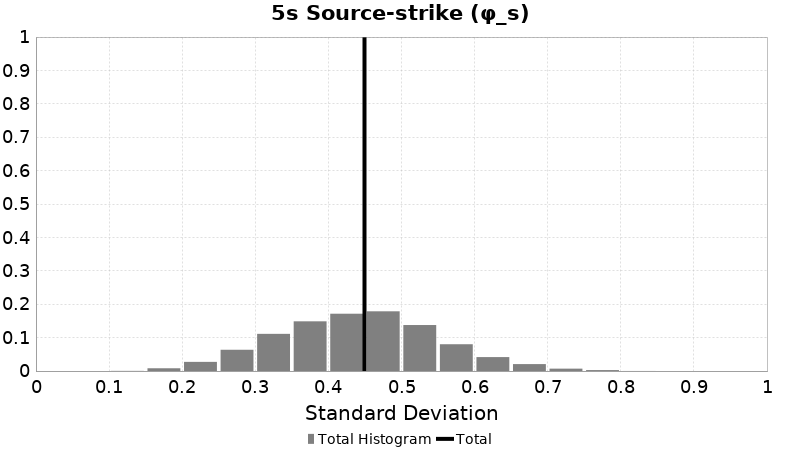 |
| 10s |  |
|  |  |

| 3s | 5s | 10s |
|-----|-----|-----|
| 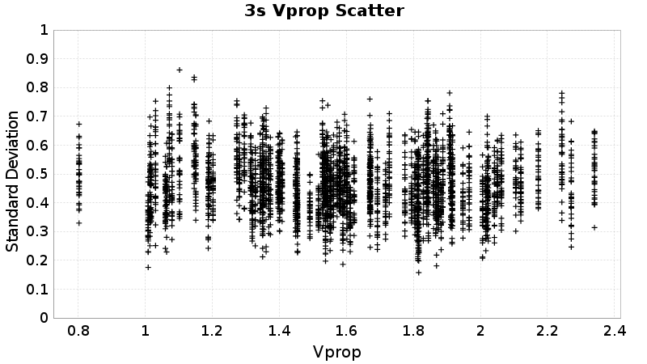 | 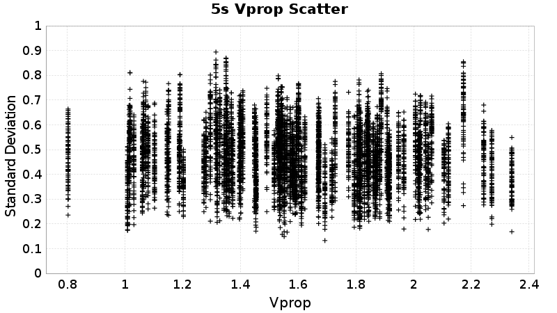 | 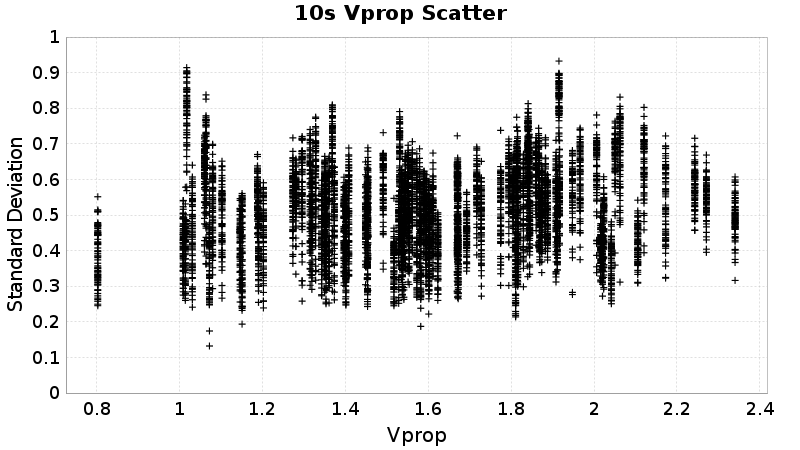 |
| 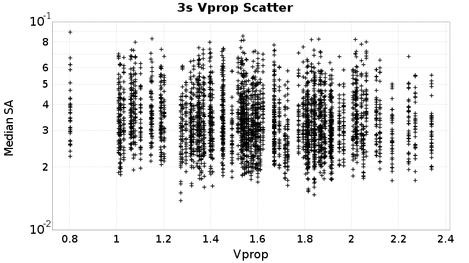 | 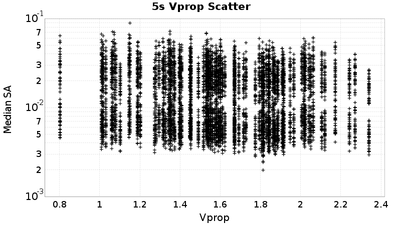 | 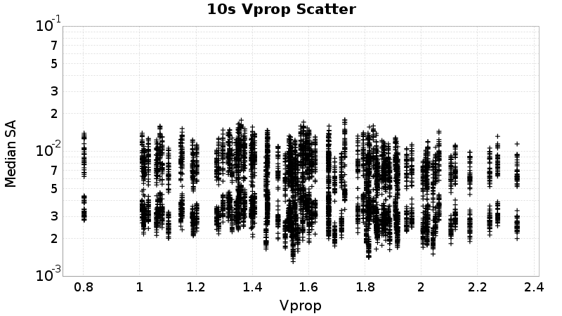 |

### 50.0 km M7.2 Source-strike Results
*[(top)](#table-of-contents)*

| Site | 3s &phi;s | Total | Mean | Median | Range | 5s &phi;s | Total | Mean | Median | Range | 10s &phi;s | Total | Mean | Median | Range |
|-----|-----|-----|-----|-----|-----|-----|-----|-----|-----|-----|-----|-----|-----|-----|-----|
| PAS |  | 0.52 | 0.5 | 0.46 | [0.16 1.05] |  | 0.46 | 0.44 | 0.42 | [0.13 0.85] |  | 0.49 | 0.49 | 0.48 | [0.18 0.93] |
| USC |  | 0.48 | 0.47 | 0.46 | [0.18 0.9] |  | 0.48 | 0.46 | 0.46 | [0.11 0.92] |  | 0.5 | 0.49 | 0.49 | [0.15 0.92] |
| **ALL SITES** |  | **0.5** | **0.48** | **0.46** | **[0.16 1.05]** |  | **0.47** | **0.45** | **0.44** | **[0.11 0.92]** |  | **0.49** | **0.49** | **0.48** | **[0.15 0.93]** |

| 3s | 5s |
|-----|-----|
| 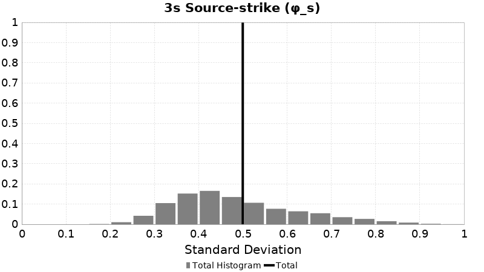 | 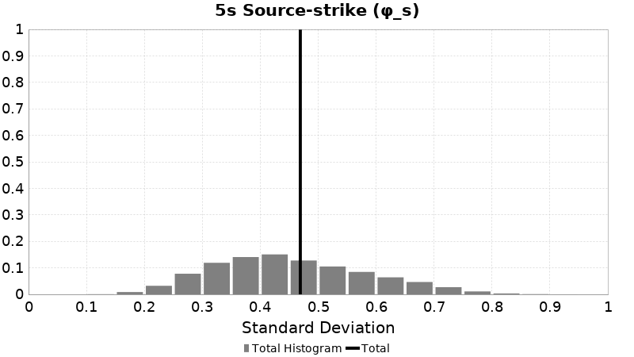 |
| 10s |  |
|  |  |

| 3s | 5s | 10s |
|-----|-----|-----|
|  |  |  |
|  |  |  |

### 100.0 km M7.2 Source-strike Results
*[(top)](#table-of-contents)*

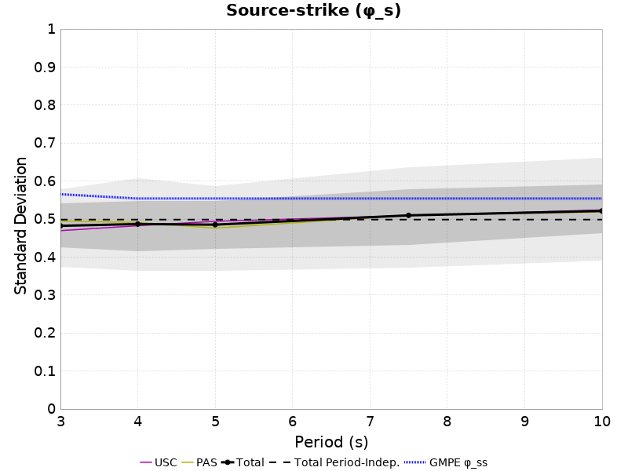

| Site | 3s &phi;s | Total | Mean | Median | Range | 5s &phi;s | Total | Mean | Median | Range | 10s &phi;s | Total | Mean | Median | Range |
|-----|-----|-----|-----|-----|-----|-----|-----|-----|-----|-----|-----|-----|-----|-----|-----|
| PAS |  | 0.49 | 0.49 | 0.49 | [0.19 0.86] |  | 0.48 | 0.46 | 0.46 | [0.13 0.87] |  | 0.52 | 0.51 | 0.51 | [0.13 0.93] |
| USC |  | 0.47 | 0.46 | 0.46 | [0.16 0.86] |  | 0.49 | 0.49 | 0.48 | [0.18 0.89] |  | 0.52 | 0.52 | 0.52 | [0.24 0.91] |
| **ALL SITES** |  | **0.48** | **0.48** | **0.47** | **[0.16 0.86]** |  | **0.49** | **0.47** | **0.47** | **[0.13 0.89]** |  | **0.52** | **0.51** | **0.51** | **[0.13 0.93]** |

| 3s | 5s |
|-----|-----|
|  |  |
| 10s |  |
| 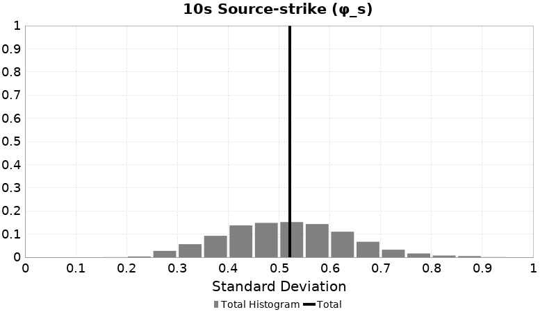 |  |

| 3s | 5s | 10s |
|-----|-----|-----|
|  |  |  |
|  |  |  |

## Within-event, single-site Variability
*[(top)](#table-of-contents)*

### Within-event, single-site Variability Methodology
*[(top)](#table-of-contents)*

Within-event, single-site variability, denoted &phi;SS in Al Atik (2010), is computed separately for each:

* Site *[2 unique]*
* Distance *[3 unique]*

Then, for each unique combination of:

* Rupture *[100 unique]*

we compute residuals, &delta;Wes, of the natural-log ground motions (relative to the median), computed across all 648 combinations of:

* Rupture Strike *[18 unique]*
* Path *[36 unique]*

We take &phi;SS to be the standard deviation of all residuals, &delta;Wes, across each combination of Rupture. We also compute the total standard deviation across all residuals from all sites. This total value is reported as **ALL SITES** and in summary plots/tables.

Here is an exmample with 5 rotations, which would be repeated for each combination of [Rupture]. The site is shown with a blue square, and initially oriented rupture in bold with its hypocenter as a red star and centroid a green circle. Rotations of that rupture are in gray:

### 20.0 km M7.2 Within-event, single-site Results
*[(top)](#table-of-contents)*

| Site | 3s &phi;SS | Total | Mean | Median | Range | 5s &phi;SS | Total | Mean | Median | Range | 10s &phi;SS | Total | Mean | Median | Range |
|-----|-----|-----|-----|-----|-----|-----|-----|-----|-----|-----|-----|-----|-----|-----|-----|
| PAS |  | 0.63 | 0.63 | 0.63 | [0.46 0.8] |  | 0.51 | 0.51 | 0.51 | [0.34 0.71] |  | 0.36 | 0.34 | 0.33 | [0.14 0.73] |
| USC |  | 0.54 | 0.54 | 0.54 | [0.4 0.68] |  | 0.47 | 0.46 | 0.46 | [0.33 0.61] |  | 0.38 | 0.36 | 0.34 | [0.17 0.74] |
| **ALL SITES** |  | **0.59** | **0.58** | **0.58** | **[0.4 0.8]** |  | **0.49** | **0.48** | **0.48** | **[0.33 0.71]** |  | **0.37** | **0.35** | **0.33** | **[0.14 0.74]** |

| 3s | 5s |
|-----|-----|
|  |  |
| 10s |  |
| 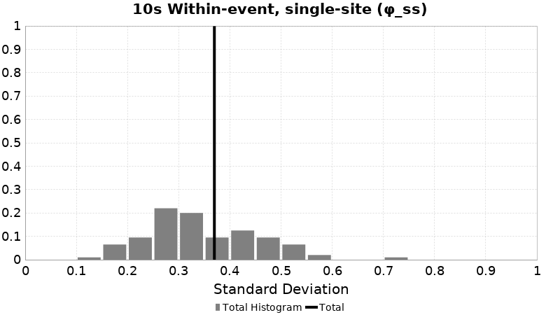 |  |

| 3s | 5s | 10s |
|-----|-----|-----|
| 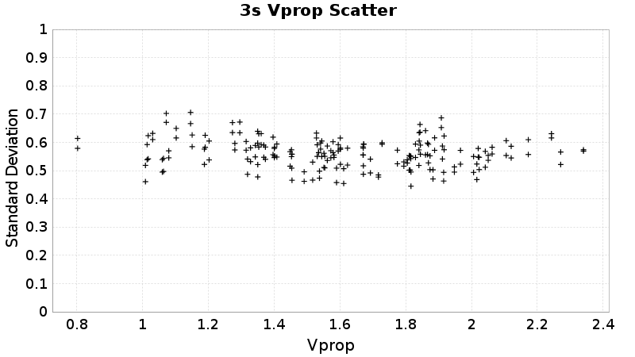 | 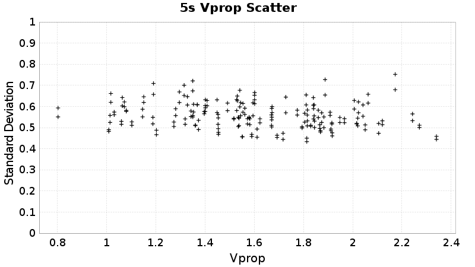 | 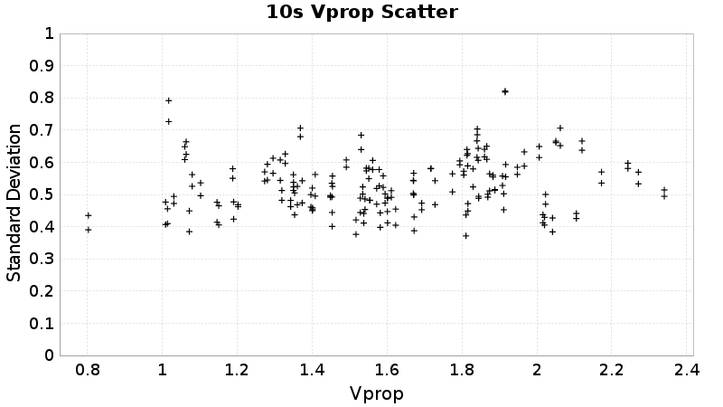 |
| 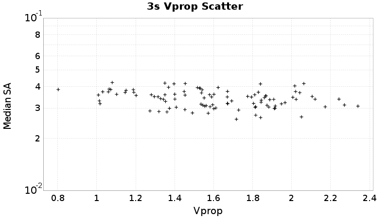 | 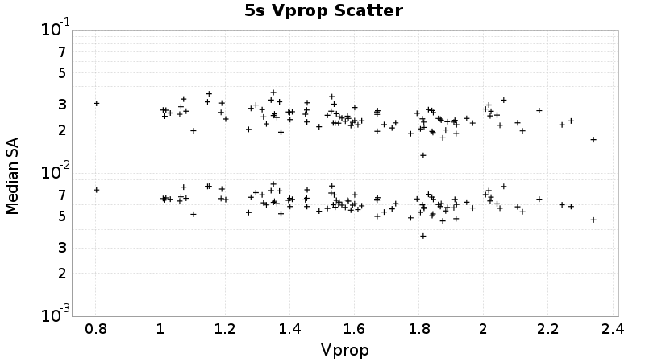 | 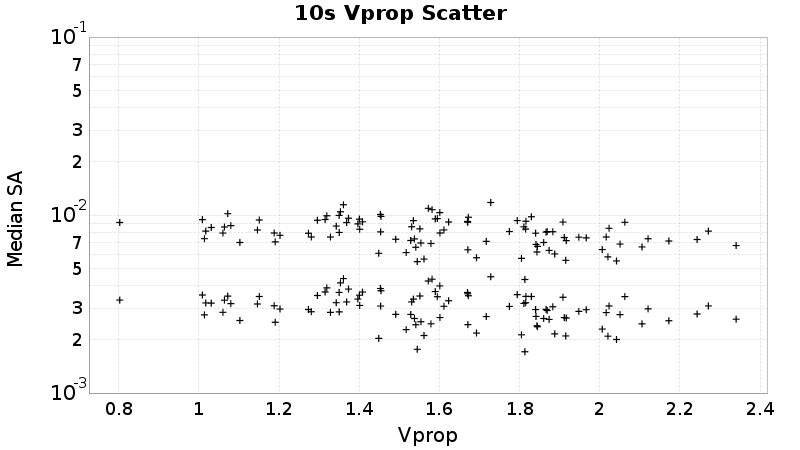 |

### 50.0 km M7.2 Within-event, single-site Results
*[(top)](#table-of-contents)*

| Site | 3s &phi;SS | Total | Mean | Median | Range | 5s &phi;SS | Total | Mean | Median | Range | 10s &phi;SS | Total | Mean | Median | Range |
|-----|-----|-----|-----|-----|-----|-----|-----|-----|-----|-----|-----|-----|-----|-----|-----|
| PAS |  | 0.59 | 0.59 | 0.59 | [0.51 0.71] |  | 0.51 | 0.51 | 0.5 | [0.4 0.64] |  | 0.49 | 0.48 | 0.47 | [0.34 0.8] |
| USC |  | 0.51 | 0.51 | 0.51 | [0.41 0.63] |  | 0.51 | 0.51 | 0.5 | [0.36 0.69] |  | 0.51 | 0.5 | 0.49 | [0.35 0.79] |
| **ALL SITES** |  | **0.55** | **0.55** | **0.55** | **[0.41 0.71]** |  | **0.51** | **0.51** | **0.5** | **[0.36 0.69]** |  | **0.5** | **0.49** | **0.48** | **[0.34 0.8]** |

| 3s | 5s |
|-----|-----|
|  |  |
| 10s |  |
| 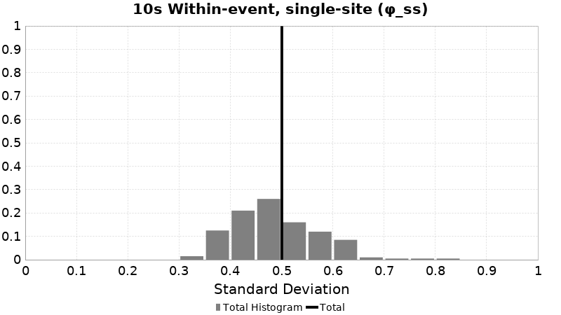 |  |

| 3s | 5s | 10s |
|-----|-----|-----|
|  |  |  |
|  |  |  |

### 100.0 km M7.2 Within-event, single-site Results
*[(top)](#table-of-contents)*

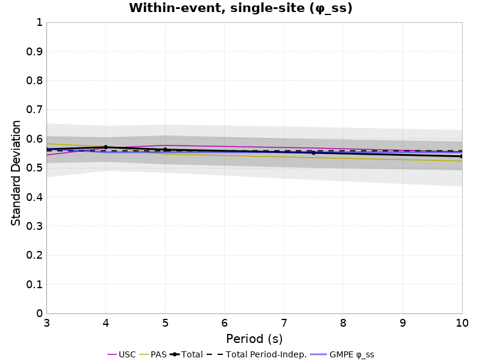

| Site | 3s &phi;SS | Total | Mean | Median | Range | 5s &phi;SS | Total | Mean | Median | Range | 10s &phi;SS | Total | Mean | Median | Range |
|-----|-----|-----|-----|-----|-----|-----|-----|-----|-----|-----|-----|-----|-----|-----|-----|
| PAS |  | 0.58 | 0.58 | 0.58 | [0.48 0.71] |  | 0.55 | 0.54 | 0.54 | [0.44 0.68] |  | 0.52 | 0.51 | 0.5 | [0.37 0.82] |
| USC |  | 0.54 | 0.54 | 0.55 | [0.44 0.67] |  | 0.58 | 0.57 | 0.57 | [0.43 0.75] |  | 0.56 | 0.55 | 0.54 | [0.42 0.82] |
| **ALL SITES** |  | **0.56** | **0.56** | **0.56** | **[0.44 0.71]** |  | **0.56** | **0.56** | **0.55** | **[0.43 0.75]** |  | **0.54** | **0.53** | **0.52** | **[0.37 0.82]** |

| 3s | 5s |
|-----|-----|
|  | 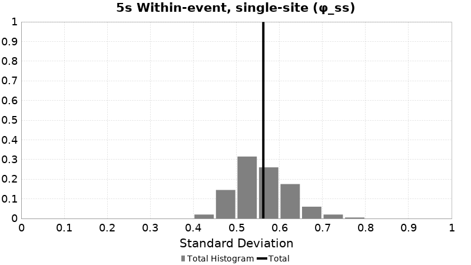 |
| 10s |  |
| 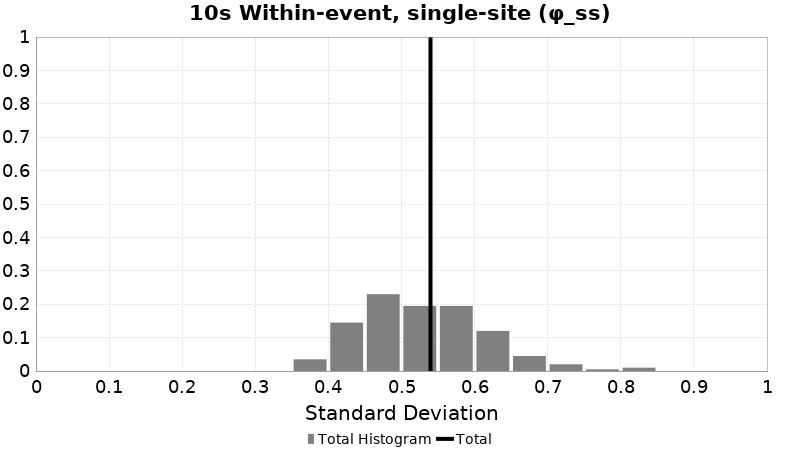 |  |

| 3s | 5s | 10s |
|-----|-----|-----|
|  |  |  |
|  |  |  |

## Between-events Variability
*[(top)](#table-of-contents)*

### Between-events Variability Methodology
*[(top)](#table-of-contents)*

Between-events variability, denoted &tau; in Al Atik (2010), is computed separately for each:

* Site *[2 unique]*
* Distance *[3 unique]*

We first compute the median natural-log ground motion, &delta;Be, for each combination of:

* Rupture *[100 unique]*

That median, &delta;Be, is computed across all 648 combinations of:

* Rupture Strike *[18 unique]*
* Path *[36 unique]*

We take &tau; to be the standard deviation of all &delta;Be. Finally, we compute the median standard deviation across all sites. This total value is reported as **ALL SITES** and in summary plots/tables.

Here is an exmample with 5 rotations, which would be repeated for each combination of [Rupture]. The site is shown with a blue square, and initially oriented rupture in bold with its hypocenter as a red star and centroid a green circle. Rotations of that rupture are in gray:

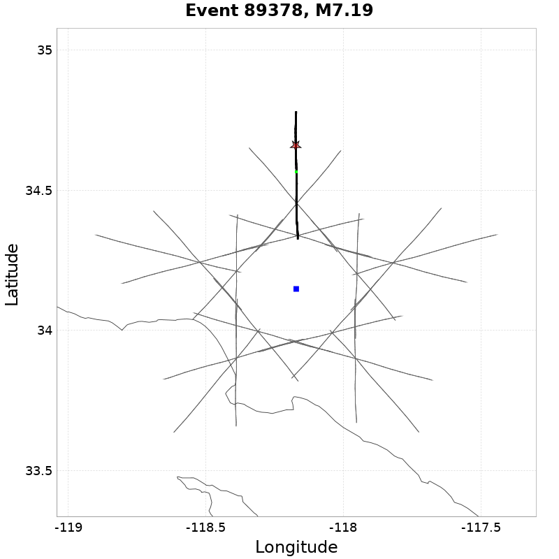

### 20.0 km M7.2 Between-events Results
*[(top)](#table-of-contents)*

| Site | 3s &tau; | Mean &delta;Be | &delta;Be Range | 5s &tau; | Mean &delta;Be | &delta;Be Range | 10s &tau; | Mean &delta;Be | &delta;Be Range |
|-----|-----|-----|-----|-----|-----|-----|-----|-----|-----|
| PAS | 0.12 | -3.11 | [-3.35 -2.82] | 0.15 | -3.74 | [-4.3 -3.39] | 0.18 | -4.7 | [-5.09 -4.21] |
| USC | 0.13 | -1.92 | [-2.21 -1.62] | 0.16 | -2.54 | [-3.05 -2.21] | 0.18 | -3.73 | [-4.17 -3.32] |
| **ALL SITES** | **0.13** | **-2.51** | **[-3.35 -1.62]** | **0.16** | **-3.14** | **[-4.3 -2.21]** | **0.18** | **-4.21** | **[-5.09 -3.32]** |

### 50.0 km M7.2 Between-events Results
*[(top)](#table-of-contents)*

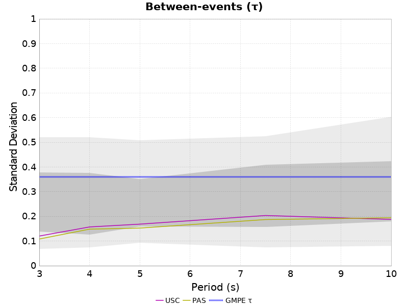

| Site | 3s &tau; | Mean &delta;Be | &delta;Be Range | 5s &tau; | Mean &delta;Be | &delta;Be Range | 10s &tau; | Mean &delta;Be | &delta;Be Range |
|-----|-----|-----|-----|-----|-----|-----|-----|-----|-----|
| PAS | 0.11 | -4.08 | [-4.35 -3.83] | 0.15 | -4.51 | [-5.06 -4.16] | 0.19 | -5.34 | [-5.78 -4.92] |
| USC | 0.12 | -2.73 | [-3.03 -2.47] | 0.17 | -3.13 | [-3.69 -2.72] | 0.19 | -4.33 | [-4.84 -3.96] |
| **ALL SITES** | **0.11** | **-3.41** | **[-4.35 -2.47]** | **0.16** | **-3.82** | **[-5.06 -2.72]** | **0.19** | **-4.84** | **[-5.78 -3.96]** |

### 100.0 km M7.2 Between-events Results
*[(top)](#table-of-contents)*

| Site | 3s &tau; | Mean &delta;Be | &delta;Be Range | 5s &tau; | Mean &delta;Be | &delta;Be Range | 10s &tau; | Mean &delta;Be | &delta;Be Range |
|-----|-----|-----|-----|-----|-----|-----|-----|-----|-----|
| PAS | 0.11 | -4.67 | [-4.93 -4.42] | 0.14 | -5.08 | [-5.62 -4.78] | 0.2 | -5.82 | [-6.37 -5.4] |
| USC | 0.11 | -3.38 | [-3.65 -3.17] | 0.17 | -3.71 | [-4.32 -3.31] | 0.19 | -4.84 | [-5.44 -4.44] |
| **ALL SITES** | **0.11** | **-4.03** | **[-4.93 -3.17]** | **0.15** | **-4.4** | **[-5.62 -3.31]** | **0.19** | **-5.33** | **[-6.37 -4.44]** |

## Azumth Dependence
*[(top)](#table-of-contents)*

### PAS Azumth Dependence
*[(top)](#table-of-contents)*

#### PAS Rupture Strike Dependence
*[(top)](#table-of-contents)*

| Type | 3s | 5s | 10s |
|-----|-----|-----|-----|
| **&phi;SS** | 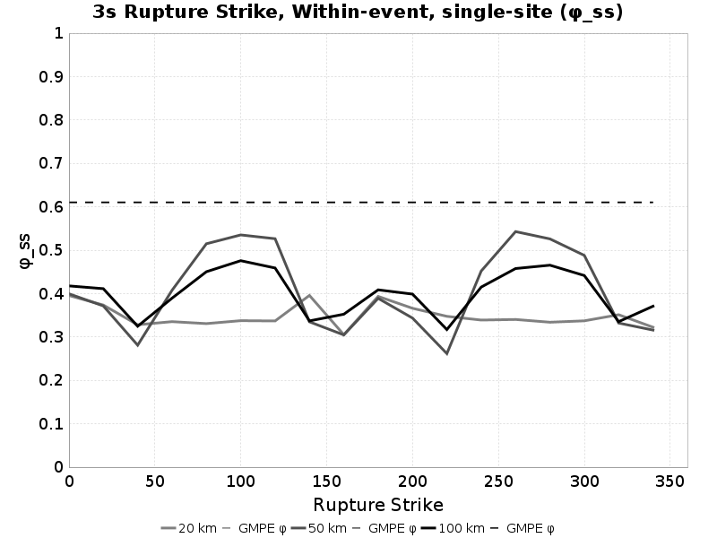 |  |  |
| **&phi;P2P** | 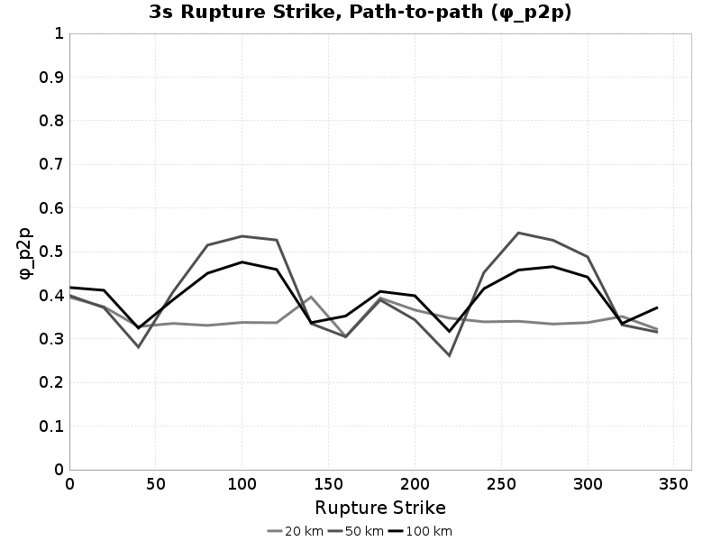 | 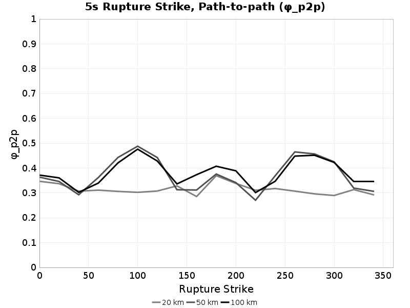 | 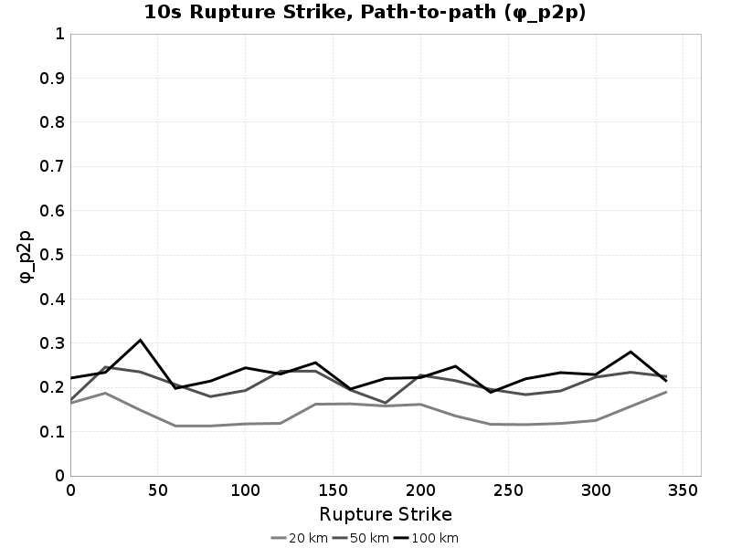 |
| **&tau;** |  |  |  |
| **Median SA** | 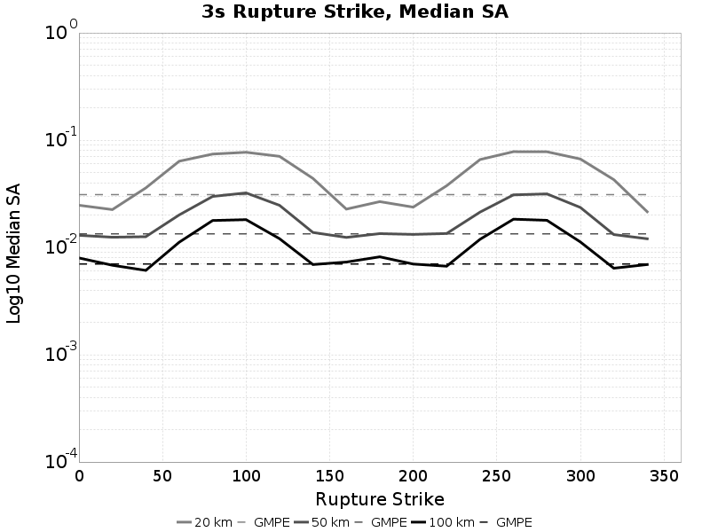 | 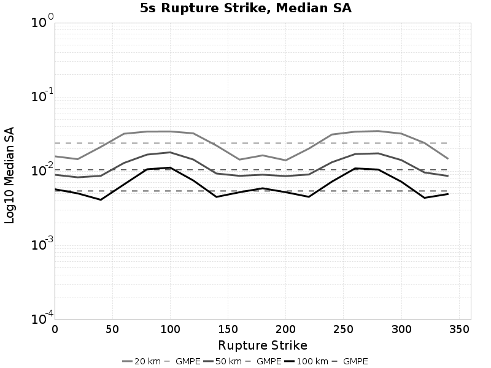 |  |

#### PAS Path Dependence
*[(top)](#table-of-contents)*

| Type | 3s | 5s | 10s |
|-----|-----|-----|-----|
| **&phi;SS** |  | 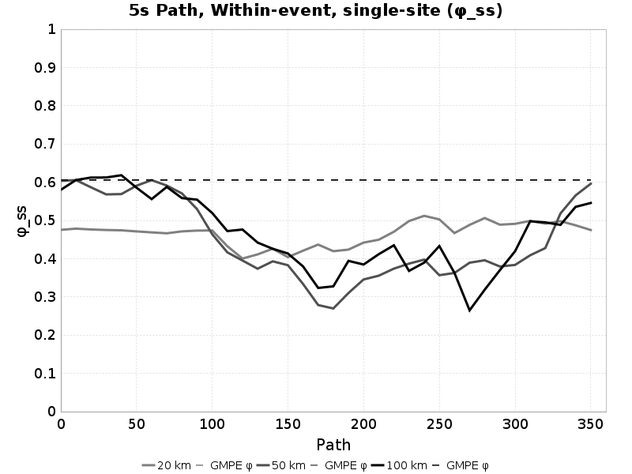 |  |
| **&phi;s** | 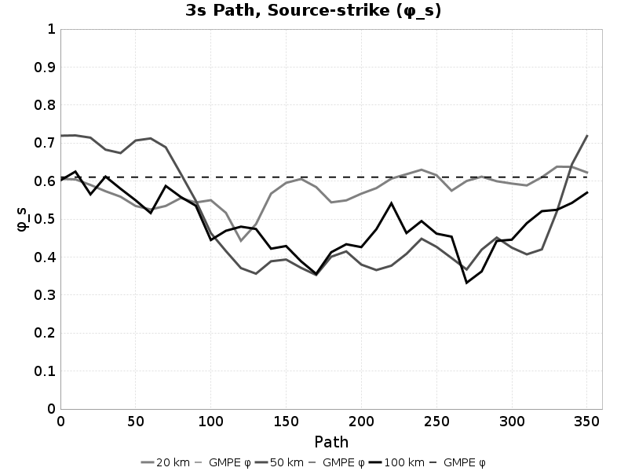 |  | 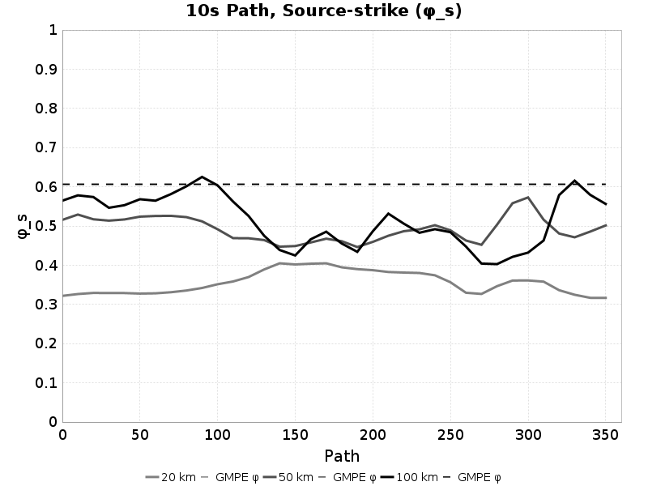 |
| **&tau;** |  | 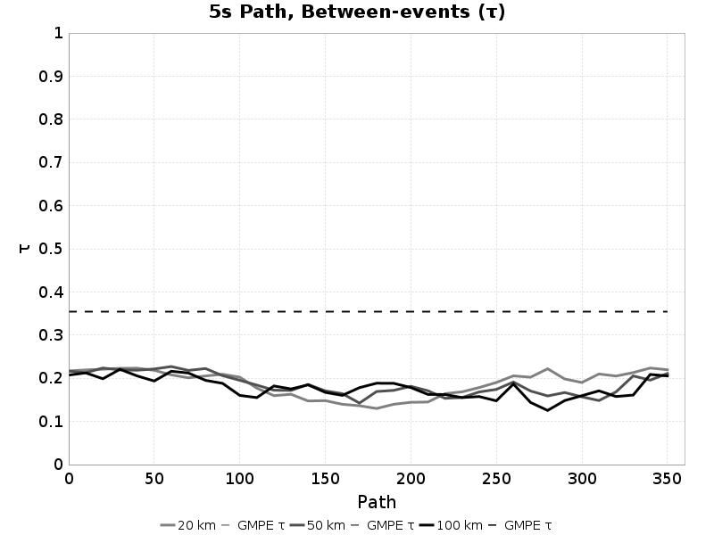 |  |
| **Median SA** |  |  |  |

### USC Azumth Dependence
*[(top)](#table-of-contents)*

#### USC Rupture Strike Dependence
*[(top)](#table-of-contents)*

| Type | 3s | 5s | 10s |
|-----|-----|-----|-----|
| **&phi;SS** | 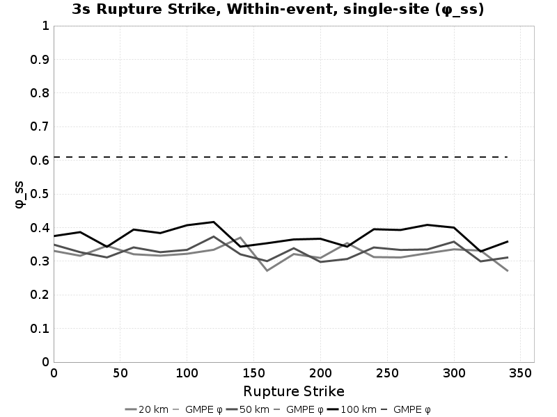 | 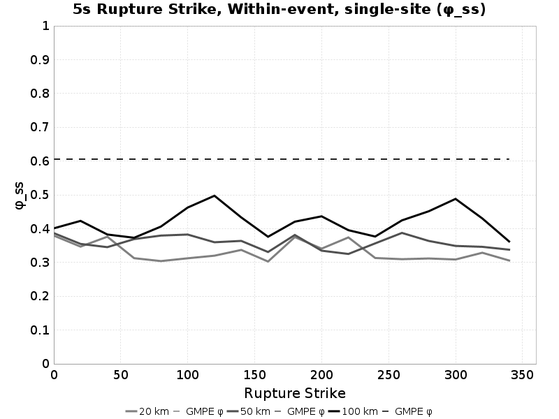 | 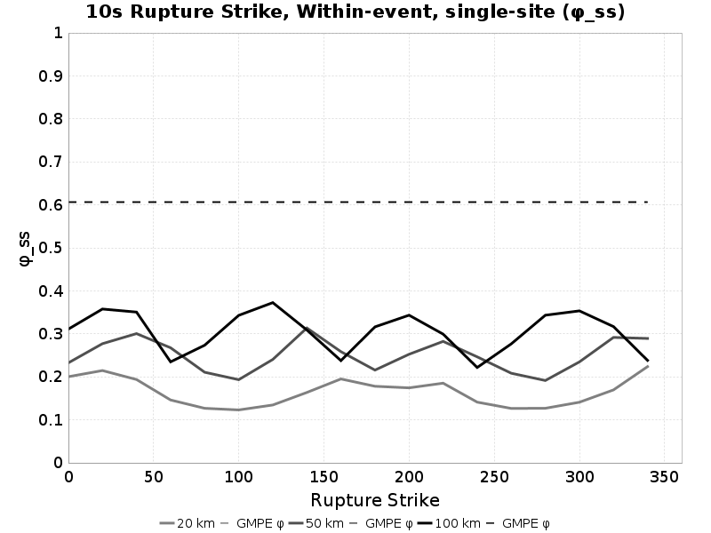 |
| **&phi;P2P** | 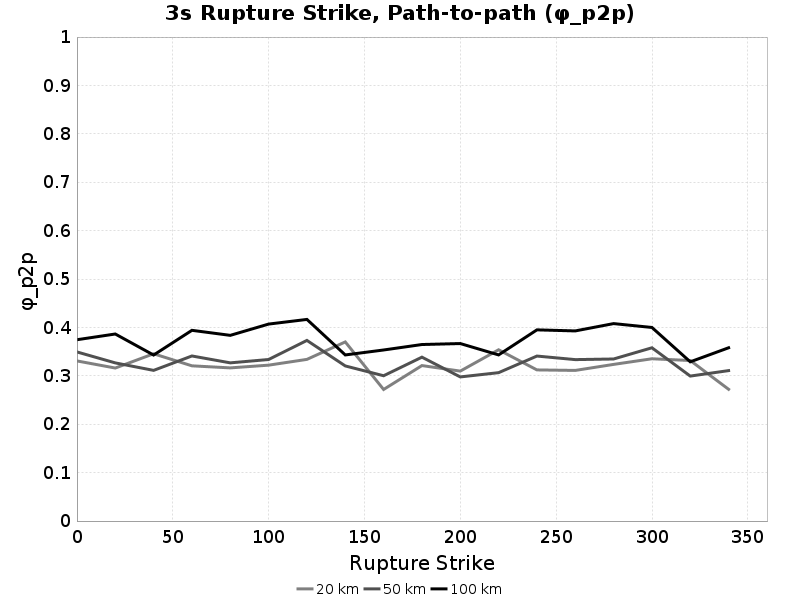 | 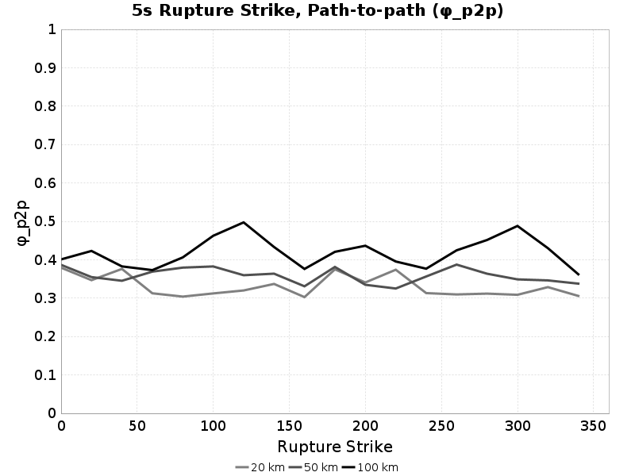 |  |
| **&tau;** |  |  |  |
| **Median SA** |  |  |  |

#### USC Path Dependence
*[(top)](#table-of-contents)*

| Type | 3s | 5s | 10s |
|-----|-----|-----|-----|
| **&phi;SS** |  |  |  |
| **&phi;s** |  |  |  |
| **&tau;** |  |  |  |
| **Median SA** |  |  |  |

### All Sites Azumth Dependence
*[(top)](#table-of-contents)*

#### All Sites Rupture Strike Dependence
*[(top)](#table-of-contents)*

| Type | 3s | 5s | 10s |
|-----|-----|-----|-----|
| **&phi;SS** |  |  |  |
| **&phi;P2P** |  |  |  |
| **&tau;** |  |  |  |
| **Median SA** |  |  |  |

#### All Sites Path Dependence
*[(top)](#table-of-contents)*

| Type | 3s | 5s | 10s |
|-----|-----|-----|-----|
| **&phi;SS** |  |  |  |
| **&phi;s** |  |  |  |
| **&tau;** |  |  |  |
| **Median SA** |  |  |  |

## BBP PartB Comparison
*[(top)](#table-of-contents)*

Here we attempt to reproduce the SCEC BroadBand Platform "Part B" validation exercise as defined in:

*Goulet, C. A., Abrahamson, N. A., Somerville, P. G., & Wooddell, K. E. (2014). The SCEC broadband platform validation exercise: Methodology for code validation in the context of seismic‐hazard analyses. Seismological Research Letters, 86(1), 17-26.* [(link)](https://pubs.geoscienceworld.org/ssa/srl/article/86/1/17/315438/the-scec-broadband-platform-validation-exercise)

The BBP exercise positioned sites in a 'racetrack' around the ruptures. Here, we instead position and rotate the ruptures around the site in order to work in 3-D with CyberShake reciprical calculations. Results for official scenarios and distances are in **bold**, results for additional magnitudes or distances not defined in the Goulet et. al. (2014) are *italicised*.

### BBP PartB Summary Table
*[(top)](#table-of-contents)*

| Scenario | Site | 20.0 km | 50.0 km | 100.0 km |
|-----|-----|-----|-----|-----|
| **M7.2 SS** | **PAS** | *(PASS)* | *(PASS)* | *(PASS)* |
| **M7.2 SS** | **USC** | *(FAIL)* | *(FAIL)* | *(FAIL)* |

### BBP PartB, M7.2, Vertical Strike-Slip with Surface Rupture
*[(top)](#table-of-contents)*

| Site | 20.0 km | 50.0 km | 100.0 km |
|-----|-----|-----|-----|
| **PAS** |  |  |  |
| **USC** |  |  |  |

## CSV Files
*[(top)](#table-of-contents)*

| Magnitude | Distance | Site | CSV File |
|-----|-----|-----|-----|
| M7.2 | 20.0 km | PAS | [sa_PAS_m7.2_20.0km.csv.gz](resources/sa_PAS_m7.2_20.0km.csv.gz) |
| M7.2 | 20.0 km | USC | [sa_USC_m7.2_20.0km.csv.gz](resources/sa_USC_m7.2_20.0km.csv.gz) |
| M7.2 | 50.0 km | PAS | [sa_PAS_m7.2_50.0km.csv.gz](resources/sa_PAS_m7.2_50.0km.csv.gz) |
| M7.2 | 50.0 km | USC | [sa_USC_m7.2_50.0km.csv.gz](resources/sa_USC_m7.2_50.0km.csv.gz) |
| M7.2 | 100.0 km | PAS | [sa_PAS_m7.2_100.0km.csv.gz](resources/sa_PAS_m7.2_100.0km.csv.gz) |
| M7.2 | 100.0 km | USC | [sa_USC_m7.2_100.0km.csv.gz](resources/sa_USC_m7.2_100.0km.csv.gz) |

