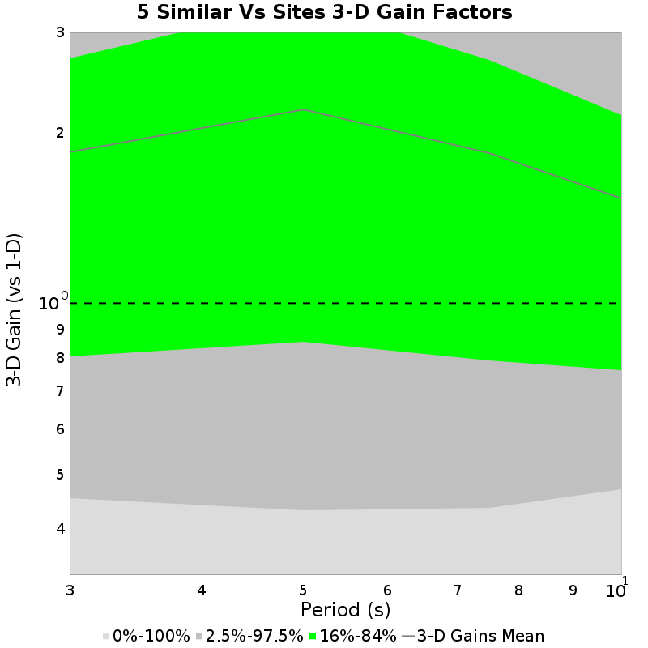
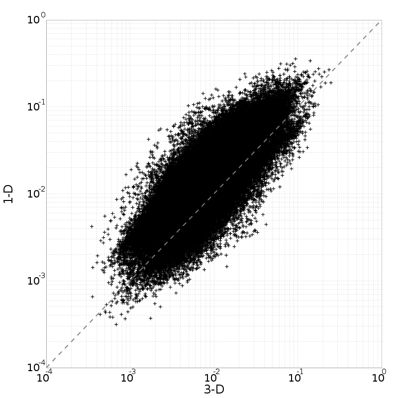
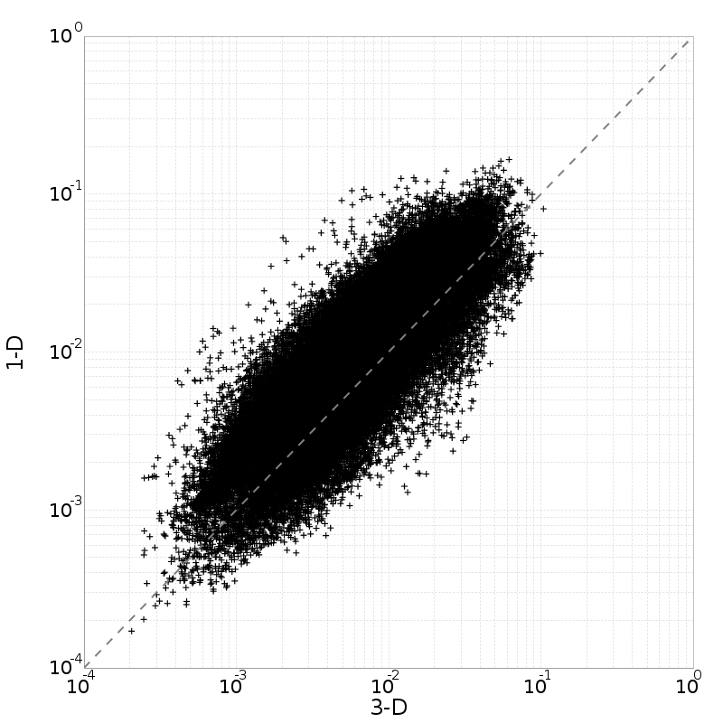
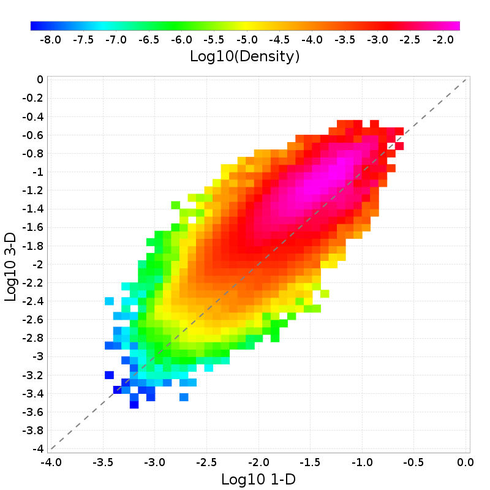
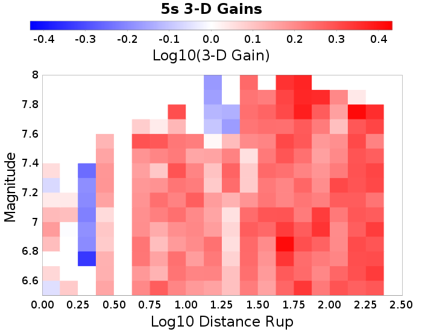
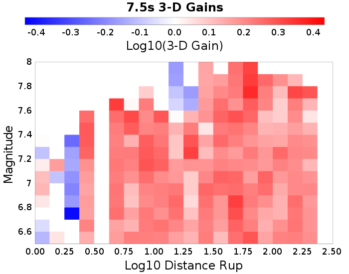
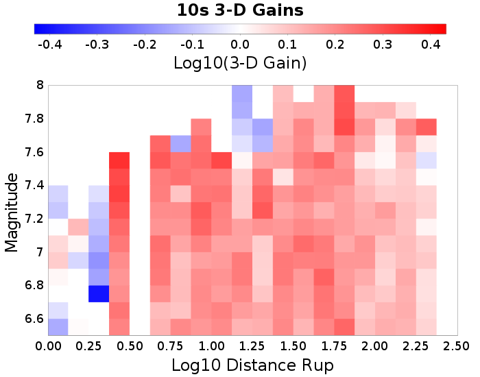
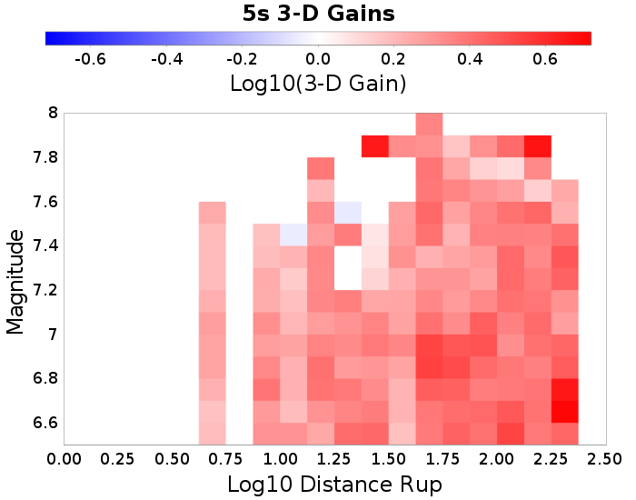

## 3-D vs 1-D Comparisons

* 3-D Model: RSQSim 4841
* 1-D Model: RSQSim-BBP (Vs30=500 m/s)

## Table Of Contents
* [3-D vs 1-D Comparisons](#3-d-vs-1-d-comparisons)
* [5 Similar Vs Sites](#5-similar-vs-sites)
  * [5 Similar Vs Sites 3-D Gain Spectra](#5-similar-vs-sites-3-d-gain-spectra)
  * [5 Similar Vs Sites Scatter Plots](#5-similar-vs-sites-scatter-plots)
  * [5 Similar Vs Sites 3-D Mag/Distance Gain Plots](#5-similar-vs-sites-3-d-magdistance-gain-plots)
* [USC](#usc)
  * [USC 3-D Gain Spectra](#usc-3-d-gain-spectra)
  * [USC Scatter Plots](#usc-scatter-plots)
  * [USC 3-D Mag/Distance Gain Plots](#usc-3-d-magdistance-gain-plots)
* [OSI](#osi)
  * [OSI 3-D Gain Spectra](#osi-3-d-gain-spectra)
  * [OSI Scatter Plots](#osi-scatter-plots)
  * [OSI 3-D Mag/Distance Gain Plots](#osi-3-d-magdistance-gain-plots)
* [WNGC](#wngc)
  * [WNGC 3-D Gain Spectra](#wngc-3-d-gain-spectra)
  * [WNGC Scatter Plots](#wngc-scatter-plots)
  * [WNGC 3-D Mag/Distance Gain Plots](#wngc-3-d-magdistance-gain-plots)
* [PDE](#pde)
  * [PDE 3-D Gain Spectra](#pde-3-d-gain-spectra)
  * [PDE Scatter Plots](#pde-scatter-plots)
  * [PDE 3-D Mag/Distance Gain Plots](#pde-3-d-magdistance-gain-plots)
* [s022](#s022)
  * [s022 3-D Gain Spectra](#s022-3-d-gain-spectra)
  * [s022 Scatter Plots](#s022-scatter-plots)
  * [s022 3-D Mag/Distance Gain Plots](#s022-3-d-magdistance-gain-plots)
## 5 Similar Vs Sites
*[(top)](#table-of-contents)*

Results for all 5 with Vs30 within 150 m/s of 1-D Vs30=500 m/s

| **Name** | **Vs30** |
|-----|-----|
| USC | 500 m/s |
| OSI | 500 m/s |
| WNGC | 500 m/s |
| PDE | 500 m/s |
| s022 | 500 m/s |

### 5 Similar Vs Sites 3-D Gain Spectra
*[(top)](#table-of-contents)*

### 5 Similar Vs Sites Scatter Plots
*[(top)](#table-of-contents)*

| **3s** | **5s** | **7.5s** | **10s** |
|-----|-----|-----|-----|
|  |  |  |  |
|  |  |  |  |

### 5 Similar Vs Sites 3-D Mag/Distance Gain Plots
*[(top)](#table-of-contents)*

| **3s** | **5s** | **7.5s** | **10s** |
|-----|-----|-----|-----|
|  |  |  |  |

## USC
*[(top)](#table-of-contents)*

| **Name** | USC |
|-----|-----|
| **Latitude** | 34.0192 |
| **Longitude** | -118.286 |
| **Site Parameters** |  |
| **Vs30** (*m/sec*) | 500.0 |
| **Depth 1.0 km/sec** (*m*) | 580.0 |
| **Depth 2.5 km/sec** (*km*) | 4.1 |

### USC 3-D Gain Spectra
*[(top)](#table-of-contents)*

### USC Scatter Plots
*[(top)](#table-of-contents)*

| **3s** | **5s** | **7.5s** | **10s** |
|-----|-----|-----|-----|
|  |  |  |  |
|  |  |  |  |

### USC 3-D Mag/Distance Gain Plots
*[(top)](#table-of-contents)*

| **3s** | **5s** | **7.5s** | **10s** |
|-----|-----|-----|-----|
|  |  |  |  |

## OSI
*[(top)](#table-of-contents)*

| **Name** | OSI |
|-----|-----|
| **Latitude** | 34.6145 |
| **Longitude** | -118.7235 |
| **Site Parameters** |  |
| **Vs30** (*m/sec*) | 500.0 |
| **Depth 1.0 km/sec** (*m*) | 310.0 |
| **Depth 2.5 km/sec** (*km*) | 0.31 |

### OSI 3-D Gain Spectra
*[(top)](#table-of-contents)*

### OSI Scatter Plots
*[(top)](#table-of-contents)*

| **3s** | **5s** | **7.5s** | **10s** |
|-----|-----|-----|-----|
|  |  |  |  |
|  |  |  |  |

### OSI 3-D Mag/Distance Gain Plots
*[(top)](#table-of-contents)*

| **3s** | **5s** | **7.5s** | **10s** |
|-----|-----|-----|-----|
|  |  |  |  |

## WNGC
*[(top)](#table-of-contents)*

| **Name** | WNGC |
|-----|-----|
| **Latitude** | 34.041824 |
| **Longitude** | -118.0653 |
| **Site Parameters** |  |
| **Vs30** (*m/sec*) | 500.0 |
| **Depth 1.0 km/sec** (*m*) | 500.0 |
| **Depth 2.5 km/sec** (*km*) | 3.49 |

### WNGC 3-D Gain Spectra
*[(top)](#table-of-contents)*

### WNGC Scatter Plots
*[(top)](#table-of-contents)*

| **3s** | **5s** | **7.5s** | **10s** |
|-----|-----|-----|-----|
|  |  |  |  |
|  |  |  |  |

### WNGC 3-D Mag/Distance Gain Plots
*[(top)](#table-of-contents)*

| **3s** | **5s** | **7.5s** | **10s** |
|-----|-----|-----|-----|
|  |  |  |  |

## PDE
*[(top)](#table-of-contents)*

| **Name** | PDE |
|-----|-----|
| **Latitude** | 34.44199 |
| **Longitude** | -118.58215 |
| **Site Parameters** |  |
| **Vs30** (*m/sec*) | 500.0 |
| **Depth 1.0 km/sec** (*m*) | 150.0 |
| **Depth 2.5 km/sec** (*km*) | 1.84 |

### PDE 3-D Gain Spectra
*[(top)](#table-of-contents)*

### PDE Scatter Plots
*[(top)](#table-of-contents)*

| **3s** | **5s** | **7.5s** | **10s** |
|-----|-----|-----|-----|
|  |  |  |  |
|  |  |  |  |

### PDE 3-D Mag/Distance Gain Plots
*[(top)](#table-of-contents)*

| **3s** | **5s** | **7.5s** | **10s** |
|-----|-----|-----|-----|
|  |  |  |  |

## s022
*[(top)](#table-of-contents)*

| **Name** | s022 |
|-----|-----|
| **Latitude** | 34.24505 |
| **Longitude** | -119.18086 |
| **Site Parameters** |  |
| **Vs30** (*m/sec*) | 500.0 |
| **Depth 1.0 km/sec** (*m*) | 510.0 |
| **Depth 2.5 km/sec** (*km*) | 4.24 |

### s022 3-D Gain Spectra
*[(top)](#table-of-contents)*

### s022 Scatter Plots
*[(top)](#table-of-contents)*

| **3s** | **5s** | **7.5s** | **10s** |
|-----|-----|-----|-----|
|  |  |  |  |
|  |  |  |  |

### s022 3-D Mag/Distance Gain Plots
*[(top)](#table-of-contents)*

| **3s** | **5s** | **7.5s** | **10s** |
|-----|-----|-----|-----|
|  |  |  |  |

