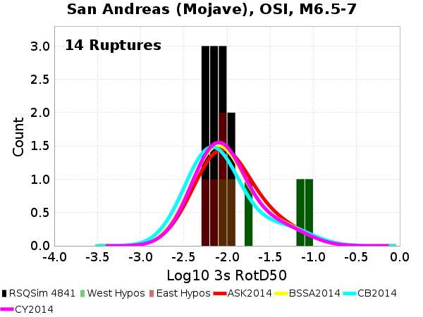
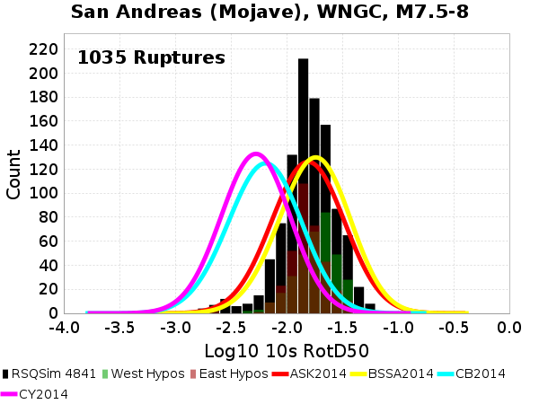

# RSQSim 4841 Source/Site GMPE Comparisons

**Vs30 Source: Simulation Value**

**GMPEs:**
* Abrahamson, Silva & Kamai (2014)
* Boore, Stewart, Seyhan & Atkinson (2014)
* Campbell & Bozorgnia (2014)
* Chiou & Youngs (2014)

## Table Of Contents
* [Puente Hills](#puente-hills)
  * [Puente Hills, OSI](#puente-hills-osi)
  * [Puente Hills, PDE](#puente-hills-pde)
  * [Puente Hills, USC](#puente-hills-usc)
  * [Puente Hills, WNGC](#puente-hills-wngc)
  * [Puente Hills, s022](#puente-hills-s022)
* [San Andreas (Mojave)](#san-andreas-mojave)
  * [San Andreas (Mojave), OSI](#san-andreas-mojave-osi)
  * [San Andreas (Mojave), PDE](#san-andreas-mojave-pde)
  * [San Andreas (Mojave), USC](#san-andreas-mojave-usc)
  * [San Andreas (Mojave), WNGC](#san-andreas-mojave-wngc)
  * [San Andreas (Mojave), s022](#san-andreas-mojave-s022)
## Puente Hills
*[(top)](#table-of-contents)*

### Puente Hills, OSI
*[(top)](#table-of-contents)*

| Mag Range | **3s** | **5s** | **10s** |
|-----|-----|-----|-----|
| **M6.5-7** |  |  |  |
| **M7-7.5** |  |  |  |
| **M7.5-8** |  |  |  |
### Puente Hills, PDE
*[(top)](#table-of-contents)*

| Mag Range | **3s** | **5s** | **10s** |
|-----|-----|-----|-----|
| **M6.5-7** |  |  |  |
| **M7-7.5** |  |  |  |
| **M7.5-8** |  |  |  |
### Puente Hills, USC
*[(top)](#table-of-contents)*

| Mag Range | **3s** | **5s** | **10s** |
|-----|-----|-----|-----|
| **M6.5-7** |  |  |  |
| **M7-7.5** |  |  |  |
| **M7.5-8** |  |  |  |
### Puente Hills, WNGC
*[(top)](#table-of-contents)*

| Mag Range | **3s** | **5s** | **10s** |
|-----|-----|-----|-----|
| **M6.5-7** |  |  |  |
| **M7-7.5** |  |  |  |
| **M7.5-8** |  |  |  |
### Puente Hills, s022
*[(top)](#table-of-contents)*

| Mag Range | **3s** | **5s** | **10s** |
|-----|-----|-----|-----|
| **M6.5-7** |  |  |  |
| **M7-7.5** |  |  |  |
| **M7.5-8** |  |  |  |
## San Andreas (Mojave)
*[(top)](#table-of-contents)*

### San Andreas (Mojave), OSI
*[(top)](#table-of-contents)*

| Mag Range | **3s** | **5s** | **10s** |
|-----|-----|-----|-----|
| **M6.5-7** |  |  |  |
| **M7-7.5** |  |  |  |
| **M7.5-8** |  |  |  |
### San Andreas (Mojave), PDE
*[(top)](#table-of-contents)*

| Mag Range | **3s** | **5s** | **10s** |
|-----|-----|-----|-----|
| **M6.5-7** |  |  |  |
| **M7-7.5** |  |  |  |
| **M7.5-8** |  |  |  |
### San Andreas (Mojave), USC
*[(top)](#table-of-contents)*

| Mag Range | **3s** | **5s** | **10s** |
|-----|-----|-----|-----|
| **M6.5-7** |  |  |  |
| **M7-7.5** |  |  |  |
| **M7.5-8** |  |  |  |
### San Andreas (Mojave), WNGC
*[(top)](#table-of-contents)*

| Mag Range | **3s** | **5s** | **10s** |
|-----|-----|-----|-----|
| **M6.5-7** |  |  |  |
| **M7-7.5** |  |  |  |
| **M7.5-8** |  |  |  |
### San Andreas (Mojave), s022
*[(top)](#table-of-contents)*

| Mag Range | **3s** | **5s** | **10s** |
|-----|-----|-----|-----|
| **M6.5-7** |  |  |  |
| **M7-7.5** |  |  |  |
| **M7.5-8** |  |  |  |
