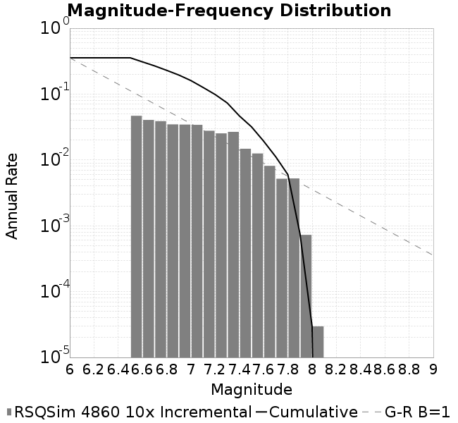
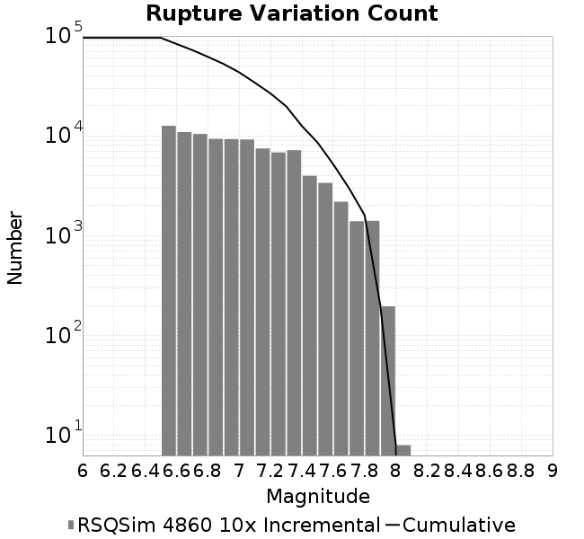
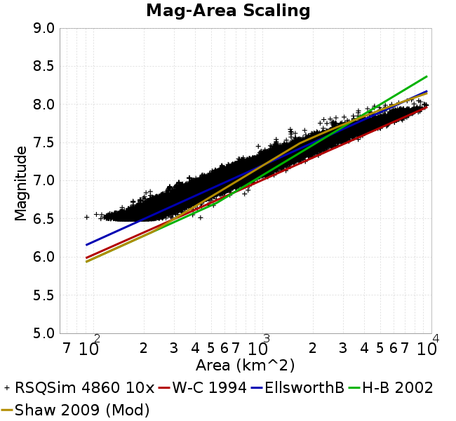
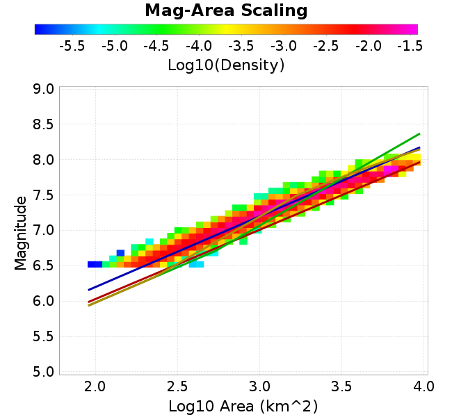
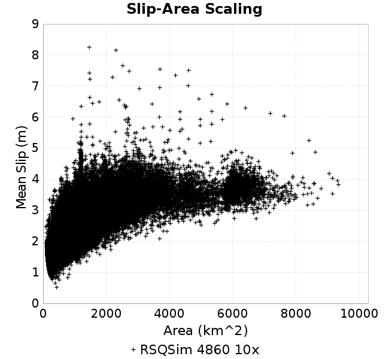
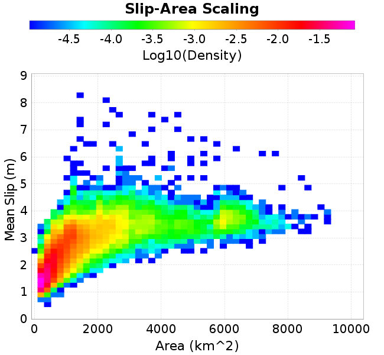

# RSQSim 4860 10x
## Metadata
| **Name** | RSQSim 4860 10x |
|-----|-----|
| **Date** | Feb 2020 |
| **Region** | Los Angeles Box |
| **Description** | RSQSim prototype with catalog 4860 (10x, 270kyr) |
| **Velocity Model** | CVM-S4.26, 4.26 |

* [Metadata](#metadata)
* [GMPE Comparisons](#gmpe-comparisons)
* [Site Hazard Comparisons](#site-hazard-comparisons)
  * [GMPE: ASK2014, Vs30 model: Simulation Value](#gmpe-ask2014-vs30-model-simulation-value)
* [Source/Site Ground Motion Comparisons](source_site_comparisons_Vs30Simulation/)
* [Plots](#plots)
  * [Magnitude-Frequency Plot](#magnitude-frequency-plot)
  * [Rupture Variation Count Plot](#rupture-variation-count-plot)
  * [Magnitude-Area Plots](#magnitude-area-plots)
  * [Slip-Area Plots](#slip-area-plots)

## GMPE Comparisons
*[(top)](#rsqsim-4860-10x)*

* [ASK2014](gmpe_comparisons_ASK2014_Vs30Simulation/)

## Site Hazard Comparisons
*[(top)](#rsqsim-4860-10x)*

### GMPE: ASK2014, Vs30 model: Simulation Value

* [USC](site_hazard_USC_ASK2014_Vs30Simulation/)
* [WSS](site_hazard_WSS_ASK2014_Vs30Simulation/)

## Source/Site Ground Motion Comparisons
*[(top)](#rsqsim-4860-10x)*

[Source/Site Ground Motion Comparisons Here](source_site_comparisons_Vs30Simulation/)

## Plots
### Magnitude-Frequency Plot
*[(top)](#rsqsim-4860-10x)*

### Rupture Variation Count Plot
*[(top)](#rsqsim-4860-10x)*

### Magnitude-Area Plots
*[(top)](#rsqsim-4860-10x)*

| Scatter | 2-D Hist |
|-----|-----|
|  |  |
### Slip-Area Plots
*[(top)](#rsqsim-4860-10x)*

| Scatter | 2-D Hist |
|-----|-----|
|  |  |
