# RSQSim 4860 10x WSS Hazard Curves

**GMPE: Abrahamson, Silva & Kamai (2014), Vs30 Source: Simulation Value**

**Study Details**

| **Name** | RSQSim 4860 10x |
|-----|-----|
| **Date** | Feb 2020 |
| **Region** | Los Angeles Box |
| **Description** | RSQSim prototype with catalog 4860 (10x, 270kyr) |
| **Velocity Model** | CVM-S4.26, 4.26 |

## Site Information

| **Name** | WSS |
|-----|-----|
| **Latitude** | 34.1717 |
| **Longitude** | -118.64971 |
| **GMPE Parameters** |  |
| **Vs30** (*m/sec*) | 500.0 |
| **Vs30 Type** | Inferred |
| **Depth 1.0 km/sec** (*m*) | 90.0 |
| **Depth 2.5 km/sec** (*km*) | 2.42 |

### Site Map

## Table Of Contents
* [Site Information](#site-information)
  * [Site Map](#site-map)
* [Curve Values Table](#curve-values-table)
* [Hazard Spectra](#hazard-spectra)
  * [Source Contribution Spectra](#source-contribution-spectra)
* [Hazard Curves](#hazard-curves)
  * [3s Hazard Curves](#3s-hazard-curves)
    * [3s GMPE-Sim Comparison](#3s-gmpe-sim-comparison)
    * [3s Source Contributions](#3s-source-contributions)
    * [3s Simulation Curve Animation](#3s-simulation-curve-animation)
  * [5s Hazard Curves](#5s-hazard-curves)
    * [5s GMPE-Sim Comparison](#5s-gmpe-sim-comparison)
    * [5s Source Contributions](#5s-source-contributions)
    * [5s Simulation Curve Animation](#5s-simulation-curve-animation)
  * [7.5s Hazard Curves](#75s-hazard-curves)
    * [7.5s GMPE-Sim Comparison](#75s-gmpe-sim-comparison)
    * [7.5s Source Contributions](#75s-source-contributions)
    * [7.5s Simulation Curve Animation](#75s-simulation-curve-animation)
  * [10s Hazard Curves](#10s-hazard-curves)
    * [10s GMPE-Sim Comparison](#10s-gmpe-sim-comparison)
    * [10s Source Contributions](#10s-source-contributions)
    * [10s Simulation Curve Animation](#10s-simulation-curve-animation)
* [Disaggregations](#disaggregations)
  * [3s Disaggregations](#3s-disaggregations)
    * [3s Disaggregations at Simulation/GMPE Intersections](#3s-disaggregations-at-simulationgmpe-intersections)
    * [3s Disaggregations at Fixed Return Periods](#3s-disaggregations-at-fixed-return-periods)
    * [3s Disaggregations at Fixed IMLs](#3s-disaggregations-at-fixed-imls)
  * [5s Disaggregations](#5s-disaggregations)
    * [5s Disaggregations at Simulation/GMPE Intersections](#5s-disaggregations-at-simulationgmpe-intersections)
    * [5s Disaggregations at Fixed Return Periods](#5s-disaggregations-at-fixed-return-periods)
    * [5s Disaggregations at Fixed IMLs](#5s-disaggregations-at-fixed-imls)
  * [7.5s Disaggregations](#75s-disaggregations)
    * [7.5s Disaggregations at Fixed Return Periods](#75s-disaggregations-at-fixed-return-periods)
    * [7.5s Disaggregations at Fixed IMLs](#75s-disaggregations-at-fixed-imls)
  * [10s Disaggregations](#10s-disaggregations)
    * [10s Disaggregations at Fixed Return Periods](#10s-disaggregations-at-fixed-return-periods)
    * [10s Disaggregations at Fixed IMLs](#10s-disaggregations-at-fixed-imls)
## Curve Values Table
*[(top)](#table-of-contents)*

| Hazard Level | RSQSim 4860 10x 3s | ASK2014 3s | RSQSim 4860 10x 5s | ASK2014 5s | RSQSim 4860 10x 7.5s | ASK2014 7.5s | RSQSim 4860 10x 10s | ASK2014 10s |
|-----|-----|-----|-----|-----|-----|-----|-----|-----|
| 1000yr | 0.10623208 | 0.12835196 | 0.068691835 | 0.07236125 | 0.031554263 | 0.051882118 | 0.019583276 | 0.03922398 |
| 2500yr | 0.1333943 | 0.17185983 | 0.08131243 | 0.096744366 | 0.038609207 | 0.06931669 | 0.024106208 | 0.052452732 |
| 10000yr | 0.17413805 | 0.25247025 | 0.107442416 | 0.14168374 | 0.052268486 | 0.10135004 | 0.032254953 | 0.07674206 |
| RTGM | 0.13739632 | 0.15245494 | 0.088842936 | 0.06410785 | 0.041744944 | 0.027725203 | 0.025409142 | 0.012155367 |

## Hazard Spectra
*[(top)](#table-of-contents)*

**Legend**:
* **Simulation Spectra**
  * Black Solid Line: CyberShake
  * Orange Solid Line: RSQSim-BBP
* **GMPE Spectra**
  * Blue Solid Line: ASK2014 full spectra
  * Blue Dashed Line: ASK2014, 3-sigma truncation
  * Blue Dotted Line: ASK2014, 2-sigma truncation
  * Blue Dotted and dashed Line: ASK2014, 1-sigma truncation

| **1000yr** | 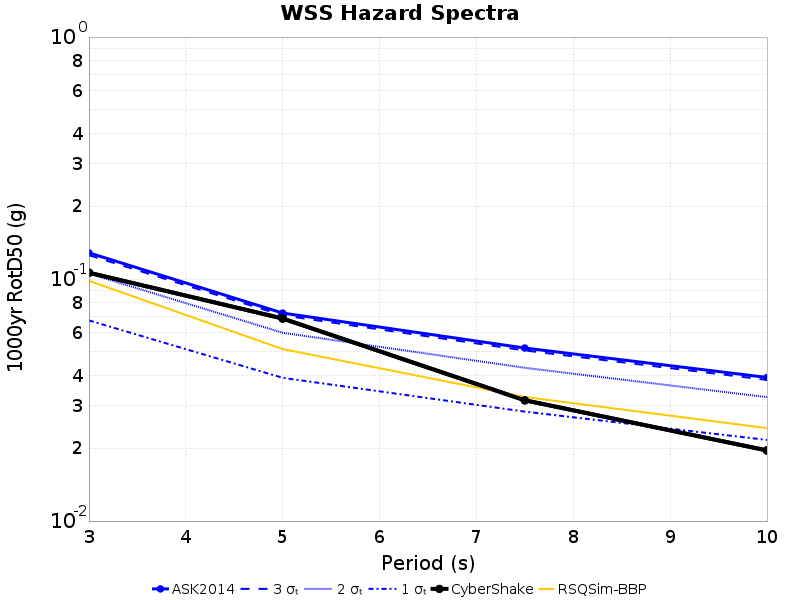 |
|-----|-----|
| **2500yr** |  |
| **10000yr** | 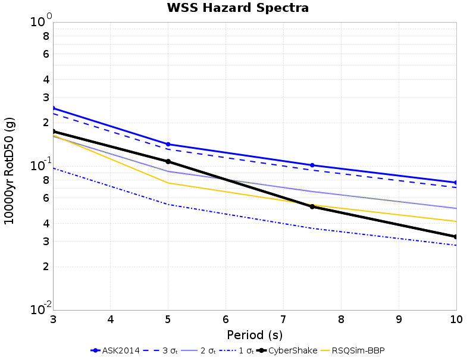 |
### Source Contribution Spectra
*[(top)](#table-of-contents)*

These plots show the contribution of each fault source to the hazard spectra. The same set of sources are plotted for both simulation values (left) and GMPE values (right). Sources are sorted in the legend (and colored by) their average contrubution in the simulation results at the given return period, and only the top 10 sources are plotted.

*NOTE: Source curves are not mututally exclusive. For the case of multi fault ruptures, a single rupture can be included in the curve for multiple sources*

| **Return Period** | **Simulation Source Contributions** | **GMPE Source Contributions** |
|-----|-----|-----|
| 1000yr |  |  |
| 2500yr | 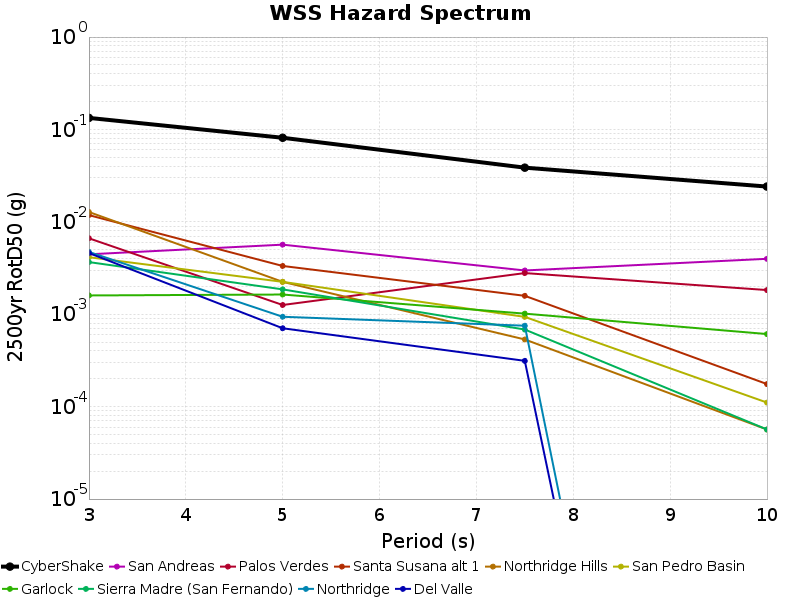 |  |
| 10000yr | 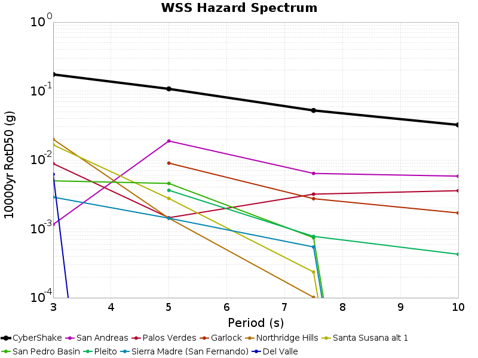 | 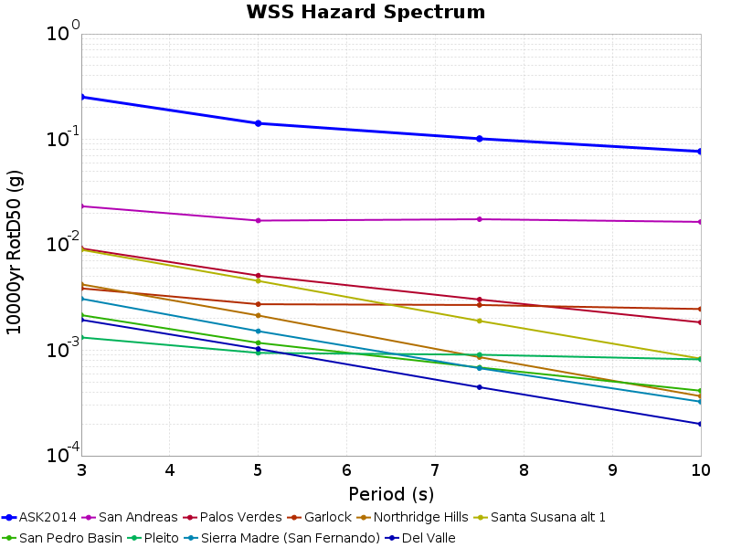 |

## Hazard Curves
*[(top)](#table-of-contents)*

**Legend**:
* **Simulation Curves** *(truncated below lowest possible y-value)*
  * Black Solid Line: CyberShake
  * Orange Solid Line: RSQSim-BBP
* **GMPE Curves**
  * Blue Solid Line: ASK2014 full curves
  * Blue Dashed Line: ASK2014, 3-sigma truncation
  * Blue Dotted Line: ASK2014, 2-sigma truncation
  * Blue Dotted and dashed Line: ASK2014, 1-sigma truncation
* Gray Dashed Lines: 1000 yr, 2500 yr, 10000 yr return periods

### 3s Hazard Curves
*[(top)](#table-of-contents)*

#### 3s GMPE-Sim Comparison
*[(top)](#table-of-contents)*

**Legend**:
* **Simulation Curves** *(truncated below lowest possible y-value)*
  * Black Solid Line: CyberShake
  * Orange Solid Line: RSQSim-BBP
* **GMPE Curves**
  * Light Red Thin Solid Lines: ASK2014 simulations (with samples from GMPE log-normal distribution)
  * Red Solid Line: ASK2014, mean of 100 simulations
  * Blue Solid Line: ASK2014 full curves
* Gray Dashed Lines: 1000 yr, 2500 yr, 10000 yr return periods

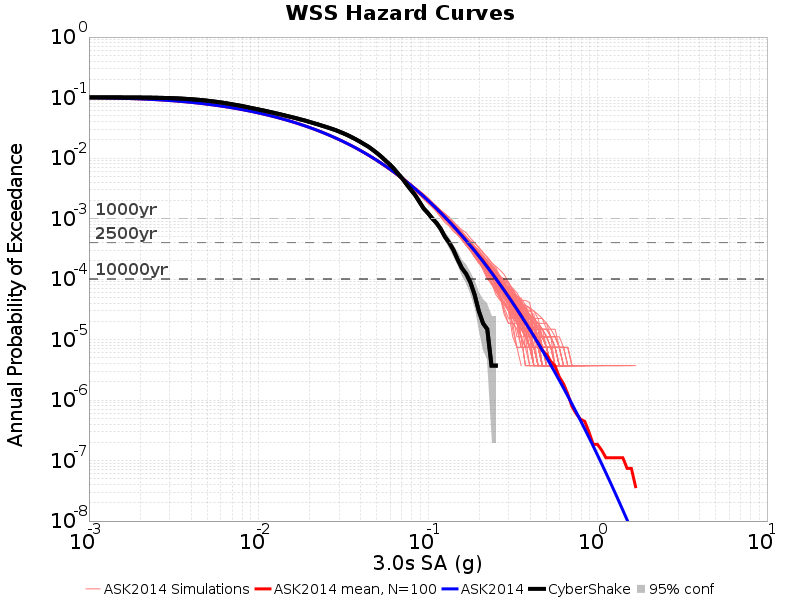

#### 3s Source Contributions
*[(top)](#table-of-contents)*

These plots show the contribution of each fault source to the hazard curves. The same set of sources are plotted for both simulation values (left) and GMPE values (right). Sources are sorted in the legend (and colored by) their risk-targeted ground motion in the simulation results, and only the top 10 sources are plotted.

*NOTE: Source curves are not mututally exclusive. For the case of multi fault ruptures, a single rupture can be included in the curve for multiple sources*

| **Simulation Source Contributions** | **GMPE Source Contributions** |
|-----|-----|
| 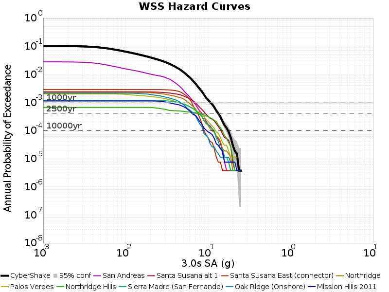 |  |

#### 3s Simulation Curve Animation
*[(top)](#table-of-contents)*

This animation shows the affect of input simulation catalog length on the simulation hazard curve. Each frame adds an additional 25000 years of the catalog to the simulation (in both the simulation and GMPE curves). Previous results (for shorter sub-catalogs) are faded out.

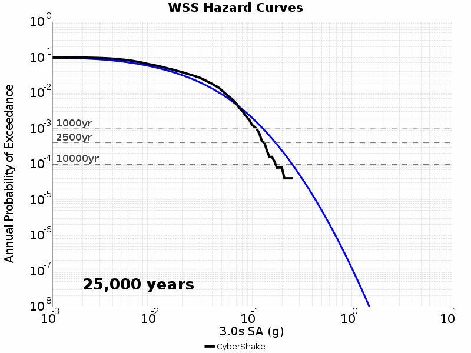

### 5s Hazard Curves
*[(top)](#table-of-contents)*

#### 5s GMPE-Sim Comparison
*[(top)](#table-of-contents)*

**Legend**:
* **Simulation Curves** *(truncated below lowest possible y-value)*
  * Black Solid Line: CyberShake
  * Orange Solid Line: RSQSim-BBP
* **GMPE Curves**
  * Light Red Thin Solid Lines: ASK2014 simulations (with samples from GMPE log-normal distribution)
  * Red Solid Line: ASK2014, mean of 100 simulations
  * Blue Solid Line: ASK2014 full curves
* Gray Dashed Lines: 1000 yr, 2500 yr, 10000 yr return periods

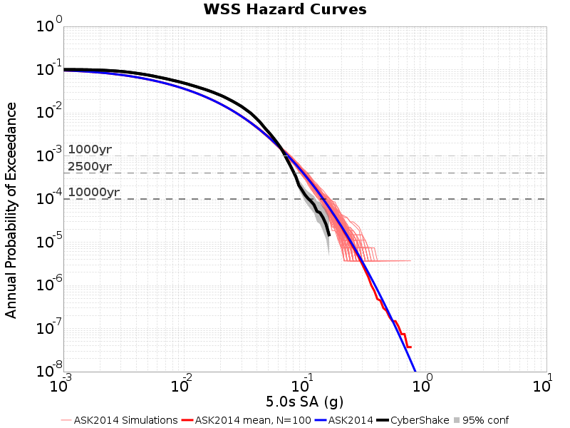

#### 5s Source Contributions
*[(top)](#table-of-contents)*

These plots show the contribution of each fault source to the hazard curves. The same set of sources are plotted for both simulation values (left) and GMPE values (right). Sources are sorted in the legend (and colored by) their risk-targeted ground motion in the simulation results, and only the top 10 sources are plotted.

*NOTE: Source curves are not mututally exclusive. For the case of multi fault ruptures, a single rupture can be included in the curve for multiple sources*

| **Simulation Source Contributions** | **GMPE Source Contributions** |
|-----|-----|
|  |  |

#### 5s Simulation Curve Animation
*[(top)](#table-of-contents)*

This animation shows the affect of input simulation catalog length on the simulation hazard curve. Each frame adds an additional 25000 years of the catalog to the simulation (in both the simulation and GMPE curves). Previous results (for shorter sub-catalogs) are faded out.

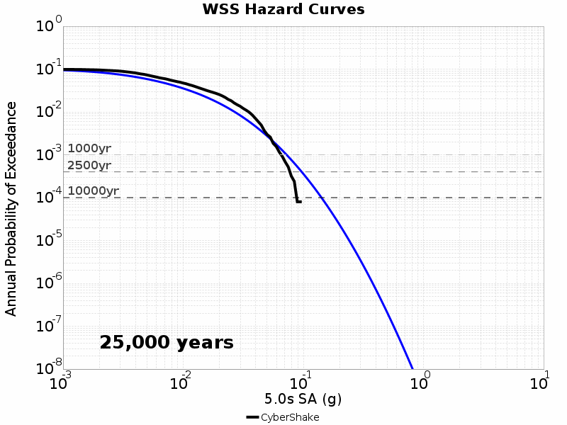

### 7.5s Hazard Curves
*[(top)](#table-of-contents)*

#### 7.5s GMPE-Sim Comparison
*[(top)](#table-of-contents)*

**Legend**:
* **Simulation Curves** *(truncated below lowest possible y-value)*
  * Black Solid Line: CyberShake
  * Orange Solid Line: RSQSim-BBP
* **GMPE Curves**
  * Light Red Thin Solid Lines: ASK2014 simulations (with samples from GMPE log-normal distribution)
  * Red Solid Line: ASK2014, mean of 100 simulations
  * Blue Solid Line: ASK2014 full curves
* Gray Dashed Lines: 1000 yr, 2500 yr, 10000 yr return periods

#### 7.5s Source Contributions
*[(top)](#table-of-contents)*

These plots show the contribution of each fault source to the hazard curves. The same set of sources are plotted for both simulation values (left) and GMPE values (right). Sources are sorted in the legend (and colored by) their risk-targeted ground motion in the simulation results, and only the top 10 sources are plotted.

*NOTE: Source curves are not mututally exclusive. For the case of multi fault ruptures, a single rupture can be included in the curve for multiple sources*

| **Simulation Source Contributions** | **GMPE Source Contributions** |
|-----|-----|
|  |  |

#### 7.5s Simulation Curve Animation
*[(top)](#table-of-contents)*

This animation shows the affect of input simulation catalog length on the simulation hazard curve. Each frame adds an additional 25000 years of the catalog to the simulation (in both the simulation and GMPE curves). Previous results (for shorter sub-catalogs) are faded out.

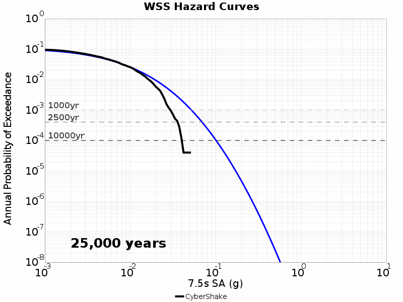

### 10s Hazard Curves
*[(top)](#table-of-contents)*

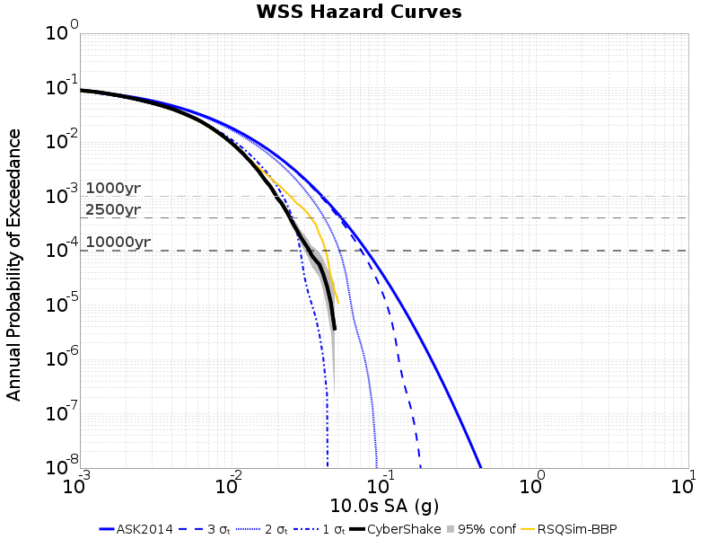

#### 10s GMPE-Sim Comparison
*[(top)](#table-of-contents)*

**Legend**:
* **Simulation Curves** *(truncated below lowest possible y-value)*
  * Black Solid Line: CyberShake
  * Orange Solid Line: RSQSim-BBP
* **GMPE Curves**
  * Light Red Thin Solid Lines: ASK2014 simulations (with samples from GMPE log-normal distribution)
  * Red Solid Line: ASK2014, mean of 100 simulations
  * Blue Solid Line: ASK2014 full curves
* Gray Dashed Lines: 1000 yr, 2500 yr, 10000 yr return periods

#### 10s Source Contributions
*[(top)](#table-of-contents)*

These plots show the contribution of each fault source to the hazard curves. The same set of sources are plotted for both simulation values (left) and GMPE values (right). Sources are sorted in the legend (and colored by) their risk-targeted ground motion in the simulation results, and only the top 10 sources are plotted.

*NOTE: Source curves are not mututally exclusive. For the case of multi fault ruptures, a single rupture can be included in the curve for multiple sources*

| **Simulation Source Contributions** | **GMPE Source Contributions** |
|-----|-----|
| 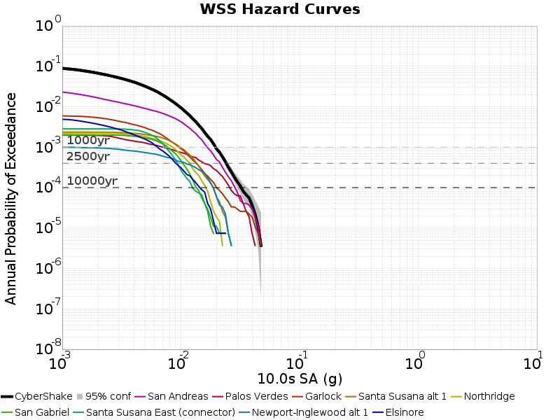 | 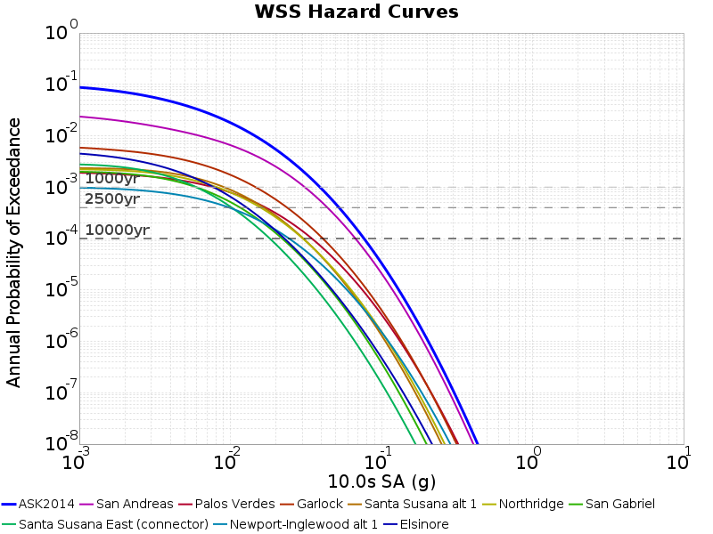 |

#### 10s Simulation Curve Animation
*[(top)](#table-of-contents)*

This animation shows the affect of input simulation catalog length on the simulation hazard curve. Each frame adds an additional 25000 years of the catalog to the simulation (in both the simulation and GMPE curves). Previous results (for shorter sub-catalogs) are faded out.

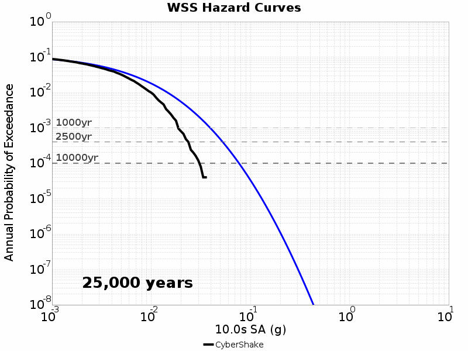

## Disaggregations
*[(top)](#table-of-contents)*

**Note on Epsilons:** Epsilon values are not straightforward for simulations. For a GMPE (in natural log space):

**GMPE Epsilon:** *epsilon = (gmpe_IML - gmpe_mean)/gmpe_sigma*

This simulation does not have distributions for each rupture, so in order to compute an epsilon, we must use the GMPE mean and sigma values:

**Simulation w/ GMPE Distribution Epsilon:** *epsilon = (sim_IML - gmpe_mean)/gmpe_sigma*

### 3s Disaggregations
*[(top)](#table-of-contents)*

#### 3s Disaggregations at Simulation/GMPE Intersections
*[(top)](#table-of-contents)*

| **Disagg Level** | **CyberShake w/ GMPE dist for Epsilon** | **Abrahamson, Silva & Kamai (2014)** |
|-----|-----|-----|
| **216 yr 0.070478596 g** |  |  |

#### 3s Disaggregations at Fixed Return Periods
*[(top)](#table-of-contents)*

| **Disagg Level** | **CyberShake w/ GMPE dist for Epsilon** | **Abrahamson, Silva & Kamai (2014)** |
|-----|-----|-----|
| **1000 yr** |  |  |
| **2500 yr** |  |  |
| **10000 yr** |  |  |

#### 3s Disaggregations at Fixed IMLs
*[(top)](#table-of-contents)*

| **Disagg Level** | **CyberShake w/ GMPE dist for Epsilon** | **Abrahamson, Silva & Kamai (2014)** |
|-----|-----|-----|
| **0.1 g** |  |  |
| **0.5 g** | N/A | N/A |  |
| **1.0 g** | N/A | N/A |  |

### 5s Disaggregations
*[(top)](#table-of-contents)*

#### 5s Disaggregations at Simulation/GMPE Intersections
*[(top)](#table-of-contents)*

| **Disagg Level** | **CyberShake w/ GMPE dist for Epsilon** | **Abrahamson, Silva & Kamai (2014)** |
|-----|-----|-----|
| **718 yr 0.06457179 g** |  |  |

#### 5s Disaggregations at Fixed Return Periods
*[(top)](#table-of-contents)*

| **Disagg Level** | **CyberShake w/ GMPE dist for Epsilon** | **Abrahamson, Silva & Kamai (2014)** |
|-----|-----|-----|
| **1000 yr** |  |  |
| **2500 yr** |  | 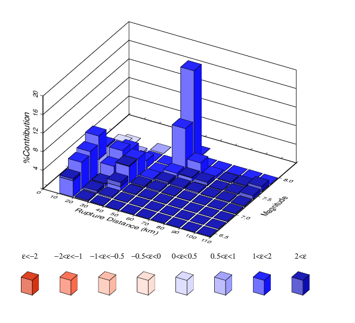 |
| **10000 yr** |  |  |

#### 5s Disaggregations at Fixed IMLs
*[(top)](#table-of-contents)*

| **Disagg Level** | **CyberShake w/ GMPE dist for Epsilon** | **Abrahamson, Silva & Kamai (2014)** |
|-----|-----|-----|
| **0.1 g** |  |  |
| **0.5 g** | N/A | N/A |  |
| **1.0 g** | N/A | N/A |  |

### 7.5s Disaggregations
*[(top)](#table-of-contents)*

#### 7.5s Disaggregations at Fixed Return Periods
*[(top)](#table-of-contents)*

| **Disagg Level** | **CyberShake w/ GMPE dist for Epsilon** | **Abrahamson, Silva & Kamai (2014)** |
|-----|-----|-----|
| **1000 yr** |  |  |
| **2500 yr** |  |  |
| **10000 yr** | 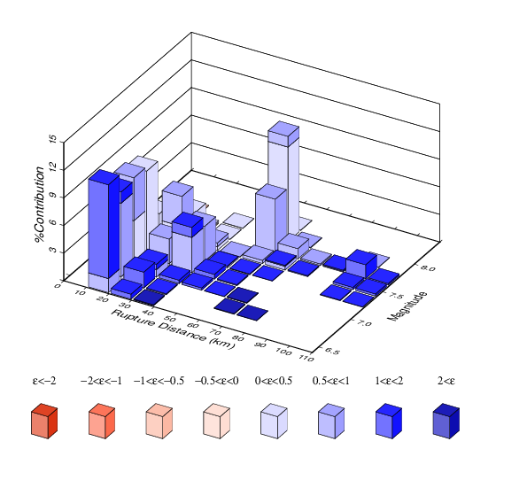 |  |

#### 7.5s Disaggregations at Fixed IMLs
*[(top)](#table-of-contents)*

| **Disagg Level** | **CyberShake w/ GMPE dist for Epsilon** | **Abrahamson, Silva & Kamai (2014)** |
|-----|-----|-----|
| **0.1 g** | N/A | N/A |  |
| **0.5 g** | N/A | N/A |  |
| **1.0 g** | N/A | N/A |  |

### 10s Disaggregations
*[(top)](#table-of-contents)*

#### 10s Disaggregations at Fixed Return Periods
*[(top)](#table-of-contents)*

| **Disagg Level** | **CyberShake w/ GMPE dist for Epsilon** | **Abrahamson, Silva & Kamai (2014)** |
|-----|-----|-----|
| **1000 yr** |  |  |
| **2500 yr** |  |  |
| **10000 yr** |  |  |

#### 10s Disaggregations at Fixed IMLs
*[(top)](#table-of-contents)*

| **Disagg Level** | **CyberShake w/ GMPE dist for Epsilon** | **Abrahamson, Silva & Kamai (2014)** |
|-----|-----|-----|
| **0.1 g** | N/A | N/A |  |
| **0.5 g** | N/A | N/A |  |
| **1.0 g** | N/A | N/A |  |

